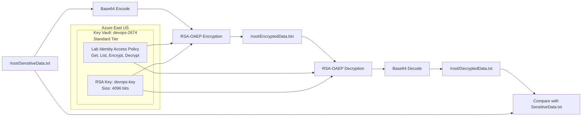

# Azure Key Vault Encryption and Decryption

## OTS Script

```bash
#!/usr/bin/env bash

set -euo pipefail

LOCATION="eastus"
KEY_VAULT_NAME="devops-2674"
KEY_NAME="devops-key"
SOURCE_FILE="/root/SensitiveData.txt"
ENCRYPTED_FILE="/root/EncryptedData.bin"
DECRYPTED_FILE="/root/DecryptedData.txt"

# Identify the existing resource group
RESOURCE_GROUP="$(az group list --query '[0].name' -o tsv)"

if [[ -z "$RESOURCE_GROUP" ]]; then
    echo "ERROR: No existing resource group found."
    exit 1
fi

if [[ ! -f "$SOURCE_FILE" ]]; then
    echo "ERROR: $SOURCE_FILE does not exist."
    exit 1
fi

echo "Using resource group: $RESOURCE_GROUP"

# Create Key Vault
az keyvault create \
    --name "$KEY_VAULT_NAME" \
    --resource-group "$RESOURCE_GROUP" \
    --location "$LOCATION" \
    --sku standard \
    --retention-days 7 \
    --enable-rbac-authorization false \
    -o table

# Retrieve lab identity ID
IDENTITY_ID="$(az account show --query user.name -o tsv)"

if [[ -z "$IDENTITY_ID" ]]; then
    echo "ERROR: Unable to retrieve the lab identity."
    exit 1
fi

echo "Lab identity: $IDENTITY_ID"

# Temporarily include Create permission to create the required key
az keyvault set-policy \
    --name "$KEY_VAULT_NAME" \
    --object-id "$IDENTITY_ID" \
    --key-permissions get list create encrypt decrypt

# Create the RSA 4096-bit key
az keyvault key create \
    --vault-name "$KEY_VAULT_NAME" \
    --name "$KEY_NAME" \
    --kty RSA \
    --size 4096 \
    -o table

# Configure the final required permissions
az keyvault set-policy \
    --name "$KEY_VAULT_NAME" \
    --object-id "$IDENTITY_ID" \
    --key-permissions get list encrypt decrypt

# Base64 encode the plaintext
PLAINTEXT_BASE64="$(base64 -w 0 "$SOURCE_FILE")"

# Encrypt the Base64-encoded plaintext using RSA-OAEP
az keyvault key encrypt \
    --vault-name "$KEY_VAULT_NAME" \
    --name "$KEY_NAME" \
    --algorithm RSA-OAEP \
    --value "$PLAINTEXT_BASE64" \
    --query result \
    -o tsv > "$ENCRYPTED_FILE"

# Decrypt EncryptedData.bin
DECRYPTED_BASE64="$(az keyvault key decrypt \
    --vault-name "$KEY_VAULT_NAME" \
    --name "$KEY_NAME" \
    --algorithm RSA-OAEP \
    --value "$(cat "$ENCRYPTED_FILE")" \
    --query result \
    -o tsv)"

# Base64 decode the decrypted output
echo "$DECRYPTED_BASE64" | base64 --decode > "$DECRYPTED_FILE"

# Verify that the decrypted file matches the original
cmp --silent "$SOURCE_FILE" "$DECRYPTED_FILE"

echo "SUCCESS: DecryptedData.txt matches SensitiveData.txt"
```

Run the OTS:

```bash
chmod +x ots.sh
./ots.sh
```

## Mermaid Diagram



## Runbook

### Identify the existing resource group

```bash
az account show -o table
az group list -o table

RESOURCE_GROUP="$(az group list --query '[0].name' -o tsv)"
echo "$RESOURCE_GROUP"
```

### Verify the sensitive file

```bash
ls -l /root/SensitiveData.txt
```

### Create the Key Vault

```bash
az keyvault create \
    --name devops-2674 \
    --resource-group "$RESOURCE_GROUP" \
    --location eastus \
    --sku standard \
    --retention-days 7 \
    --enable-rbac-authorization false \
    -o table
```

### Retrieve the lab identity

```bash
IDENTITY_ID="$(az account show --query user.name -o tsv)"
echo "$IDENTITY_ID"
```

### Grant temporary key creation permission

```bash
az keyvault set-policy \
    --name devops-2674 \
    --object-id "$IDENTITY_ID" \
    --key-permissions get list create encrypt decrypt
```

### Create the RSA key

```bash
az keyvault key create \
    --vault-name devops-2674 \
    --name devops-key \
    --kty RSA \
    --size 4096 \
    -o table
```

### Configure the required access policy

```bash
az keyvault set-policy \
    --name devops-2674 \
    --object-id "$IDENTITY_ID" \
    --key-permissions get list encrypt decrypt
```

### Base64 encode and encrypt the file

```bash
PLAINTEXT_BASE64="$(base64 -w 0 /root/SensitiveData.txt)"
```

```bash
az keyvault key encrypt \
    --vault-name devops-2674 \
    --name devops-key \
    --algorithm RSA-OAEP \
    --value "$PLAINTEXT_BASE64" \
    --query result \
    -o tsv > /root/EncryptedData.bin
```

Verify the encrypted file:

```bash
ls -l /root/EncryptedData.bin
```

### Decrypt the encrypted file

```bash
DECRYPTED_BASE64="$(az keyvault key decrypt \
    --vault-name devops-2674 \
    --name devops-key \
    --algorithm RSA-OAEP \
    --value "$(cat /root/EncryptedData.bin)" \
    --query result \
    -o tsv)"
```

### Base64 decode the decrypted output

```bash
echo "$DECRYPTED_BASE64" | base64 --decode > /root/DecryptedData.txt
```

### Verify the decrypted file

```bash
ls -l /root/DecryptedData.txt
```

```bash
cmp --silent \
    /root/SensitiveData.txt \
    /root/DecryptedData.txt
```

Display the result:

```bash
if cmp --silent /root/SensitiveData.txt /root/DecryptedData.txt; then
    echo "SUCCESS: Files match"
else
    echo "FAILED: Files do not match"
fi
```

### Verify the Key Vault configuration

```bash
az keyvault show \
    --name devops-2674 \
    --resource-group "$RESOURCE_GROUP" \
    --query '{
        Name:name,
        Location:location,
        SKU:properties.sku.name,
        SoftDeleteRetentionDays:properties.softDeleteRetentionInDays,
        RBACEnabled:properties.enableRbacAuthorization
    }' \
    -o table
```

### Verify the RSA key configuration

```bash
az keyvault key show \
    --vault-name devops-2674 \
    --name devops-key \
    --query '{
        Name:name,
        KeyType:key.kty,
        KeySize:length(key.n),
        Enabled:attributes.enabled
    }' \
    -o json
```

### Verify the access policy

```bash
az keyvault show \
    --name devops-2674 \
    --resource-group "$RESOURCE_GROUP" \
    --query "properties.accessPolicies[?objectId=='$IDENTITY_ID'].permissions.keys" \
    -o json
```

Expected permissions:

```json
[
  "get",
  "list",
  "encrypt",
  "decrypt"
]
```

### Final validation

```bash
test -f /root/SensitiveData.txt
test -f /root/EncryptedData.bin
test -f /root/DecryptedData.txt

cmp --silent \
    /root/SensitiveData.txt \
    /root/DecryptedData.txt

echo "Validation completed successfully."
```