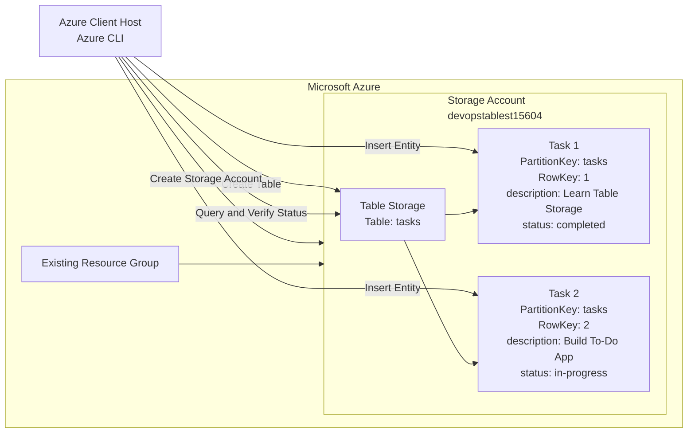

# Azure Table Storage To-Do Application

## OTS Script

```bash
#!/usr/bin/env bash

set -euo pipefail

STORAGE_ACCOUNT="devopstablest15604"
TABLE_NAME="tasks"

# Identify the existing resource group
RESOURCE_GROUP="$(az group list --query '[0].name' -o tsv)"

if [[ -z "$RESOURCE_GROUP" ]]; then
    echo "ERROR: No existing resource group found."
    exit 1
fi

# Use the existing resource group's location
LOCATION="$(az group show \
    --name "$RESOURCE_GROUP" \
    --query location \
    -o tsv)"

echo "Resource group: $RESOURCE_GROUP"
echo "Location: $LOCATION"

# Create the Storage account
az storage account create \
    --name "$STORAGE_ACCOUNT" \
    --resource-group "$RESOURCE_GROUP" \
    --location "$LOCATION" \
    --sku Standard_LRS \
    --kind StorageV2 \
    -o table

# Retrieve the Storage account key
ACCOUNT_KEY="$(az storage account keys list \
    --resource-group "$RESOURCE_GROUP" \
    --account-name "$STORAGE_ACCOUNT" \
    --query '[0].value' \
    -o tsv)"

if [[ -z "$ACCOUNT_KEY" ]]; then
    echo "ERROR: Unable to retrieve the Storage account key."
    exit 1
fi

# Create the tasks table
az storage table create \
    --name "$TABLE_NAME" \
    --account-name "$STORAGE_ACCOUNT" \
    --account-key "$ACCOUNT_KEY" \
    -o table

# Insert Task 1
az storage entity insert \
    --account-name "$STORAGE_ACCOUNT" \
    --account-key "$ACCOUNT_KEY" \
    --table-name "$TABLE_NAME" \
    --entity \
        PartitionKey=tasks \
        RowKey=1 \
        "description=Learn Table Storage" \
        status=completed \
    --if-exists replace

# Insert Task 2
az storage entity insert \
    --account-name "$STORAGE_ACCOUNT" \
    --account-key "$ACCOUNT_KEY" \
    --table-name "$TABLE_NAME" \
    --entity \
        PartitionKey=tasks \
        RowKey=2 \
        "description=Build To-Do App" \
        status=in-progress \
    --if-exists replace

# Retrieve Task 1 status
TASK1_STATUS="$(az storage entity show \
    --account-name "$STORAGE_ACCOUNT" \
    --account-key "$ACCOUNT_KEY" \
    --table-name "$TABLE_NAME" \
    --partition-key tasks \
    --row-key 1 \
    --query status \
    -o tsv)"

# Retrieve Task 2 status
TASK2_STATUS="$(az storage entity show \
    --account-name "$STORAGE_ACCOUNT" \
    --account-key "$ACCOUNT_KEY" \
    --table-name "$TABLE_NAME" \
    --partition-key tasks \
    --row-key 2 \
    --query status \
    -o tsv)"

echo "Task 1 status: $TASK1_STATUS"
echo "Task 2 status: $TASK2_STATUS"

# Verify task statuses
if [[ "$TASK1_STATUS" != "completed" ]]; then
    echo "ERROR: Task 1 status is not completed."
    exit 1
fi

if [[ "$TASK2_STATUS" != "in-progress" ]]; then
    echo "ERROR: Task 2 status is not in-progress."
    exit 1
fi

echo "SUCCESS: Both tasks were created and verified."

# Display all tasks
az storage entity query \
    --account-name "$STORAGE_ACCOUNT" \
    --account-key "$ACCOUNT_KEY" \
    --table-name "$TABLE_NAME" \
    --filter "PartitionKey eq 'tasks'" \
    --select PartitionKey RowKey description status \
    -o table
```

Run the OTS:

```bash
chmod +x ots.sh
./ots.sh
```

## Documentation

### Storage Account

| Property | Value |
|---|---|
| Storage account | `devopstablest15604` |
| Account type | `StorageV2` |
| SKU | `Standard_LRS` |
| Resource group | Existing resource group |
| Location | Existing resource group location |

### Table

| Property | Value |
|---|---|
| Table name | `tasks` |
| Storage service | Azure Table Storage |

### Table Entities

| PartitionKey | RowKey | description | status |
|---|---|---|---|
| `tasks` | `1` | `Learn Table Storage` | `completed` |
| `tasks` | `2` | `Build To-Do App` | `in-progress` |

### Entity Identification

Each task is uniquely identified by the combination of:

```text
PartitionKey + RowKey
```

The task identifiers are:

```text
tasks/1
tasks/2
```

## Mermaid Diagram



## Runbook

### Identify the existing resource group

```bash
az account show -o table
az group list -o table
```

```bash
RESOURCE_GROUP="$(az group list --query '[0].name' -o tsv)"
echo "$RESOURCE_GROUP"
```

### Retrieve the resource group location

```bash
LOCATION="$(az group show \
    --name "$RESOURCE_GROUP" \
    --query location \
    -o tsv)"

echo "$LOCATION"
```

### Create the Storage account

```bash
az storage account create \
    --name devopstablest15604 \
    --resource-group "$RESOURCE_GROUP" \
    --location "$LOCATION" \
    --sku Standard_LRS \
    --kind StorageV2 \
    -o table
```

### Retrieve the Storage account key

```bash
ACCOUNT_KEY="$(az storage account keys list \
    --resource-group "$RESOURCE_GROUP" \
    --account-name devopstablest15604 \
    --query '[0].value' \
    -o tsv)"
```

### Create the `tasks` table

```bash
az storage table create \
    --name tasks \
    --account-name devopstablest15604 \
    --account-key "$ACCOUNT_KEY" \
    -o table
```

### Insert Task 1

```bash
az storage entity insert \
    --account-name devopstablest15604 \
    --account-key "$ACCOUNT_KEY" \
    --table-name tasks \
    --entity \
        PartitionKey=tasks \
        RowKey=1 \
        "description=Learn Table Storage" \
        status=completed \
    --if-exists replace
```

### Insert Task 2

```bash
az storage entity insert \
    --account-name devopstablest15604 \
    --account-key "$ACCOUNT_KEY" \
    --table-name tasks \
    --entity \
        PartitionKey=tasks \
        RowKey=2 \
        "description=Build To-Do App" \
        status=in-progress \
    --if-exists replace
```

### Verify Task 1

```bash
az storage entity show \
    --account-name devopstablest15604 \
    --account-key "$ACCOUNT_KEY" \
    --table-name tasks \
    --partition-key tasks \
    --row-key 1 \
    --select PartitionKey RowKey description status \
    -o table
```

Verify only the status:

```bash
az storage entity show \
    --account-name devopstablest15604 \
    --account-key "$ACCOUNT_KEY" \
    --table-name tasks \
    --partition-key tasks \
    --row-key 1 \
    --query status \
    -o tsv
```

Expected result:

```text
completed
```

### Verify Task 2

```bash
az storage entity show \
    --account-name devopstablest15604 \
    --account-key "$ACCOUNT_KEY" \
    --table-name tasks \
    --partition-key tasks \
    --row-key 2 \
    --select PartitionKey RowKey description status \
    -o table
```

Verify only the status:

```bash
az storage entity show \
    --account-name devopstablest15604 \
    --account-key "$ACCOUNT_KEY" \
    --table-name tasks \
    --partition-key tasks \
    --row-key 2 \
    --query status \
    -o tsv
```

Expected result:

```text
in-progress
```

### Display all tasks

```bash
az storage entity query \
    --account-name devopstablest15604 \
    --account-key "$ACCOUNT_KEY" \
    --table-name tasks \
    --filter "PartitionKey eq 'tasks'" \
    --select PartitionKey RowKey description status \
    -o table
```

Expected data:

```text
PartitionKey    RowKey    description          status
--------------  --------  -------------------  -----------
tasks           1         Learn Table Storage  completed
tasks           2         Build To-Do App      in-progress
```

### Final validation

```bash
TASK1_STATUS="$(az storage entity show \
    --account-name devopstablest15604 \
    --account-key "$ACCOUNT_KEY" \
    --table-name tasks \
    --partition-key tasks \
    --row-key 1 \
    --query status \
    -o tsv)"

TASK2_STATUS="$(az storage entity show \
    --account-name devopstablest15604 \
    --account-key "$ACCOUNT_KEY" \
    --table-name tasks \
    --partition-key tasks \
    --row-key 2 \
    --query status \
    -o tsv)"

[[ "$TASK1_STATUS" == "completed" ]] &&
[[ "$TASK2_STATUS" == "in-progress" ]] &&
echo "SUCCESS: Both tasks are configured correctly."
```