# Azure Blob Container Cleanup

## OTS Script

```bash
#!/usr/bin/env bash

set -euo pipefail

STORAGE_ACCOUNT="datacenterst6441"
CONTAINER_NAME="datacenter-blob-31986"
DESTINATION="/opt"

# Locate the Storage account resource group
RESOURCE_GROUP="$(az storage account list \
    --query "[?name=='$STORAGE_ACCOUNT'].resourceGroup | [0]" \
    -o tsv)"

if [[ -z "$RESOURCE_GROUP" ]]; then
    echo "ERROR: Storage account $STORAGE_ACCOUNT was not found."
    exit 1
fi

# Verify the Storage account region
LOCATION="$(az storage account show \
    --name "$STORAGE_ACCOUNT" \
    --resource-group "$RESOURCE_GROUP" \
    --query location \
    -o tsv)"

if [[ "$LOCATION" != "westus" ]]; then
    echo "ERROR: Storage account is not located in westus."
    exit 1
fi

# Retrieve the Storage account key
ACCOUNT_KEY="$(az storage account keys list \
    --account-name "$STORAGE_ACCOUNT" \
    --resource-group "$RESOURCE_GROUP" \
    --query '[0].value' \
    -o tsv)"

if [[ -z "$ACCOUNT_KEY" ]]; then
    echo "ERROR: Unable to retrieve the Storage account key."
    exit 1
fi

# Verify that the container exists
CONTAINER_EXISTS="$(az storage container exists \
    --name "$CONTAINER_NAME" \
    --account-name "$STORAGE_ACCOUNT" \
    --account-key "$ACCOUNT_KEY" \
    --query exists \
    -o tsv)"

if [[ "$CONTAINER_EXISTS" != "true" ]]; then
    echo "ERROR: Container $CONTAINER_NAME does not exist."
    exit 1
fi

# Create the destination directory
mkdir -p "$DESTINATION"

# Save the blob names for download verification
BLOB_LIST="$(mktemp)"

az storage blob list \
    --container-name "$CONTAINER_NAME" \
    --account-name "$STORAGE_ACCOUNT" \
    --account-key "$ACCOUNT_KEY" \
    --query '[].name' \
    -o tsv > "$BLOB_LIST"

# Download all container contents recursively to /opt
az storage blob download-batch \
    --source "$CONTAINER_NAME" \
    --destination "$DESTINATION" \
    --account-name "$STORAGE_ACCOUNT" \
    --account-key "$ACCOUNT_KEY" \
    --overwrite true

# Verify every blob was downloaded
while IFS= read -r BLOB_NAME; do
    [[ -z "$BLOB_NAME" ]] && continue

    if [[ ! -f "$DESTINATION/$BLOB_NAME" ]]; then
        echo "ERROR: Downloaded file is missing: $DESTINATION/$BLOB_NAME"
        rm -f "$BLOB_LIST"
        exit 1
    fi

    echo "Verified: $DESTINATION/$BLOB_NAME"
done < "$BLOB_LIST"

rm -f "$BLOB_LIST"

# Delete the blob container
az storage container delete \
    --name "$CONTAINER_NAME" \
    --account-name "$STORAGE_ACCOUNT" \
    --account-key "$ACCOUNT_KEY" \
    --fail-not-exist

# Verify container deletion
CONTAINER_EXISTS="$(az storage container exists \
    --name "$CONTAINER_NAME" \
    --account-name "$STORAGE_ACCOUNT" \
    --account-key "$ACCOUNT_KEY" \
    --query exists \
    -o tsv)"

if [[ "$CONTAINER_EXISTS" == "false" ]]; then
    echo "SUCCESS: Container contents were downloaded to /opt."
    echo "SUCCESS: Container $CONTAINER_NAME was deleted."
else
    echo "ERROR: Container deletion verification failed."
    exit 1
fi
```

Run the OTS:

```bash
chmod +x ots.sh
./ots.sh
```

## Documentation

### Existing Azure Resources

| Property | Value |
|---|---|
| Storage account | `datacenterst6441` |
| Blob container | `datacenter-blob-31986` |
| Container access | Private |
| Region | `westus` |
| Download destination | `/opt` |
| Final container state | Deleted |

### Process

1. Locate the existing Storage account.
2. Confirm that it is in `westus`.
3. Retrieve its access key.
4. Verify that `datacenter-blob-31986` exists.
5. Download all blobs recursively to `/opt`.
6. Verify the downloaded files.
7. Delete `datacenter-blob-31986`.
8. Verify that the container no longer exists.

## Colorful Mermaid Diagram

```mermaid
flowchart LR
    Client["Azure Client Host"]

    subgraph Azure["Microsoft Azure: West US"]
        Account["Storage Account<br/>datacenterst6441"]

        Container["Private Blob Container<br/>datacenter-blob-31986"]

        Blobs["Blob Contents"]
    end

    Destination["Local Directory<br/>/opt"]

    Verify["Verify Downloaded Files"]

    Delete["Delete Container"]

    Result["Container Removed<br/>Files Retained in /opt"]

    Client -->|"Retrieve account key"| Account
    Account --> Container
    Container --> Blobs
    Blobs -->|"Download recursively"| Destination
    Destination --> Verify
    Verify -->|"Download successful"| Delete
    Delete --> Container
    Delete --> Result

    classDef client fill:#e8ddff,stroke:#673ab7,stroke-width:3px,color:#311b92
    classDef account fill:#c8e6c9,stroke:#2e7d32,stroke-width:3px,color:#1b5e20
    classDef container fill:#ffe0b2,stroke:#ef6c00,stroke-width:3px,color:#e65100
    classDef blobs fill:#bbdefb,stroke:#1565c0,stroke-width:3px,color:#0d47a1
    classDef destination fill:#fff9c4,stroke:#f9a825,stroke-width:3px,color:#795548
    classDef verify fill:#b2ebf2,stroke:#00838f,stroke-width:3px,color:#006064
    classDef delete fill:#ffcdd2,stroke:#c62828,stroke-width:3px,color:#b71c1c
    classDef result fill:#dcedc8,stroke:#558b2f,stroke-width:3px,color:#33691e

    class Client client
    class Account account
    class Container container
    class Blobs blobs
    class Destination destination
    class Verify verify
    class Delete delete
    class Result result
```



## Runbook

### Check Azure authentication

```bash
az account show -o table
```

Retrieve the lab credentials if required:

```bash
showcreds
```

### Locate the Storage account

```bash
STORAGE_ACCOUNT="datacenterst6441"
CONTAINER_NAME="datacenter-blob-31986"
DESTINATION="/opt"
```

```bash
RESOURCE_GROUP="$(az storage account list \
    --query "[?name=='$STORAGE_ACCOUNT'].resourceGroup | [0]" \
    -o tsv)"

echo "$RESOURCE_GROUP"
```

### Verify the Storage account region

```bash
az storage account show \
    --name "$STORAGE_ACCOUNT" \
    --resource-group "$RESOURCE_GROUP" \
    --query '{
        Name:name,
        ResourceGroup:resourceGroup,
        Location:location
    }' \
    -o table
```

Expected location:

```text
westus
```

### Retrieve the Storage account key

```bash
ACCOUNT_KEY="$(az storage account keys list \
    --account-name "$STORAGE_ACCOUNT" \
    --resource-group "$RESOURCE_GROUP" \
    --query '[0].value' \
    -o tsv)"
```

### Verify the container exists

```bash
az storage container exists \
    --name "$CONTAINER_NAME" \
    --account-name "$STORAGE_ACCOUNT" \
    --account-key "$ACCOUNT_KEY" \
    -o table
```

Expected result:

```text
Exists
------
True
```

### List the blobs before downloading

```bash
az storage blob list \
    --container-name "$CONTAINER_NAME" \
    --account-name "$STORAGE_ACCOUNT" \
    --account-key "$ACCOUNT_KEY" \
    --query '[].{
        Name:name,
        Size:properties.contentLength
    }' \
    -o table
```

### Create the destination directory

```bash
mkdir -p /opt
```

### Download all blob contents

```bash
az storage blob download-batch \
    --source "$CONTAINER_NAME" \
    --destination /opt \
    --account-name "$STORAGE_ACCOUNT" \
    --account-key "$ACCOUNT_KEY" \
    --overwrite true
```

### Verify the downloaded files

```bash
find /opt -type f -ls
```

Compare the blob names with the downloaded files:

```bash
az storage blob list \
    --container-name "$CONTAINER_NAME" \
    --account-name "$STORAGE_ACCOUNT" \
    --account-key "$ACCOUNT_KEY" \
    --query '[].name' \
    -o tsv
```

```bash
find /opt -type f
```

### Delete the blob container

```bash
az storage container delete \
    --name "$CONTAINER_NAME" \
    --account-name "$STORAGE_ACCOUNT" \
    --account-key "$ACCOUNT_KEY" \
    --fail-not-exist
```

### Verify the container was deleted

```bash
az storage container exists \
    --name "$CONTAINER_NAME" \
    --account-name "$STORAGE_ACCOUNT" \
    --account-key "$ACCOUNT_KEY" \
    --query exists \
    -o tsv
```

Expected result:

```text
false
```

### Final validation

```bash
CONTAINER_EXISTS="$(az storage container exists \
    --name "$CONTAINER_NAME" \
    --account-name "$STORAGE_ACCOUNT" \
    --account-key "$ACCOUNT_KEY" \
    --query exists \
    -o tsv)"

if [[ "$CONTAINER_EXISTS" == "false" ]]; then
    echo "SUCCESS: Container deleted."
else
    echo "FAILED: Container still exists."
fi

find /opt -type f -ls
```