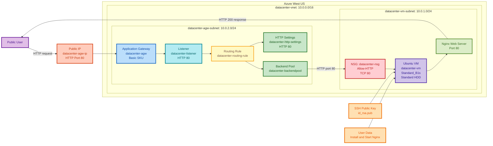

# Azure VM and Application Gateway

## Why the original OTS failed

- **Incorrect copy format:** The script contained `$(bash ... )`, which launched a nested shell, captured output, and caused blank output and terminal redirection.
- **Copied instructions:** The text `Copy only the script...` was copied into the script and interpreted as a command.
- **Incorrect VM parameter:** This Azure CLI requires `--storage-sku Standard_LRS`, not `--os-disk-sku`.
- **Azure Policy restriction:** The subscription permits only Application Gateway `Basic`, while the installed CLI recognizes only older and Standard/WAF SKUs.
- **REST payload issue:** The initial REST payload placed `sku` at the top level. Application Gateway REST requests require it inside `properties` ([Microsoft REST API](https://learn.microsoft.com/en-us/rest/api/application-gateway/application-gateways/create-or-update)).
- **Why manual steps worked:** Each failure was isolated and corrected. Previously created resources remained available, and the Basic Application Gateway was successfully created through the ARM REST API.

## Final OTS

```bash
#!/usr/bin/env bash
set -euo pipefail

RG="$(az group list --query '[0].name' -o tsv)"
LOCATION="westus"

VM_NAME="datacenter-vm"
NSG_NAME="datacenter-nsg"
VNET_NAME="datacenter-vnet"
VM_SUBNET="datacenter-vm-subnet"
AGW_SUBNET="datacenter-agw-subnet"

AGW_NAME="datacenter-agw"
AGW_PIP_NAME="datacenter-agw-ip"

echo "============================================================"
echo "TASK 1: Validate Azure authentication"
echo "============================================================"

az account show \
  --query '{Subscription:name,User:user.name}' \
  -o table

echo "Resource group: $RG"
echo "Region: $LOCATION"

echo "============================================================"
echo "TASK 2: Create SSH key"
echo "============================================================"

mkdir -p ~/.ssh
chmod 700 ~/.ssh

if [[ ! -f ~/.ssh/id_rsa.pub ]]; then
    ssh-keygen \
      -t rsa \
      -b 4096 \
      -f ~/.ssh/id_rsa \
      -N ""
    echo "SSH key created."
else
    echo "SSH key already exists."
fi

echo "============================================================"
echo "TASK 3: Create Network Security Group"
echo "============================================================"

if ! az network nsg show \
  -g "$RG" \
  -n "$NSG_NAME" >/dev/null 2>&1; then

    az network nsg create \
      -g "$RG" \
      -n "$NSG_NAME" \
      -l "$LOCATION" \
      -o table
else
    echo "NSG already exists."
fi

echo "============================================================"
echo "TASK 4: Allow inbound TCP port 80"
echo "============================================================"

if ! az network nsg rule show \
  -g "$RG" \
  --nsg-name "$NSG_NAME" \
  -n Allow-HTTP >/dev/null 2>&1; then

    az network nsg rule create \
      -g "$RG" \
      --nsg-name "$NSG_NAME" \
      -n Allow-HTTP \
      --priority 100 \
      --direction Inbound \
      --access Allow \
      --protocol Tcp \
      --source-address-prefixes "*" \
      --source-port-ranges "*" \
      --destination-address-prefixes "*" \
      --destination-port-ranges 80 \
      -o table
else
    echo "Allow-HTTP rule already exists."
fi

echo "============================================================"
echo "TASK 5: Create virtual network"
echo "============================================================"

if ! az network vnet show \
  -g "$RG" \
  -n "$VNET_NAME" >/dev/null 2>&1; then

    az network vnet create \
      -g "$RG" \
      -n "$VNET_NAME" \
      -l "$LOCATION" \
      --address-prefixes 10.0.0.0/16 \
      -o table
else
    echo "Virtual network already exists."
fi

echo "============================================================"
echo "TASK 6: Create VM subnet"
echo "============================================================"

if ! az network vnet subnet show \
  -g "$RG" \
  --vnet-name "$VNET_NAME" \
  -n "$VM_SUBNET" >/dev/null 2>&1; then

    az network vnet subnet create \
      -g "$RG" \
      --vnet-name "$VNET_NAME" \
      -n "$VM_SUBNET" \
      --address-prefixes 10.0.1.0/24 \
      -o table
else
    echo "VM subnet already exists."
fi

echo "============================================================"
echo "TASK 7: Create Application Gateway subnet"
echo "============================================================"

if ! az network vnet subnet show \
  -g "$RG" \
  --vnet-name "$VNET_NAME" \
  -n "$AGW_SUBNET" >/dev/null 2>&1; then

    az network vnet subnet create \
      -g "$RG" \
      --vnet-name "$VNET_NAME" \
      -n "$AGW_SUBNET" \
      --address-prefixes 10.0.2.0/24 \
      -o table
else
    echo "Application Gateway subnet already exists."
fi

echo "============================================================"
echo "TASK 8: Create Nginx user-data configuration"
echo "============================================================"

cat >/tmp/cloud-init.yaml <<'EOF'
#cloud-config
package_update: true
packages:
  - nginx
runcmd:
  - systemctl enable nginx
  - systemctl start nginx
EOF

echo "Nginx user-data file created."

echo "============================================================"
echo "TASK 9: Create Ubuntu VM"
echo "============================================================"

if ! az vm show \
  -g "$RG" \
  -n "$VM_NAME" >/dev/null 2>&1; then

    az vm create \
      -g "$RG" \
      -n "$VM_NAME" \
      -l "$LOCATION" \
      --image Ubuntu2204 \
      --size Standard_B1s \
      --admin-username azureuser \
      --authentication-type ssh \
      --ssh-key-values ~/.ssh/id_rsa.pub \
      --storage-sku Standard_LRS \
      --vnet-name "$VNET_NAME" \
      --subnet "$VM_SUBNET" \
      --nsg "$NSG_NAME" \
      --public-ip-address "" \
      --custom-data /tmp/cloud-init.yaml \
      -o table
else
    echo "VM already exists."
fi

echo "Waiting for VM deployment..."

az vm wait \
  -g "$RG" \
  -n "$VM_NAME" \
  --created

VM_IP="$(az vm show \
  -g "$RG" \
  -n "$VM_NAME" \
  --show-details \
  --query privateIps \
  -o tsv)"

echo "VM private IP: $VM_IP"

echo "============================================================"
echo "TASK 10: Create Application Gateway public IP"
echo "============================================================"

if ! az network public-ip show \
  -g "$RG" \
  -n "$AGW_PIP_NAME" >/dev/null 2>&1; then

    az network public-ip create \
      -g "$RG" \
      -n "$AGW_PIP_NAME" \
      -l "$LOCATION" \
      --sku Standard \
      --allocation-method Static \
      -o table
else
    echo "Application Gateway public IP already exists."
fi

echo "============================================================"
echo "TASK 11: Prepare Application Gateway resource IDs"
echo "============================================================"

SUBSCRIPTION_ID="$(az account show --query id -o tsv)"

SUBNET_ID="$(az network vnet subnet show \
  -g "$RG" \
  --vnet-name "$VNET_NAME" \
  -n "$AGW_SUBNET" \
  --query id \
  -o tsv)"

PUBLIC_IP_ID="$(az network public-ip show \
  -g "$RG" \
  -n "$AGW_PIP_NAME" \
  --query id \
  -o tsv)"

AGW_ID="/subscriptions/${SUBSCRIPTION_ID}/resourceGroups/${RG}/providers/Microsoft.Network/applicationGateways/${AGW_NAME}"

echo "VM private IP: $VM_IP"
echo "Gateway subnet ID: $SUBNET_ID"
echo "Public IP ID: $PUBLIC_IP_ID"

echo "============================================================"
echo "TASK 12: Create Basic SKU Application Gateway"
echo "============================================================"

if ! az network application-gateway show \
  -g "$RG" \
  -n "$AGW_NAME" >/dev/null 2>&1; then

    cat >/tmp/datacenter-agw.json <<EOF
{
  "location": "${LOCATION}",
  "properties": {
    "sku": {
      "name": "Basic",
      "tier": "Basic",
      "capacity": 1
    },
    "gatewayIPConfigurations": [
      {
        "name": "datacenter-agw-ipconfig",
        "properties": {
          "subnet": {
            "id": "${SUBNET_ID}"
          }
        }
      }
    ],
    "frontendIPConfigurations": [
      {
        "name": "datacenter-frontend-ip",
        "properties": {
          "publicIPAddress": {
            "id": "${PUBLIC_IP_ID}"
          }
        }
      }
    ],
    "frontendPorts": [
      {
        "name": "datacenter-frontend-port",
        "properties": {
          "port": 80
        }
      }
    ],
    "backendAddressPools": [
      {
        "name": "datacenter-backendpool",
        "properties": {
          "backendAddresses": [
            {
              "ipAddress": "${VM_IP}"
            }
          ]
        }
      }
    ],
    "backendHttpSettingsCollection": [
      {
        "name": "datacenter-http-settings",
        "properties": {
          "port": 80,
          "protocol": "Http",
          "cookieBasedAffinity": "Disabled",
          "requestTimeout": 30
        }
      }
    ],
    "httpListeners": [
      {
        "name": "datacenter-listener",
        "properties": {
          "frontendIPConfiguration": {
            "id": "${AGW_ID}/frontendIPConfigurations/datacenter-frontend-ip"
          },
          "frontendPort": {
            "id": "${AGW_ID}/frontendPorts/datacenter-frontend-port"
          },
          "protocol": "Http",
          "requireServerNameIndication": false
        }
      }
    ],
    "requestRoutingRules": [
      {
        "name": "datacenter-routing-rule",
        "properties": {
          "ruleType": "Basic",
          "priority": 100,
          "httpListener": {
            "id": "${AGW_ID}/httpListeners/datacenter-listener"
          },
          "backendAddressPool": {
            "id": "${AGW_ID}/backendAddressPools/datacenter-backendpool"
          },
          "backendHttpSettings": {
            "id": "${AGW_ID}/backendHttpSettingsCollection/datacenter-http-settings"
          }
        }
      }
    ],
    "enableHttp2": false
  }
}
EOF

    echo "Submitting Basic Application Gateway deployment..."

    az rest \
      --method put \
      --url "https://management.azure.com${AGW_ID}?api-version=2025-05-01" \
      --body @/tmp/datacenter-agw.json \
      --output none

    echo "Application Gateway deployment submitted."
else
    echo "Application Gateway already exists."
fi

echo "============================================================"
echo "TASK 13: Wait for Application Gateway deployment"
echo "============================================================"

DEPLOYMENT_COMPLETE="false"

for ATTEMPT in {1..60}; do
    STATE="$(az network application-gateway show \
      -g "$RG" \
      -n "$AGW_NAME" \
      --query provisioningState \
      -o tsv 2>/dev/null || true)"

    OPERATIONAL_STATE="$(az network application-gateway show \
      -g "$RG" \
      -n "$AGW_NAME" \
      --query operationalState \
      -o tsv 2>/dev/null || true)"

    echo "Attempt $ATTEMPT: Provisioning=$STATE, Operational=$OPERATIONAL_STATE"

    if [[ "$STATE" == "Succeeded" ]]; then
        DEPLOYMENT_COMPLETE="true"
        break
    fi

    if [[ "$STATE" == "Failed" ]]; then
        echo "ERROR: Application Gateway deployment failed."
        exit 1
    fi

    sleep 30
done

if [[ "$DEPLOYMENT_COMPLETE" != "true" ]]; then
    echo "ERROR: Application Gateway deployment did not finish."
    exit 1
fi

echo "Application Gateway deployment succeeded."

echo "============================================================"
echo "TASK 14: Verify Application Gateway configuration"
echo "============================================================"

az network application-gateway show \
  -g "$RG" \
  -n "$AGW_NAME" \
  --query '{
    Name:name,
    SKU:sku.name,
    State:provisioningState,
    OperationalState:operationalState,
    BackendPools:backendAddressPools[].name,
    HTTPSettings:backendHttpSettingsCollection[].name,
    Listeners:httpListeners[].name,
    Rules:requestRoutingRules[].name
  }' \
  -o json

echo "============================================================"
echo "TASK 15: Test Nginx through Application Gateway"
echo "============================================================"

AGW_PUBLIC_IP="$(az network public-ip show \
  -g "$RG" \
  -n "$AGW_PIP_NAME" \
  --query ipAddress \
  -o tsv)"

echo "Application Gateway URL: http://$AGW_PUBLIC_IP"

WEBSITE_READY="false"

for ATTEMPT in {1..20}; do
    HTTP_STATUS="$(curl \
      --silent \
      --output /dev/null \
      --max-time 20 \
      --write-out '%{http_code}' \
      "http://$AGW_PUBLIC_IP" || true)"

    echo "Attempt $ATTEMPT: HTTP $HTTP_STATUS"

    if [[ "$HTTP_STATUS" == "200" ]]; then
        WEBSITE_READY="true"
        break
    fi

    sleep 15
done

if [[ "$WEBSITE_READY" != "true" ]]; then
    echo "ERROR: Website did not return HTTP 200."
    exit 1
fi

echo "============================================================"
echo "DEPLOYMENT COMPLETED SUCCESSFULLY"
echo "============================================================"
echo "VM                   : $VM_NAME"
echo "VM private IP        : $VM_IP"
echo "Application Gateway  : $AGW_NAME"
echo "Application Gateway  : Basic SKU"
echo "Public IP            : $AGW_PUBLIC_IP"
echo "Website              : http://$AGW_PUBLIC_IP"
echo "HTTP result          : 200 OK"
echo "============================================================"
```

## Runbook

### Resource configuration

| Resource | Configuration |
|---|---|
| Region | `westus` |
| VM | `datacenter-vm` |
| VM image | Ubuntu 22.04 |
| VM size | `Standard_B1s` |
| OS disk | Standard HDD |
| Authentication | SSH public key |
| NSG | `datacenter-nsg` |
| NSG rule | `Allow-HTTP`, inbound TCP 80 |
| Application Gateway | `datacenter-agw` |
| Gateway SKU | `Basic` |
| Public IP | `datacenter-agw-ip` |
| Backend pool | `datacenter-backendpool` |
| HTTP settings | `datacenter-http-settings`, HTTP 80 |
| Listener | `datacenter-listener`, HTTP 80 |
| Routing rule | `datacenter-routing-rule` |

### Validate the VM

```bash
RG="$(az group list --query '[0].name' -o tsv)"

az vm show \
  -g "$RG" \
  -n datacenter-vm \
  --show-details \
  --query '{
    Name:name,
    Location:location,
    Size:hardwareProfile.vmSize,
    PrivateIP:privateIps,
    State:powerState
  }' \
  -o table
```

### Validate the NSG

```bash
az network nsg rule show \
  -g "$RG" \
  --nsg-name datacenter-nsg \
  -n Allow-HTTP \
  --query '{
    Name:name,
    Access:access,
    Direction:direction,
    Protocol:protocol,
    Port:destinationPortRange
  }' \
  -o table
```

### Validate Application Gateway

```bash
az network application-gateway show \
  -g "$RG" \
  -n datacenter-agw \
  --query '{
    Name:name,
    SKU:sku.name,
    State:provisioningState,
    OperationalState:operationalState,
    BackendPools:backendAddressPools[].name,
    HTTPSettings:backendHttpSettingsCollection[].name,
    Listeners:httpListeners[].name,
    Rules:requestRoutingRules[].name
  }' \
  -o json
```

Expected values:

```json
{
  "BackendPools": [
    "datacenter-backendpool"
  ],
  "HTTPSettings": [
    "datacenter-http-settings"
  ],
  "Listeners": [
    "datacenter-listener"
  ],
  "OperationalState": "Running",
  "Rules": [
    "datacenter-routing-rule"
  ],
  "SKU": "Basic",
  "State": "Succeeded"
}
```

### Validate the public endpoint

```bash
AGW_IP="$(az network public-ip show \
  -g "$RG" \
  -n datacenter-agw-ip \
  --query ipAddress \
  -o tsv)"

echo "http://$AGW_IP"
curl -I "http://$AGW_IP"
```

Expected result:

```text
HTTP/1.1 200 OK
Server: nginx
```

### Validate backend health

```bash
az network application-gateway show-backend-health \
  -g "$RG" \
  -n datacenter-agw \
  -o table
```

## Colorful Mermaid Diagram

