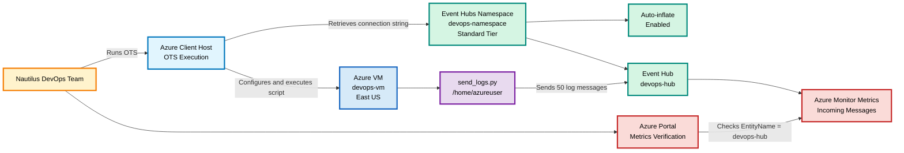

# OTS

```bash
#!/usr/bin/env bash

set -euo pipefail

LOCATION="eastus"
VM_NAME="devops-vm"
NAMESPACE_NAME="devops-namespace"
EVENT_HUB_NAME="devops-hub"
SCRIPT_PATH="/home/azureuser/send_logs.py"

echo "============================================================"
echo "Azure VM to Event Hubs Integration"
echo "============================================================"

echo
echo "[1/7] Validating Azure authentication..."
az account show --output none
echo "SUCCESS: Azure authentication validated."

echo
echo "[2/7] Locating existing VM..."

RG="$(az vm list \
  --query "[?name=='${VM_NAME}'].resourceGroup | [0]" \
  --output tsv)"

if [[ -z "$RG" ]]; then
    echo "ERROR: VM ${VM_NAME} was not found."
    exit 1
fi

VM_LOCATION="$(az vm show \
  --resource-group "$RG" \
  --name "$VM_NAME" \
  --query location \
  --output tsv)"

if [[ "$VM_LOCATION" != "$LOCATION" ]]; then
    echo "ERROR: VM is not located in East US."
    exit 1
fi

echo "SUCCESS: VM ${VM_NAME} found."
echo "Resource group: ${RG}"
echo "Location: ${VM_LOCATION}"

echo
echo "[3/7] Creating or validating Event Hubs namespace..."

if az eventhubs namespace show \
  --resource-group "$RG" \
  --name "$NAMESPACE_NAME" \
  --output none 2>/dev/null; then

    echo "INFO: Namespace already exists."

    az eventhubs namespace update \
      --resource-group "$RG" \
      --name "$NAMESPACE_NAME" \
      --set isAutoInflateEnabled=true maximumThroughputUnits=10 \
      --output none
else
    az eventhubs namespace create \
      --resource-group "$RG" \
      --name "$NAMESPACE_NAME" \
      --location "$LOCATION" \
      --sku Standard \
      --capacity 1 \
      --enable-auto-inflate true \
      --maximum-throughput-units 10 \
      --output none
fi

NS_LOCATION="$(az eventhubs namespace show \
  --resource-group "$RG" \
  --name "$NAMESPACE_NAME" \
  --query location \
  --output tsv)"

NS_TIER="$(az eventhubs namespace show \
  --resource-group "$RG" \
  --name "$NAMESPACE_NAME" \
  --query sku.name \
  --output tsv)"

AUTO_INFLATE="$(az eventhubs namespace show \
  --resource-group "$RG" \
  --name "$NAMESPACE_NAME" \
  --query isAutoInflateEnabled \
  --output tsv)"

[[ "$NS_LOCATION" == "$LOCATION" ]] || {
    echo "ERROR: Namespace is not in East US."
    exit 1
}

[[ "$NS_TIER" == "Standard" ]] || {
    echo "ERROR: Namespace is not using Standard tier."
    exit 1
}

[[ "$AUTO_INFLATE" == "true" || "$AUTO_INFLATE" == "True" ]] || {
    echo "ERROR: Auto-inflate is not enabled."
    exit 1
}

az eventhubs namespace show \
  --resource-group "$RG" \
  --name "$NAMESPACE_NAME" \
  --query '{
    Name:name,
    Location:location,
    Tier:sku.name,
    AutoInflate:isAutoInflateEnabled,
    MaximumThroughputUnits:maximumThroughputUnits,
    State:provisioningState
  }' \
  --output table

echo "SUCCESS: Namespace configuration validated."

echo
echo "[4/7] Creating or validating Event Hub..."

if az eventhubs eventhub show \
  --resource-group "$RG" \
  --namespace-name "$NAMESPACE_NAME" \
  --name "$EVENT_HUB_NAME" \
  --output none 2>/dev/null; then

    echo "INFO: Event Hub already exists."
else
    az eventhubs eventhub create \
      --resource-group "$RG" \
      --namespace-name "$NAMESPACE_NAME" \
      --name "$EVENT_HUB_NAME" \
      --output none
fi

az eventhubs eventhub show \
  --resource-group "$RG" \
  --namespace-name "$NAMESPACE_NAME" \
  --name "$EVENT_HUB_NAME" \
  --query '{
    Name:name,
    Status:status,
    Partitions:partitionCount
  }' \
  --output table

echo "SUCCESS: Event Hub validated."

echo
echo "[5/7] Retrieving Event Hubs connection string..."

CONNECTION_STRING="$(az eventhubs namespace authorization-rule keys list \
  --resource-group "$RG" \
  --namespace-name "$NAMESPACE_NAME" \
  --authorization-rule-name RootManageSharedAccessKey \
  --query primaryConnectionString \
  --output tsv)"

if [[ -z "$CONNECTION_STRING" ]]; then
    echo "ERROR: Connection string is empty."
    exit 1
fi

CONNECTION_B64="$(printf '%s' "$CONNECTION_STRING" | base64 -w 0)"

echo "SUCCESS: Connection string retrieved."

echo
echo "[6/7] Configuring and executing send_logs.py..."

REMOTE_COMMAND=$(cat <<EOF
set -e

cd /home/azureuser

if [ ! -f "${SCRIPT_PATH}" ]; then
    echo "ERROR: ${SCRIPT_PATH} was not found."
    exit 1
fi

if ! python3 -c "import azure.eventhub" 2>/dev/null; then
    echo "Installing azure-eventhub package..."
    python3 -m pip install --user azure-eventhub --quiet
fi

python3 - <<'PYTHON'
import base64
import re
import shutil

path = "/home/azureuser/send_logs.py"
backup = "/home/azureuser/send_logs.py.backup"

connection_string = base64.b64decode(
    "${CONNECTION_B64}"
).decode("utf-8")

shutil.copy2(path, backup)

with open(path, "r") as file:
    content = file.read()

pattern = re.compile(
    r'^(\s*)connection_str\s*=.*$',
    re.MULTILINE
)

content, replacements = pattern.subn(
    lambda match: (
        f"{match.group(1)}connection_str = "
        f"{connection_string!r}"
    ),
    content
)

if replacements == 0:
    raise RuntimeError(
        "connection_str assignment was not found"
    )

with open(path, "w") as file:
    file.write(content)

print("SUCCESS: Connection string configured.")
PYTHON

for RUN in 1 2 3 4 5; do
    echo "============================================================"
    echo "Executing send_logs.py: Run \$RUN of 5"
    python3 "${SCRIPT_PATH}"
    echo "Run \$RUN completed successfully."
    sleep 3
done

echo "REMOTE_SUCCESS: send_logs.py executed five times."
EOF
)

RUN_OUTPUT="$(az vm run-command invoke \
  --resource-group "$RG" \
  --name "$VM_NAME" \
  --command-id RunShellScript \
  --scripts "$REMOTE_COMMAND" \
  --query "value[].message" \
  --output tsv)"

echo "$RUN_OUTPUT"

if echo "$RUN_OUTPUT" | grep -q "Traceback"; then
    echo "ERROR: send_logs.py returned a Python error."
    exit 1
fi

if ! echo "$RUN_OUTPUT" | grep -q "REMOTE_SUCCESS"; then
    echo "ERROR: Successful execution was not confirmed."
    exit 1
fi

echo "SUCCESS: 50 log messages were sent."

echo
echo "[7/7] Checking incoming-message metrics..."

NAMESPACE_ID="$(az eventhubs namespace show \
  --resource-group "$RG" \
  --name "$NAMESPACE_NAME" \
  --query id \
  --output tsv)"

METRICS_FOUND="false"

for ATTEMPT in 1 2 3 4 5; do
    echo "Metrics check: Attempt ${ATTEMPT} of 5"

    VALUES="$(az monitor metrics list \
      --resource "$NAMESPACE_ID" \
      --metric IncomingMessages \
      --interval PT1M \
      --aggregation Total \
      --query "value[0].timeseries[].data[].total" \
      --output tsv 2>/dev/null || true)"

    TOTAL="$(echo "$VALUES" | awk '
      NF && $1 != "null" {
          total += $1
      }
      END {
          print total + 0
      }
    ')"

    echo "Incoming messages: ${TOTAL}"

    if awk "BEGIN {exit !(${TOTAL} > 0)}"; then
        METRICS_FOUND="true"
        break
    fi

    echo "Waiting 30 seconds for metrics..."
    sleep 30
done

echo
echo "============================================================"
echo "OTS completed successfully"
echo "============================================================"
echo "Resource group : ${RG}"
echo "Region         : East US"
echo "Namespace      : ${NAMESPACE_NAME}"
echo "Tier           : Standard"
echo "Auto-inflate   : Enabled"
echo "Event Hub      : ${EVENT_HUB_NAME}"
echo "VM             : ${VM_NAME}"
echo "Script runs    : 5"
echo "Messages sent  : 50"
echo "Metrics found  : ${METRICS_FOUND}"
echo
echo "Portal verification:"
echo "devops-namespace > Metrics > Incoming Messages"
echo "Filter: EntityName = devops-hub"
echo "============================================================"
```

Execution:

```bash
chmod +x ots.sh
bash -n ots.sh && echo "Syntax OK"
./ots.sh
```

# Runbook

## Configuration

| Component | Required value |
|---|---|
| Region | East US |
| Existing VM | `devops-vm` |
| Python script | `/home/azureuser/send_logs.py` |
| Namespace | `devops-namespace` |
| Pricing tier | Standard |
| Auto-inflate | Enabled |
| Event Hub | `devops-hub` |

## Procedure

### Locate the VM resource group

```bash
RG="$(az vm list \
  --query "[?name=='devops-vm'].resourceGroup | [0]" \
  -o tsv)"
```

### Create the namespace

```bash
az eventhubs namespace create \
  --resource-group "$RG" \
  --name devops-namespace \
  --location eastus \
  --sku Standard \
  --capacity 1 \
  --enable-auto-inflate true \
  --maximum-throughput-units 10
```

### Create the Event Hub

```bash
az eventhubs eventhub create \
  --resource-group "$RG" \
  --namespace-name devops-namespace \
  --name devops-hub
```

### Retrieve the connection string

```bash
CONNECTION_STRING="$(az eventhubs namespace authorization-rule keys list \
  --resource-group "$RG" \
  --namespace-name devops-namespace \
  --authorization-rule-name RootManageSharedAccessKey \
  --query primaryConnectionString \
  -o tsv)"
```

### Configure `send_logs.py`

Replace:

```python
connection_str = "<your_event_hub_connection_string>"
```

with the retrieved connection string.

The OTS performs this replacement automatically and creates this backup:

```text
/home/azureuser/send_logs.py.backup
```

### Execute the script multiple times

```bash
cd /home/azureuser

for RUN in 1 2 3 4 5; do
    python3 send_logs.py
    sleep 3
done
```

Each execution sends ten messages. Five executions send fifty messages.

### Verify metrics

1. Open the Azure portal.
2. Open **Event Hubs Namespaces**.
3. Select `devops-namespace`.
4. Open **Metrics**.
5. Add the **Incoming Messages** metric.
6. Set the filter to `EntityName = devops-hub`.
7. Confirm that incoming messages are greater than zero.

## Validation checklist

- [ ] VM `devops-vm` exists in East US.
- [ ] Namespace `devops-namespace` exists in East US.
- [ ] Namespace uses the Standard tier.
- [ ] Auto-inflate is enabled.
- [ ] Event Hub `devops-hub` exists.
- [ ] The connection-string placeholder was replaced.
- [ ] `send_logs.py` executed multiple times.
- [ ] Incoming Messages is greater than zero.

# Mermaid

