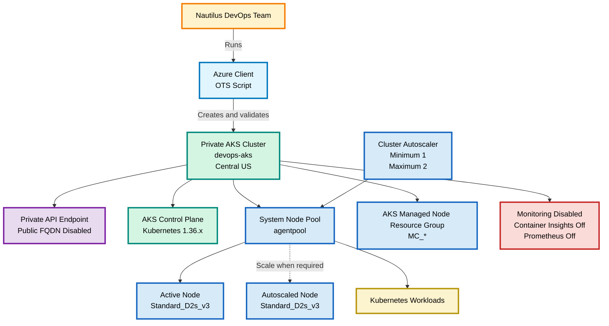

# OTS

Copy only from `#!/usr/bin/env bash` to the final line inside the block.

```bash
#!/usr/bin/env bash

set -euo pipefail

LOCATION="centralus"
CLUSTER_NAME="devops-aks"
NODEPOOL_NAME="agentpool"
NODE_VM_SIZE="Standard_D2s_v3"
MIN_COUNT=1
MAX_COUNT=2

echo "============================================================"
echo "AKS Private Cluster OTS"
echo "============================================================"

echo
echo "[1/6] Validating Azure authentication..."

az account show --output none
echo "SUCCESS: Azure authentication validated."

echo
echo "[2/6] Locating existing resource group..."

RG="$(az group list --query "[0].name" --output tsv)"

if [[ -z "$RG" ]]; then
    echo "ERROR: No existing resource group was found."
    exit 1
fi

echo "SUCCESS: Resource group: ${RG}"
echo "Required region: ${LOCATION}"

echo
echo "[3/6] Selecting an available Kubernetes 1.36.x release..."

K8S_VERSION="$(az aks get-versions \
  --location "$LOCATION" \
  --query "sort(keys(values[?version=='1.36'].patchVersions | [0]))[-1]" \
  --output tsv 2>/dev/null || true)"

if [[ -z "$K8S_VERSION" || "$K8S_VERSION" == "null" ]]; then
    echo "ERROR: Kubernetes 1.36.x is unavailable in Central US."
    exit 1
fi

echo "SUCCESS: Selected Kubernetes ${K8S_VERSION}."

echo
echo "[4/6] Creating or locating AKS cluster..."

if az aks show \
  --resource-group "$RG" \
  --name "$CLUSTER_NAME" \
  --output none 2>/dev/null; then

    echo "INFO: Cluster ${CLUSTER_NAME} already exists."
else
    echo "INFO: Creating private AKS cluster."
    echo "INFO: This deployment can take several minutes."

    az aks create \
      --resource-group "$RG" \
      --name "$CLUSTER_NAME" \
      --location "$LOCATION" \
      --kubernetes-version "$K8S_VERSION" \
      --enable-private-cluster \
      --disable-public-fqdn \
      --nodepool-name "$NODEPOOL_NAME" \
      --node-vm-size "$NODE_VM_SIZE" \
      --node-count "$MIN_COUNT" \
      --enable-cluster-autoscaler \
      --min-count "$MIN_COUNT" \
      --max-count "$MAX_COUNT" \
      --generate-ssh-keys \
      --output none

    echo "SUCCESS: Private AKS cluster created."
fi

echo
echo "[5/6] Disabling monitoring..."

OMS_ENABLED="$(az aks show \
  --resource-group "$RG" \
  --name "$CLUSTER_NAME" \
  --query addonProfiles.omsagent.enabled \
  --output tsv)"

if [[ "$OMS_ENABLED" == "true" ||
      "$OMS_ENABLED" == "True" ]]; then

    az aks disable-addons \
      --resource-group "$RG" \
      --name "$CLUSTER_NAME" \
      --addons monitoring \
      --output none

    echo "SUCCESS: Container Insights disabled."
else
    echo "INFO: Container Insights is already disabled."
fi

PROMETHEUS_ENABLED="$(az aks show \
  --resource-group "$RG" \
  --name "$CLUSTER_NAME" \
  --query azureMonitorProfile.metrics.enabled \
  --output tsv)"

if [[ "$PROMETHEUS_ENABLED" == "true" ||
      "$PROMETHEUS_ENABLED" == "True" ]]; then

    az aks update \
      --resource-group "$RG" \
      --name "$CLUSTER_NAME" \
      --disable-azure-monitor-metrics \
      --output none

    echo "SUCCESS: Managed Prometheus disabled."
else
    echo "INFO: Managed Prometheus is already disabled."
fi

AKS_ID="$(az aks show \
  --resource-group "$RG" \
  --name "$CLUSTER_NAME" \
  --query id \
  --output tsv)"

DIAGNOSTIC_SETTINGS="$(az monitor diagnostic-settings list \
  --resource "$AKS_ID" \
  --query "value[].name" \
  --output tsv 2>/dev/null || true)"

if [[ -n "$DIAGNOSTIC_SETTINGS" ]]; then
    for SETTING in $DIAGNOSTIC_SETTINGS; do
        echo "INFO: Removing diagnostic setting ${SETTING}."

        az monitor diagnostic-settings delete \
          --resource "$AKS_ID" \
          --name "$SETTING"
    done
else
    echo "INFO: No AKS diagnostic settings exist."
fi

echo
echo "[6/6] Verifying final configuration..."

CLUSTER_LOCATION="$(az aks show \
  --resource-group "$RG" \
  --name "$CLUSTER_NAME" \
  --query location \
  --output tsv)"

CLUSTER_VERSION="$(az aks show \
  --resource-group "$RG" \
  --name "$CLUSTER_NAME" \
  --query currentKubernetesVersion \
  --output tsv)"

if [[ -z "$CLUSTER_VERSION" ]]; then
    CLUSTER_VERSION="$(az aks show \
      --resource-group "$RG" \
      --name "$CLUSTER_NAME" \
      --query kubernetesVersion \
      --output tsv)"
fi

PRIVATE_CLUSTER="$(az aks show \
  --resource-group "$RG" \
  --name "$CLUSTER_NAME" \
  --query apiServerAccessProfile.enablePrivateCluster \
  --output tsv)"

PUBLIC_FQDN="$(az aks show \
  --resource-group "$RG" \
  --name "$CLUSTER_NAME" \
  --query apiServerAccessProfile.enablePrivateClusterPublicFqdn \
  --output tsv)"

PROVISIONING_STATE="$(az aks show \
  --resource-group "$RG" \
  --name "$CLUSTER_NAME" \
  --query provisioningState \
  --output tsv)"

POWER_STATE="$(az aks show \
  --resource-group "$RG" \
  --name "$CLUSTER_NAME" \
  --query powerState.code \
  --output tsv)"

POOL_COUNT="$(az aks show \
  --resource-group "$RG" \
  --name "$CLUSTER_NAME" \
  --query "length(agentPoolProfiles)" \
  --output tsv)"

POOL_NAME="$(az aks show \
  --resource-group "$RG" \
  --name "$CLUSTER_NAME" \
  --query "agentPoolProfiles[0].name" \
  --output tsv)"

POOL_MODE="$(az aks show \
  --resource-group "$RG" \
  --name "$CLUSTER_NAME" \
  --query "agentPoolProfiles[0].mode" \
  --output tsv)"

POOL_SIZE="$(az aks show \
  --resource-group "$RG" \
  --name "$CLUSTER_NAME" \
  --query "agentPoolProfiles[0].vmSize" \
  --output tsv)"

CURRENT_NODES="$(az aks show \
  --resource-group "$RG" \
  --name "$CLUSTER_NAME" \
  --query "agentPoolProfiles[0].count" \
  --output tsv)"

POOL_MIN="$(az aks show \
  --resource-group "$RG" \
  --name "$CLUSTER_NAME" \
  --query "agentPoolProfiles[0].minCount" \
  --output tsv)"

POOL_MAX="$(az aks show \
  --resource-group "$RG" \
  --name "$CLUSTER_NAME" \
  --query "agentPoolProfiles[0].maxCount" \
  --output tsv)"

AUTOSCALING="$(az aks show \
  --resource-group "$RG" \
  --name "$CLUSTER_NAME" \
  --query "agentPoolProfiles[0].enableAutoScaling" \
  --output tsv)"

OMS_FINAL="$(az aks show \
  --resource-group "$RG" \
  --name "$CLUSTER_NAME" \
  --query addonProfiles.omsagent.enabled \
  --output tsv)"

PROMETHEUS_FINAL="$(az aks show \
  --resource-group "$RG" \
  --name "$CLUSTER_NAME" \
  --query azureMonitorProfile.metrics.enabled \
  --output tsv)"

[[ "$CLUSTER_LOCATION" == "$LOCATION" ]] || {
    echo "ERROR: Incorrect region."
    exit 1
}

[[ "$CLUSTER_VERSION" == "1.36" ||
   "$CLUSTER_VERSION" == 1.36.* ]] || {
    echo "ERROR: Kubernetes version is not 1.36.x."
    exit 1
}

[[ "$PRIVATE_CLUSTER" == "true" ||
   "$PRIVATE_CLUSTER" == "True" ]] || {
    echo "ERROR: Private endpoint is disabled."
    exit 1
}

[[ "$PUBLIC_FQDN" != "true" &&
   "$PUBLIC_FQDN" != "True" ]] || {
    echo "ERROR: Public FQDN is enabled."
    exit 1
}

[[ "$POOL_COUNT" == "1" ]] || {
    echo "ERROR: More than one node pool exists."
    exit 1
}

[[ "$POOL_NAME" == "$NODEPOOL_NAME" ]] || {
    echo "ERROR: The node pool is not agentpool."
    exit 1
}

[[ "$POOL_MODE" == "System" ]] || {
    echo "ERROR: agentpool is not a System pool."
    exit 1
}

[[ "$POOL_SIZE" == "$NODE_VM_SIZE" ]] || {
    echo "ERROR: Incorrect node size."
    exit 1
}

[[ "$POOL_MIN" == "$MIN_COUNT" ]] || {
    echo "ERROR: Minimum node count is incorrect."
    exit 1
}

[[ "$POOL_MAX" == "$MAX_COUNT" ]] || {
    echo "ERROR: Maximum node count is incorrect."
    exit 1
}

[[ "$AUTOSCALING" == "true" ||
   "$AUTOSCALING" == "True" ]] || {
    echo "ERROR: Autoscaling is disabled."
    exit 1
}

[[ "$OMS_FINAL" != "true" &&
   "$OMS_FINAL" != "True" ]] || {
    echo "ERROR: Container Insights is enabled."
    exit 1
}

[[ "$PROMETHEUS_FINAL" != "true" &&
   "$PROMETHEUS_FINAL" != "True" ]] || {
    echo "ERROR: Managed Prometheus is enabled."
    exit 1
}

[[ "$PROVISIONING_STATE" == "Succeeded" ]] || {
    echo "ERROR: Provisioning has not succeeded."
    exit 1
}

az aks show \
  --resource-group "$RG" \
  --name "$CLUSTER_NAME" \
  --query '{
    Name:name,
    Location:location,
    KubernetesVersion:currentKubernetesVersion,
    ProvisioningState:provisioningState,
    PowerState:powerState.code,
    PrivateCluster:apiServerAccessProfile.enablePrivateCluster,
    PublicFQDN:apiServerAccessProfile.enablePrivateClusterPublicFqdn,
    ContainerInsights:addonProfiles.omsagent.enabled,
    PrometheusMetrics:azureMonitorProfile.metrics.enabled
  }' \
  --output table

az aks show \
  --resource-group "$RG" \
  --name "$CLUSTER_NAME" \
  --query "agentPoolProfiles[].{
    Name:name,
    Mode:mode,
    VMSize:vmSize,
    Count:count,
    AutoScaling:enableAutoScaling,
    Minimum:minCount,
    Maximum:maxCount
  }" \
  --output table

echo
echo "============================================================"
echo "AKS configuration completed successfully"
echo "============================================================"
echo "Cluster            : ${CLUSTER_NAME}"
echo "Region             : Central US"
echo "Kubernetes version : ${CLUSTER_VERSION}"
echo "Private endpoint   : Enabled"
echo "Public FQDN        : Disabled"
echo "Node pools         : ${POOL_COUNT}"
echo "Node pool          : ${POOL_NAME}"
echo "Node pool mode     : ${POOL_MODE}"
echo "Node size          : ${POOL_SIZE}"
echo "Current nodes      : ${CURRENT_NODES}"
echo "Minimum nodes      : ${POOL_MIN}"
echo "Maximum nodes      : ${POOL_MAX}"
echo "Autoscaling        : Enabled"
echo "Container Insights : Disabled"
echo "Prometheus metrics : Disabled"
echo "Cluster state      : ${PROVISIONING_STATE}"
echo "Power state        : ${POWER_STATE}"
echo "============================================================"
```

Run:

```bash
chmod +x aks.sh
bash -n aks.sh && echo "Syntax OK"
./aks.sh
```

# Runbook

## Required configuration

| Property | Required value |
|---|---|
| Cluster name | `devops-aks` |
| Region | Central US |
| Kubernetes | Available `1.36.x` |
| API endpoint | Private |
| Public FQDN | Disabled |
| Node pool | `agentpool` only |
| Pool mode | System |
| Node size | `Standard_D2s_v3` |
| Minimum nodes | 1 |
| Maximum nodes | 2 |
| Autoscaling | Enabled |
| Container Insights | Disabled |
| Prometheus monitoring | Disabled |

## Procedure

### Select Kubernetes version

```bash
az aks get-versions \
  --location centralus \
  --query "values[?version=='1.36']" \
  --output jsonc
```

Select the latest key under `patchVersions`.

### Create the cluster

```bash
az aks create \
  --resource-group "$RG" \
  --name devops-aks \
  --location centralus \
  --kubernetes-version 1.36.2 \
  --enable-private-cluster \
  --disable-public-fqdn \
  --nodepool-name agentpool \
  --node-vm-size Standard_D2s_v3 \
  --node-count 1 \
  --enable-cluster-autoscaler \
  --min-count 1 \
  --max-count 2 \
  --generate-ssh-keys
```

### Disable monitoring

```bash
az aks disable-addons \
  --resource-group "$RG" \
  --name devops-aks \
  --addons monitoring
```

```bash
az aks update \
  --resource-group "$RG" \
  --name devops-aks \
  --disable-azure-monitor-metrics
```

### Verify cluster configuration

```bash
az aks show \
  --resource-group "$RG" \
  --name devops-aks \
  --query '{
    Name:name,
    Location:location,
    Version:currentKubernetesVersion,
    State:provisioningState,
    PowerState:powerState.code,
    Private:apiServerAccessProfile.enablePrivateCluster,
    PublicFQDN:apiServerAccessProfile.enablePrivateClusterPublicFqdn
  }' \
  --output table
```

### Verify node pool through the parent resource

```bash
az aks show \
  --resource-group "$RG" \
  --name devops-aks \
  --query "agentPoolProfiles[].{
    Name:name,
    Mode:mode,
    VMSize:vmSize,
    Count:count,
    AutoScaling:enableAutoScaling,
    Minimum:minCount,
    Maximum:maxCount
  }" \
  --output table
```

The lab identity might not display nodes in the portal because it cannot read the automatically created `MC_` node resource group. AKS stores node infrastructure in this secondary managed resource group ([Microsoft Learn](https://learn.microsoft.com/en-us/azure/aks/faq)).

## Validation checklist

- [ ] `devops-aks` exists.
- [ ] Region is Central US.
- [ ] Kubernetes version is `1.36.x`.
- [ ] Private endpoint is enabled.
- [ ] Public FQDN is disabled.
- [ ] Only `agentpool` exists.
- [ ] Pool mode is System.
- [ ] Node size is `Standard_D2s_v3`.
- [ ] Minimum node count is 1.
- [ ] Maximum node count is 2.
- [ ] Autoscaling is enabled.
- [ ] Container Insights is disabled.
- [ ] Prometheus metrics are disabled.
- [ ] Provisioning state is `Succeeded`.
- [ ] Power state is `Running`.

# Mermaid

