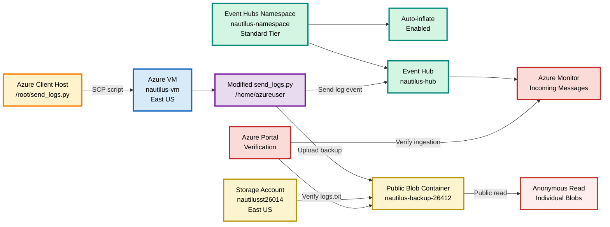

# OTS

Copy only from `#!/usr/bin/env bash`; do not copy the Markdown fences.

```bash
#!/usr/bin/env bash

set -euo pipefail

LOCATION="eastus"
NAMESPACE_NAME="nautilus-namespace"
EVENT_HUB_NAME="nautilus-hub"
STORAGE_ACCOUNT="nautilusst26014"
CONTAINER_NAME="nautilus-backup-26412"
VM_NAME="nautilus-vm"
VM_SIZE="Standard_B1s"
ADMIN_USER="azureuser"
SOURCE_SCRIPT="/root/send_logs.py"
DESTINATION_SCRIPT="/home/azureuser/send_logs.py"
SSH_PRIVATE_KEY="/root/.ssh/id_rsa"
SSH_PUBLIC_KEY="/root/.ssh/id_rsa.pub"

echo "============================================================"
echo "VM, Event Hubs and Blob Storage Integration"
echo "============================================================"

echo
echo "[1/9] Validating authentication and source script..."

az account show --output none

if [[ ! -f "$SOURCE_SCRIPT" ]]; then
    echo "ERROR: ${SOURCE_SCRIPT} was not found."
    exit 1
fi

RG="$(az group list --query "[0].name" --output tsv)"

if [[ -z "$RG" ]]; then
    echo "ERROR: Existing resource group was not found."
    exit 1
fi

echo "SUCCESS: Authentication validated."
echo "SUCCESS: Source script found."
echo "Resource group: ${RG}"

echo
echo "[2/9] Creating or validating Event Hubs namespace..."

if az eventhubs namespace show \
  -g "$RG" \
  -n "$NAMESPACE_NAME" \
  -o none 2>/dev/null; then

    echo "SKIPPED: Namespace already exists."

    az eventhubs namespace update \
      -g "$RG" \
      -n "$NAMESPACE_NAME" \
      --set isAutoInflateEnabled=true maximumThroughputUnits=10 \
      -o none
else
    az eventhubs namespace create \
      -g "$RG" \
      -n "$NAMESPACE_NAME" \
      -l "$LOCATION" \
      --sku Standard \
      --capacity 1 \
      --enable-auto-inflate true \
      --maximum-throughput-units 10 \
      -o none

    echo "SUCCESS: Namespace created."
fi

NS_LOCATION="$(az eventhubs namespace show \
  -g "$RG" -n "$NAMESPACE_NAME" --query location -o tsv)"

NS_SKU="$(az eventhubs namespace show \
  -g "$RG" -n "$NAMESPACE_NAME" --query sku.name -o tsv)"

AUTO_INFLATE="$(az eventhubs namespace show \
  -g "$RG" -n "$NAMESPACE_NAME" \
  --query isAutoInflateEnabled -o tsv)"

[[ "$NS_LOCATION" == "$LOCATION" ]] || {
    echo "ERROR: Namespace is not in East US."
    exit 1
}

[[ "$NS_SKU" == "Standard" ]] || {
    echo "ERROR: Namespace is not using Standard tier."
    exit 1
}

[[ "$AUTO_INFLATE" == "true" ||
   "$AUTO_INFLATE" == "True" ]] || {
    echo "ERROR: Auto-inflate is not enabled."
    exit 1
}

echo "SUCCESS: Namespace validated."

echo
echo "[3/9] Creating or validating Event Hub..."

if az eventhubs eventhub show \
  -g "$RG" \
  --namespace-name "$NAMESPACE_NAME" \
  -n "$EVENT_HUB_NAME" \
  -o none 2>/dev/null; then

    echo "SKIPPED: Event Hub already exists."
else
    az eventhubs eventhub create \
      -g "$RG" \
      --namespace-name "$NAMESPACE_NAME" \
      -n "$EVENT_HUB_NAME" \
      -o none

    echo "SUCCESS: Event Hub created."
fi

az eventhubs eventhub show \
  -g "$RG" \
  --namespace-name "$NAMESPACE_NAME" \
  -n "$EVENT_HUB_NAME" \
  --query "{Name:name,Status:status,Partitions:partitionCount}" \
  -o table

echo
echo "[4/9] Creating or validating Storage Account..."

if az storage account show \
  -g "$RG" \
  -n "$STORAGE_ACCOUNT" \
  -o none 2>/dev/null; then

    echo "SKIPPED: Storage Account already exists."

    az storage account update \
      -g "$RG" \
      -n "$STORAGE_ACCOUNT" \
      --allow-blob-public-access true \
      -o none
else
    az storage account create \
      -g "$RG" \
      -n "$STORAGE_ACCOUNT" \
      -l "$LOCATION" \
      --sku Standard_LRS \
      --kind StorageV2 \
      --allow-blob-public-access true \
      -o none

    echo "SUCCESS: Storage Account created."
fi

STORAGE_LOCATION="$(az storage account show \
  -g "$RG" \
  -n "$STORAGE_ACCOUNT" \
  --query primaryLocation \
  -o tsv)"

[[ "$STORAGE_LOCATION" == "$LOCATION" ]] || {
    echo "ERROR: Storage Account is not in East US."
    exit 1
}

STORAGE_KEY="$(az storage account keys list \
  -g "$RG" \
  --account-name "$STORAGE_ACCOUNT" \
  --query "[0].value" \
  -o tsv)"

if [[ -z "$STORAGE_KEY" ]]; then
    echo "ERROR: Storage Account key could not be retrieved."
    exit 1
fi

echo
echo "[5/9] Creating or validating public Blob container..."

CONTAINER_EXISTS="$(az storage container exists \
  --account-name "$STORAGE_ACCOUNT" \
  --account-key "$STORAGE_KEY" \
  --name "$CONTAINER_NAME" \
  --query exists \
  -o tsv)"

if [[ "$CONTAINER_EXISTS" == "true" ||
      "$CONTAINER_EXISTS" == "True" ]]; then

    echo "SKIPPED: Blob container already exists."
else
    az storage container create \
      --account-name "$STORAGE_ACCOUNT" \
      --account-key "$STORAGE_KEY" \
      --name "$CONTAINER_NAME" \
      --public-access blob \
      -o none

    echo "SUCCESS: Blob container created."
fi

az storage container set-permission \
  --account-name "$STORAGE_ACCOUNT" \
  --account-key "$STORAGE_KEY" \
  --name "$CONTAINER_NAME" \
  --public-access blob \
  -o none

PUBLIC_ACCESS="$(az storage container show \
  --account-name "$STORAGE_ACCOUNT" \
  --account-key "$STORAGE_KEY" \
  --name "$CONTAINER_NAME" \
  --query properties.publicAccess \
  -o tsv)"

[[ "$PUBLIC_ACCESS" == "blob" ]] || {
    echo "ERROR: Public read access is not enabled."
    exit 1
}

echo "SUCCESS: Container public access: ${PUBLIC_ACCESS}"

echo
echo "[6/9] Creating or validating Virtual Machine..."

if [[ ! -f "$SSH_PUBLIC_KEY" ]]; then
    mkdir -p /root/.ssh
    ssh-keygen -t rsa -b 4096 -f "$SSH_PRIVATE_KEY" -N ""
    echo "SUCCESS: SSH key pair created."
else
    echo "SKIPPED: SSH key pair already exists."
fi

if az vm show \
  -g "$RG" \
  -n "$VM_NAME" \
  -o none 2>/dev/null; then

    echo "SKIPPED: VM already exists."
else
    az vm create \
      -g "$RG" \
      -n "$VM_NAME" \
      -l "$LOCATION" \
      --image Ubuntu2204 \
      --size "$VM_SIZE" \
      --admin-username "$ADMIN_USER" \
      --authentication-type ssh \
      --ssh-key-values "$SSH_PUBLIC_KEY" \
      --storage-sku Standard_LRS \
      --public-ip-sku Standard \
      -o none

    echo "SUCCESS: VM created."
fi

VM_LOCATION="$(az vm show \
  -g "$RG" -n "$VM_NAME" --query location -o tsv)"

[[ "$VM_LOCATION" == "$LOCATION" ]] || {
    echo "ERROR: VM is not in East US."
    exit 1
}

VM_PUBLIC_IP="$(az vm show \
  -g "$RG" \
  -n "$VM_NAME" \
  --show-details \
  --query publicIps \
  -o tsv)"

if [[ -z "$VM_PUBLIC_IP" ]]; then
    echo "ERROR: VM does not have a public IP."
    exit 1
fi

echo "SUCCESS: VM public IP: ${VM_PUBLIC_IP}"

SSH_OPTIONS=(
  -i "$SSH_PRIVATE_KEY"
  -o StrictHostKeyChecking=no
  -o UserKnownHostsFile=/dev/null
  -o LogLevel=ERROR
)

echo
echo "[7/9] Waiting for SSH and copying send_logs.py..."

SSH_READY="false"

for ATTEMPT in $(seq 1 30); do
    echo "SSH check: Attempt ${ATTEMPT} of 30"

    if ssh "${SSH_OPTIONS[@]}" \
      -o ConnectTimeout=5 \
      "${ADMIN_USER}@${VM_PUBLIC_IP}" \
      "echo SSH ready" >/dev/null 2>&1; then

        SSH_READY="true"
        break
    fi

    sleep 10
done

if [[ "$SSH_READY" != "true" ]]; then
    echo "ERROR: Unable to connect to the VM."
    exit 1
fi

scp "${SSH_OPTIONS[@]}" \
  "$SOURCE_SCRIPT" \
  "${ADMIN_USER}@${VM_PUBLIC_IP}:${DESTINATION_SCRIPT}"

echo "SUCCESS: Script copied to ${DESTINATION_SCRIPT}."

echo
echo "[8/9] Configuring and executing send_logs.py..."

EVENT_HUB_CONNECTION="$(az eventhubs namespace authorization-rule keys list \
  -g "$RG" \
  --namespace-name "$NAMESPACE_NAME" \
  --authorization-rule-name RootManageSharedAccessKey \
  --query primaryConnectionString \
  -o tsv)"

STORAGE_CONNECTION="$(az storage account show-connection-string \
  -g "$RG" \
  -n "$STORAGE_ACCOUNT" \
  --query connectionString \
  -o tsv)"

if [[ -z "$EVENT_HUB_CONNECTION" ]]; then
    echo "ERROR: Event Hub connection string is empty."
    exit 1
fi

if [[ -z "$STORAGE_CONNECTION" ]]; then
    echo "ERROR: Storage connection string is empty."
    exit 1
fi

EVENT_HUB_B64="$(printf '%s' "$EVENT_HUB_CONNECTION" | base64 -w 0)"
STORAGE_B64="$(printf '%s' "$STORAGE_CONNECTION" | base64 -w 0)"

ssh "${SSH_OPTIONS[@]}" \
  "${ADMIN_USER}@${VM_PUBLIC_IP}" \
  "python3 -" <<PYTHON
import base64
import shutil

path = "${DESTINATION_SCRIPT}"
backup = "${DESTINATION_SCRIPT}.backup"

eventhub_connection = base64.b64decode(
    "${EVENT_HUB_B64}"
).decode("utf-8")

storage_connection = base64.b64decode(
    "${STORAGE_B64}"
).decode("utf-8")

shutil.copy2(path, backup)

with open(path, "r") as file:
    content = file.read()

eventhub_placeholder = "<Event Hub Connection String>"
storage_placeholder = "<Blob Storage Connection String>"

if eventhub_placeholder in content:
    content = content.replace(
        eventhub_placeholder,
        eventhub_connection
    )

if storage_placeholder in content:
    content = content.replace(
        storage_placeholder,
        storage_connection
    )

with open(path, "w") as file:
    file.write(content)

if eventhub_placeholder in content:
    raise RuntimeError("Event Hub placeholder remains.")

if storage_placeholder in content:
    raise RuntimeError("Blob Storage placeholder remains.")

print("SUCCESS: Event Hub connection string configured.")
print("SUCCESS: Blob Storage connection string configured.")
print(f"Backup created: {backup}")
PYTHON

echo "Installing Python package manager and dependencies..."

ssh "${SSH_OPTIONS[@]}" \
  "${ADMIN_USER}@${VM_PUBLIC_IP}" \
  "sudo apt-get update -y &&
   sudo DEBIAN_FRONTEND=noninteractive apt-get install -y python3-pip &&
   python3 -m pip install --user azure-eventhub azure-storage-blob &&
   python3 -c 'import azure.eventhub; import azure.storage.blob'"

echo "SUCCESS: Python dependencies installed."

SCRIPT_OUTPUT=""

for RUN in 1 2 3; do
    echo "Executing send_logs.py: Run ${RUN} of 3"

    CURRENT_OUTPUT="$(ssh "${SSH_OPTIONS[@]}" \
      "${ADMIN_USER}@${VM_PUBLIC_IP}" \
      "python3 ${DESTINATION_SCRIPT}")"

    echo "$CURRENT_OUTPUT"
    SCRIPT_OUTPUT="${SCRIPT_OUTPUT}${CURRENT_OUTPUT}"

    sleep 5
done

if ! echo "$SCRIPT_OUTPUT" | grep -q \
  "Log sent to Event Hub and backed up to Blob Storage"; then

    echo "ERROR: Successful script execution was not confirmed."
    exit 1
fi

echo "SUCCESS: send_logs.py executed three times."

echo
echo "[9/9] Verifying Event Hubs and Blob Storage..."

BLOB_COUNT="$(az storage blob list \
  --account-name "$STORAGE_ACCOUNT" \
  --account-key "$STORAGE_KEY" \
  --container-name "$CONTAINER_NAME" \
  --query "length(@)" \
  -o tsv)"

if [[ "$BLOB_COUNT" -lt 1 ]]; then
    echo "ERROR: No backup blobs were found."
    exit 1
fi

az storage blob list \
  --account-name "$STORAGE_ACCOUNT" \
  --account-key "$STORAGE_KEY" \
  --container-name "$CONTAINER_NAME" \
  --query "[].{
    Name:name,
    BlobType:properties.blobType,
    Size:properties.contentLength,
    LastModified:properties.lastModified
  }" \
  -o table

FIRST_BLOB="$(az storage blob list \
  --account-name "$STORAGE_ACCOUNT" \
  --account-key "$STORAGE_KEY" \
  --container-name "$CONTAINER_NAME" \
  --query "[0].name" \
  -o tsv)"

PUBLIC_BLOB_URL="https://${STORAGE_ACCOUNT}.blob.core.windows.net/${CONTAINER_NAME}/${FIRST_BLOB}"

HTTP_STATUS="$(curl \
  --silent \
  --output /dev/null \
  --write-out "%{http_code}" \
  "$PUBLIC_BLOB_URL")"

[[ "$HTTP_STATUS" == "200" ]] || {
    echo "ERROR: Public blob returned HTTP ${HTTP_STATUS}."
    exit 1
}

echo "SUCCESS: Backup blob count: ${BLOB_COUNT}"
echo "SUCCESS: Public blob returned HTTP 200."
echo "Public blob URL: ${PUBLIC_BLOB_URL}"

NAMESPACE_ID="$(az eventhubs namespace show \
  -g "$RG" \
  -n "$NAMESPACE_NAME" \
  --query id \
  -o tsv)"

METRICS_FOUND="false"

for ATTEMPT in 1 2 3 4 5; do
    echo "Metrics check: Attempt ${ATTEMPT} of 5"

    VALUES="$(az monitor metrics list \
      --resource "$NAMESPACE_ID" \
      --metric IncomingMessages \
      --interval PT1M \
      --aggregation Total \
      --query "value[0].timeseries[].data[].total" \
      -o tsv 2>/dev/null || true)"

    TOTAL="$(echo "$VALUES" | awk '
      NF && $1 != "null" {total += $1}
      END {print total + 0}
    ')"

    echo "Incoming messages: ${TOTAL}"

    if awk "BEGIN {exit !(${TOTAL} > 0)}"; then
        METRICS_FOUND="true"
        break
    fi

    echo "Waiting 30 seconds for metrics..."
    sleep 30
done

echo
echo "============================================================"
echo "Integration completed successfully"
echo "============================================================"
echo "Region            : East US"
echo "Namespace         : ${NAMESPACE_NAME}"
echo "Event Hub         : ${EVENT_HUB_NAME}"
echo "Storage Account   : ${STORAGE_ACCOUNT}"
echo "Container         : ${CONTAINER_NAME}"
echo "Public access     : Blob read"
echo "Virtual Machine   : ${VM_NAME}"
echo "Script location   : ${DESTINATION_SCRIPT}"
echo "Script executions : 3"
echo "Backup blobs      : ${BLOB_COUNT}"
echo "Metrics detected  : ${METRICS_FOUND}"
echo "============================================================"
```

# Runbook

## Required configuration

| Resource | Required value |
|---|---|
| Region | East US |
| Event Hubs namespace | `nautilus-namespace` |
| Pricing tier | Standard |
| Auto-inflate | Enabled |
| Event Hub | `nautilus-hub` |
| Storage Account | `nautilusst26014` |
| Blob container | `nautilus-backup-26412` |
| Container access | Public blob read |
| Virtual Machine | `nautilus-vm` |
| Source script | `/root/send_logs.py` |
| VM script | `/home/azureuser/send_logs.py` |

## Procedure

### Create Event Hubs resources

```bash
az eventhubs namespace create \
  -g "$RG" \
  -n nautilus-namespace \
  -l eastus \
  --sku Standard \
  --capacity 1 \
  --enable-auto-inflate true \
  --maximum-throughput-units 10
```

```bash
az eventhubs eventhub create \
  -g "$RG" \
  --namespace-name nautilus-namespace \
  -n nautilus-hub
```

### Create Blob Storage

```bash
az storage account create \
  -g "$RG" \
  -n nautilusst26014 \
  -l eastus \
  --sku Standard_LRS \
  --kind StorageV2 \
  --allow-blob-public-access true
```

```bash
az storage container create \
  --account-name nautilusst26014 \
  --account-key "$STORAGE_KEY" \
  --name nautilus-backup-26412 \
  --public-access blob
```

### Create the VM

```bash
az vm create \
  -g "$RG" \
  -n nautilus-vm \
  -l eastus \
  --image Ubuntu2204 \
  --size Standard_B1s \
  --admin-username azureuser \
  --authentication-type ssh \
  --ssh-key-values /root/.ssh/id_rsa.pub \
  --storage-sku Standard_LRS
```

### Copy the source script

```bash
scp \
  -i /root/.ssh/id_rsa \
  /root/send_logs.py \
  azureuser@"$VM_PUBLIC_IP":/home/azureuser/send_logs.py
```

### Configure the script

Replace:

```python
eventhub_conn_str = "<Event Hub Connection String>"
blob_conn_str = "<Blob Storage Connection String>"
```

with the retrieved Event Hubs and Storage connection strings.

The OTS automatically creates:

```text
/home/azureuser/send_logs.py.backup
```

### Install dependencies

```bash
sudo apt-get update -y
sudo apt-get install -y python3-pip
python3 -m pip install --user azure-eventhub azure-storage-blob
```

### Execute the script

```bash
cd /home/azureuser

for RUN in 1 2 3; do
    python3 send_logs.py
    sleep 5
done
```

### Verify Event Hubs

1. Open `nautilus-namespace`.
2. Select **Metrics**.
3. Select **Incoming Messages**.
4. Filter using `EntityName = nautilus-hub`.
5. Confirm the value is greater than zero.

### Verify Blob Storage

1. Open `nautilusst26014`.
2. Select **Containers**.
3. Open `nautilus-backup-26412`.
4. Confirm that `logs.txt` exists.
5. Open its public blob URL.
6. Confirm that the file is readable.

## Validation checklist

- [ ] Namespace is in East US.
- [ ] Namespace uses Standard tier.
- [ ] Auto-inflate is enabled.
- [ ] `nautilus-hub` exists.
- [ ] Storage Account is in East US.
- [ ] Container exists.
- [ ] Container public access is `blob`.
- [ ] VM is in East US.
- [ ] Script was copied from the client host.
- [ ] Event Hub placeholder was replaced.
- [ ] Blob Storage placeholder was replaced.
- [ ] Python dependencies were installed.
- [ ] Script executed successfully.
- [ ] Incoming Messages is greater than zero.
- [ ] Backup blob exists.
- [ ] Blob is publicly readable.

# Mermaid

