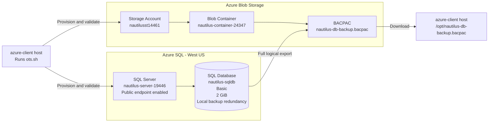

# Azure SQL Database Backup OTS

This implementation follows the four required tasks exactly. The backup will be named `nautilus-db-backup.bacpac` because Azure SQL export produces a BACPAC file.

## Prerequisites

- Run from the `azure-client` host.
- Azure CLI must be installed.
- Authenticate first with `az login`.
- The lab resource group must already exist.
- The authenticated identity needs permissions for Azure SQL, Storage, and SQL export operations.
- The SQL server and storage account names must be globally available.
- The client host must have write access to `/opt` through root or `sudo`.
- Provide a strong SQL administrator password when prompted.

## OTS Script

Save as `ots.sh`.

Copy only the content beginning with `#!/usr/bin/env bash`. Do not copy the Markdown fence lines.

```bash
#!/usr/bin/env bash

set -Eeuo pipefail

SQL_LOCATION="westus"

SQL_SERVER="nautilus-server-19446"
SQL_DATABASE="nautilus-sqldb"
SQL_ADMIN="nautilus-admin"
SQL_EDITION="Basic"
SQL_OBJECTIVE="Basic"
SQL_MAX_SIZE="2GB"
EXPECTED_SIZE_BYTES="2147483648"

STORAGE_ACCOUNT="nautilusst14461"
CONTAINER="nautilus-container-24347"
BACKUP_NAME="nautilus-db-backup"
BACKUP_FILE="${BACKUP_NAME}.bacpac"
DOWNLOAD_FILE="/opt/${BACKUP_FILE}"

FIREWALL_RULE="AllowAzureServices"

step() {
    echo
    echo "============================================================"
    echo "$1"
    echo "============================================================"
}

info() {
    echo "INFO: $1"
}

success() {
    echo "SUCCESS: $1"
}

fail() {
    echo "ERROR: $1" >&2
    exit 1
}

trap 'echo "ERROR: OTS failed at line ${LINENO}." >&2' ERR

echo "============================================================"
echo "Azure SQL Database Backup OTS"
echo "============================================================"

step "[1/11] Validating prerequisites"

command -v az >/dev/null 2>&1 ||
    fail "Azure CLI is not installed."

az account show >/dev/null 2>&1 ||
    fail "Azure authentication failed. Run az login."

if command -v sudo >/dev/null 2>&1; then
    SUDO="sudo"
else
    SUDO=""
fi

success "Azure CLI and authentication validated."

step "[2/11] Locating the existing resource group"

RG="${RESOURCE_GROUP:-$(az group list --query "[0].name" -o tsv)}"

[[ -n "$RG" ]] ||
    fail "No existing resource group was found."

RG_LOCATION="$(az group show \
    --name "$RG" \
    --query location \
    -o tsv)"

[[ -n "$RG_LOCATION" ]] ||
    fail "Unable to determine resource group location."

info "Resource group: $RG"
info "Resource group location: $RG_LOCATION"
info "Required SQL location: West US"

success "Existing resource group identified."

step "[3/11] Reading SQL administrator password"

if [[ -z "${SQL_ADMIN_PASSWORD:-}" ]]; then
    read -rsp "Enter a strong password for ${SQL_ADMIN}: " SQL_ADMIN_PASSWORD
    echo

    read -rsp "Confirm SQL administrator password: " PASSWORD_CONFIRMATION
    echo

    [[ "$SQL_ADMIN_PASSWORD" == "$PASSWORD_CONFIRMATION" ]] ||
        fail "The supplied passwords do not match."
fi

[[ ${#SQL_ADMIN_PASSWORD} -ge 8 ]] ||
    fail "The SQL administrator password must contain at least 8 characters."

success "SQL administrator password supplied."

step "[4/11] Creating or validating Azure SQL Server"

if az sql server show \
    --resource-group "$RG" \
    --name "$SQL_SERVER" \
    >/dev/null 2>&1; then

    info "SQL server already exists."

    SERVER_LOCATION="$(az sql server show \
        --resource-group "$RG" \
        --name "$SQL_SERVER" \
        --query location \
        -o tsv)"

    SERVER_ADMIN="$(az sql server show \
        --resource-group "$RG" \
        --name "$SQL_SERVER" \
        --query administratorLogin \
        -o tsv)"

    [[ "${SERVER_LOCATION,,}" == "$SQL_LOCATION" ]] ||
        fail "Existing SQL server is in ${SERVER_LOCATION}, not West US."

    [[ "$SERVER_ADMIN" == "$SQL_ADMIN" ]] ||
        fail "Existing administrator is ${SERVER_ADMIN}, not ${SQL_ADMIN}."

    info "Ensuring public network access is enabled."

    az sql server update \
        --resource-group "$RG" \
        --name "$SQL_SERVER" \
        --enable-public-network true \
        --admin-password "$SQL_ADMIN_PASSWORD" \
        --only-show-errors \
        >/dev/null
else
    info "Creating SQL server ${SQL_SERVER} in West US."

    az sql server create \
        --resource-group "$RG" \
        --name "$SQL_SERVER" \
        --location "$SQL_LOCATION" \
        --admin-user "$SQL_ADMIN" \
        --admin-password "$SQL_ADMIN_PASSWORD" \
        --enable-public-network true \
        --only-show-errors \
        >/dev/null
fi

success "SQL server is available with public endpoint access."

step "[5/11] Configuring the SQL export firewall rule"

if az sql server firewall-rule show \
    --resource-group "$RG" \
    --server "$SQL_SERVER" \
    --name "$FIREWALL_RULE" \
    >/dev/null 2>&1; then

    info "Azure-services firewall rule already exists."
else
    az sql server firewall-rule create \
        --resource-group "$RG" \
        --server "$SQL_SERVER" \
        --name "$FIREWALL_RULE" \
        --start-ip-address "0.0.0.0" \
        --end-ip-address "0.0.0.0" \
        --only-show-errors \
        >/dev/null

    info "Azure-services firewall rule created."
fi

success "SQL export firewall requirement configured."

step "[6/11] Creating or configuring Azure SQL Database"

if az sql db show \
    --resource-group "$RG" \
    --server "$SQL_SERVER" \
    --name "$SQL_DATABASE" \
    >/dev/null 2>&1; then

    info "Database already exists."
    info "Applying only the required database properties."

    az sql db update \
        --resource-group "$RG" \
        --server "$SQL_SERVER" \
        --name "$SQL_DATABASE" \
        --edition "$SQL_EDITION" \
        --service-objective "$SQL_OBJECTIVE" \
        --max-size "$SQL_MAX_SIZE" \
        --backup-storage-redundancy Local \
        --only-show-errors \
        >/dev/null
else
    info "Creating Basic database ${SQL_DATABASE}."

    az sql db create \
        --resource-group "$RG" \
        --server "$SQL_SERVER" \
        --name "$SQL_DATABASE" \
        --edition "$SQL_EDITION" \
        --service-objective "$SQL_OBJECTIVE" \
        --max-size "$SQL_MAX_SIZE" \
        --backup-storage-redundancy Local \
        --only-show-errors \
        >/dev/null
fi

info "Waiting for the database to reach the Online/Ready state."

DB_STATUS=""

for ATTEMPT in {1..30}; do
    DB_STATUS="$(az sql db show \
        --resource-group "$RG" \
        --server "$SQL_SERVER" \
        --name "$SQL_DATABASE" \
        --query status \
        -o tsv)"

    echo "Attempt ${ATTEMPT}/30: Database status=${DB_STATUS}"

    [[ "$DB_STATUS" == "Online" ]] && break

    sleep 20
done

[[ "$DB_STATUS" == "Online" ]] ||
    fail "Database did not reach the Online/Ready state."

DB_LOCATION="$(az sql db show \
    --resource-group "$RG" \
    --server "$SQL_SERVER" \
    --name "$SQL_DATABASE" \
    --query location \
    -o tsv)"

DB_EDITION="$(az sql db show \
    --resource-group "$RG" \
    --server "$SQL_SERVER" \
    --name "$SQL_DATABASE" \
    --query edition \
    -o tsv)"

DB_OBJECTIVE="$(az sql db show \
    --resource-group "$RG" \
    --server "$SQL_SERVER" \
    --name "$SQL_DATABASE" \
    --query currentServiceObjectiveName \
    -o tsv)"

DB_SIZE="$(az sql db show \
    --resource-group "$RG" \
    --server "$SQL_SERVER" \
    --name "$SQL_DATABASE" \
    --query maxSizeBytes \
    -o tsv)"

DB_REDUNDANCY="$(az sql db show \
    --resource-group "$RG" \
    --server "$SQL_SERVER" \
    --name "$SQL_DATABASE" \
    --query currentBackupStorageRedundancy \
    -o tsv)"

if [[ -z "$DB_REDUNDANCY" || "$DB_REDUNDANCY" == "None" ]]; then
    DB_REDUNDANCY="$(az sql db show \
        --resource-group "$RG" \
        --server "$SQL_SERVER" \
        --name "$SQL_DATABASE" \
        --query requestedBackupStorageRedundancy \
        -o tsv)"
fi

[[ "${DB_LOCATION,,}" == "$SQL_LOCATION" ]] ||
    fail "Database is not in West US."

[[ "$DB_EDITION" == "Basic" ]] ||
    fail "Database edition is ${DB_EDITION}, not Basic."

[[ "$DB_OBJECTIVE" == "Basic" ]] ||
    fail "Database service objective is ${DB_OBJECTIVE}, not Basic."

[[ "$DB_SIZE" == "$EXPECTED_SIZE_BYTES" ]] ||
    fail "Database maximum size is not 2 GiB."

[[ "${DB_REDUNDANCY,,}" == "local" ]] ||
    fail "Database backup redundancy is ${DB_REDUNDANCY}, not Local."

az sql db show \
    --resource-group "$RG" \
    --server "$SQL_SERVER" \
    --name "$SQL_DATABASE" \
    --query '{
        Database:name,
        Status:status,
        Location:location,
        Edition:edition,
        ServiceObjective:currentServiceObjectiveName,
        MaximumSizeBytes:maxSizeBytes,
        BackupRedundancy:currentBackupStorageRedundancy
    }' \
    -o table

success "Database satisfies all required properties."

step "[7/11] Creating or validating Storage Account"

if az storage account show \
    --resource-group "$RG" \
    --name "$STORAGE_ACCOUNT" \
    >/dev/null 2>&1; then

    info "Storage account already exists."
else
    info "Creating storage account using standard default configuration."
    info "Storage location follows the existing resource group location."

    az storage account create \
        --resource-group "$RG" \
        --name "$STORAGE_ACCOUNT" \
        --location "$RG_LOCATION" \
        --only-show-errors \
        >/dev/null
fi

STORAGE_KEY="$(az storage account keys list \
    --resource-group "$RG" \
    --account-name "$STORAGE_ACCOUNT" \
    --query "[0].value" \
    -o tsv)"

[[ -n "$STORAGE_KEY" ]] ||
    fail "Unable to retrieve the Storage Account key."

success "Storage Account ${STORAGE_ACCOUNT} is available."

step "[8/11] Creating or validating Blob Container"

CONTAINER_EXISTS="$(az storage container exists \
    --account-name "$STORAGE_ACCOUNT" \
    --account-key "$STORAGE_KEY" \
    --name "$CONTAINER" \
    --query exists \
    -o tsv)"

if [[ "$CONTAINER_EXISTS" == "true" ]]; then
    info "Blob Container already exists."
else
    az storage container create \
        --account-name "$STORAGE_ACCOUNT" \
        --account-key "$STORAGE_KEY" \
        --name "$CONTAINER" \
        --only-show-errors \
        >/dev/null

    info "Blob Container created."
fi

success "Blob Container ${CONTAINER} is available."

step "[9/11] Exporting a fresh SQL Database backup"

STORAGE_URI="https://${STORAGE_ACCOUNT}.blob.core.windows.net/${CONTAINER}/${BACKUP_FILE}"

EXISTING_BACKUP="$(az storage blob exists \
    --account-name "$STORAGE_ACCOUNT" \
    --account-key "$STORAGE_KEY" \
    --container-name "$CONTAINER" \
    --name "$BACKUP_FILE" \
    --query exists \
    -o tsv)"

if [[ "$EXISTING_BACKUP" == "true" ]]; then
    info "Removing the previous backup before creating a fresh export."

    az storage blob delete \
        --account-name "$STORAGE_ACCOUNT" \
        --account-key "$STORAGE_KEY" \
        --container-name "$CONTAINER" \
        --name "$BACKUP_FILE" \
        --only-show-errors \
        >/dev/null
fi

info "Exporting ${SQL_DATABASE} to ${BACKUP_FILE}."
info "The BACPAC export can take several minutes."

az sql db export \
    --resource-group "$RG" \
    --server "$SQL_SERVER" \
    --name "$SQL_DATABASE" \
    --admin-user "$SQL_ADMIN" \
    --admin-password "$SQL_ADMIN_PASSWORD" \
    --auth-type SQL \
    --storage-key-type StorageAccessKey \
    --storage-key "$STORAGE_KEY" \
    --storage-uri "$STORAGE_URI" \
    --only-show-errors \
    >/dev/null

success "SQL Database export command completed."

step "[10/11] Verifying and downloading the BACPAC"

BACKUP_EXISTS="$(az storage blob exists \
    --account-name "$STORAGE_ACCOUNT" \
    --account-key "$STORAGE_KEY" \
    --container-name "$CONTAINER" \
    --name "$BACKUP_FILE" \
    --query exists \
    -o tsv)"

[[ "$BACKUP_EXISTS" == "true" ]] ||
    fail "The exported BACPAC was not found."

BLOB_SIZE="$(az storage blob show \
    --account-name "$STORAGE_ACCOUNT" \
    --account-key "$STORAGE_KEY" \
    --container-name "$CONTAINER" \
    --name "$BACKUP_FILE" \
    --query properties.contentLength \
    -o tsv)"

[[ -n "$BLOB_SIZE" && "$BLOB_SIZE" -gt 0 ]] ||
    fail "The exported BACPAC is empty."

$SUDO mkdir -p /opt
$SUDO rm -f "$DOWNLOAD_FILE"

TEMP_FILE="/tmp/${BACKUP_FILE}"
rm -f "$TEMP_FILE"

az storage blob download \
    --account-name "$STORAGE_ACCOUNT" \
    --account-key "$STORAGE_KEY" \
    --container-name "$CONTAINER" \
    --name "$BACKUP_FILE" \
    --file "$TEMP_FILE" \
    --overwrite true \
    --only-show-errors \
    >/dev/null

$SUDO mv "$TEMP_FILE" "$DOWNLOAD_FILE"
$SUDO chmod 644 "$DOWNLOAD_FILE"

[[ -f "$DOWNLOAD_FILE" ]] ||
    fail "The backup was not downloaded to ${DOWNLOAD_FILE}."

[[ -r "$DOWNLOAD_FILE" ]] ||
    fail "The downloaded backup is not readable."

[[ -s "$DOWNLOAD_FILE" ]] ||
    fail "The downloaded backup is empty."

LOCAL_SIZE="$(stat -c '%s' "$DOWNLOAD_FILE")"

[[ "$LOCAL_SIZE" == "$BLOB_SIZE" ]] ||
    fail "Downloaded file size does not match the Blob size."

success "Backup verified and downloaded successfully."

step "[11/11] Displaying final verification"

az storage blob show \
    --account-name "$STORAGE_ACCOUNT" \
    --account-key "$STORAGE_KEY" \
    --container-name "$CONTAINER" \
    --name "$BACKUP_FILE" \
    --query '{
        Backup:name,
        Size:properties.contentLength,
        LastModified:properties.lastModified
    }' \
    -o table

ls -lh "$DOWNLOAD_FILE"

echo
echo "============================================================"
echo "Azure SQL Database backup completed successfully"
echo "============================================================"
echo "Resource group      : $RG"
echo "SQL server          : $SQL_SERVER"
echo "SQL database        : $SQL_DATABASE"
echo "SQL location        : West US"
echo "Database state      : Online/Ready"
echo "Database tier       : Basic"
echo "Database size       : 2 GiB"
echo "Backup redundancy   : Locally redundant"
echo "Public endpoint     : Enabled"
echo "Storage account     : $STORAGE_ACCOUNT"
echo "Blob Container      : $CONTAINER"
echo "Backup Blob         : $BACKUP_FILE"
echo "Blob size           : $BLOB_SIZE bytes"
echo "Downloaded file     : $DOWNLOAD_FILE"
echo "Downloaded size     : $LOCAL_SIZE bytes"
echo "File permissions    : $(stat -c '%A' "$DOWNLOAD_FILE")"
echo "============================================================"
```

Run:

```bash
chmod +x ots.sh
bash -n ots.sh && echo "Syntax OK"
./ots.sh
```

## Runbook

### Authenticate

```bash
az login
az account show -o table
```

Do not place the Azure Portal password inside the OTS.

### Execute the OTS

```bash
chmod +x ots.sh
bash -n ots.sh
./ots.sh
```

Enter a strong SQL administrator password when prompted.

### Verify the SQL database

```bash
RG="$(az group list --query '[0].name' -o tsv)"

az sql db show \
  -g "$RG" \
  -s nautilus-server-19446 \
  -n nautilus-sqldb \
  --query '{
    Name:name,
    State:status,
    Location:location,
    Tier:edition,
    Size:maxSizeBytes,
    Redundancy:currentBackupStorageRedundancy
  }' \
  -o table
```

Expected:

- State: `Online`, representing Ready
- Location: `westus`
- Tier: `Basic`
- Size: `2147483648` bytes
- Redundancy: `Local`

### Verify the backup

```bash
STORAGE_KEY="$(az storage account keys list \
  -g "$RG" \
  -n nautilusst14461 \
  --query '[0].value' \
  -o tsv)"

az storage blob show \
  --account-name nautilusst14461 \
  --account-key "$STORAGE_KEY" \
  --container-name nautilus-container-24347 \
  --name nautilus-db-backup.bacpac \
  --query '{Name:name,Size:properties.contentLength}' \
  -o table
```

The Blob must exist and have a nonzero size.

### Verify the downloaded file

```bash
ls -lh /opt/nautilus-db-backup.bacpac
stat /opt/nautilus-db-backup.bacpac
```

Expected path:

```text
/opt/nautilus-db-backup.bacpac
```

### Portal verification

1. Open **SQL databases**.
2. Select `nautilus-sqldb`.
3. Confirm it is Online/Ready.
4. Confirm Basic tier, 2 GiB size, and locally redundant backup storage.
5. Open storage account `nautilusst14461`.
6. Open container `nautilus-container-24347`.
7. Confirm `nautilus-db-backup.bacpac` is present.

## Mermaid Diagram

