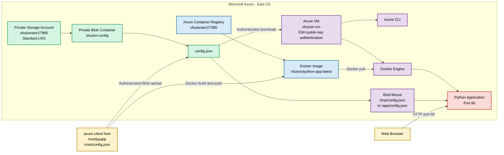

# Azure VM, ACR and Blob Storage Implementation

## OTS Script

Save as `ots.sh`. Copy only from `#!/usr/bin/env bash`.

```bash
#!/usr/bin/env bash

set -Eeuo pipefail

LOCATION="eastus"
VM_NAME="xfusion-vm"
VM_ADMIN="azureuser"
VM_SIZE="Standard_B1s"
SSH_KEY="/root/.ssh/id_rsa"
SSH_PUB="${SSH_KEY}.pub"

ACR_NAME="xfusionacr27985"
REPOSITORY="xfusion/python-app"
IMAGE_TAG="latest"
APP_DIR="/root/pyapp"
DOCKERFILE="${APP_DIR}/Dockerfile"
APP_CONTAINER="xfusion-python-app"

STORAGE_ACCOUNT="xfusionstor27985"
BLOB_CONTAINER="xfusion-config"
LOCAL_CONFIG="/root/config.json"
VM_CONFIG="/tmp/config.json"
CONTAINER_CONFIG="/app/config.json"

step() {
    echo
    echo "============================================================"
    echo "$1"
    echo "============================================================"
}

info() { echo "INFO: $1"; }
success() { echo "SUCCESS: $1"; }
fail() { echo "ERROR: $1" >&2; exit 1; }

trap 'echo "ERROR: OTS failed at line ${LINENO}." >&2' ERR

echo "============================================================"
echo "Azure VM, ACR and Blob Storage OTS"
echo "============================================================"

step "[1/10] Validating prerequisites"

command -v az >/dev/null || fail "Azure CLI is missing."
command -v ssh >/dev/null || fail "SSH client is missing."
command -v curl >/dev/null || fail "curl is missing."

az account show >/dev/null 2>&1 ||
    fail "Azure authentication failed."

[[ -f "$DOCKERFILE" ]] ||
    fail "${DOCKERFILE} does not exist."

[[ -f "$LOCAL_CONFIG" ]] ||
    fail "${LOCAL_CONFIG} does not exist."

RG="${RESOURCE_GROUP:-$(az group list --query '[0].name' -o tsv)}"

[[ -n "$RG" ]] ||
    fail "No existing resource group was found."

info "Resource group: $RG"
success "Prerequisites validated."

step "[2/10] Creating or validating the SSH key"

mkdir -p /root/.ssh
chmod 700 /root/.ssh

if [[ ! -f "$SSH_KEY" || ! -f "$SSH_PUB" ]]; then
    ssh-keygen \
        -t rsa \
        -b 4096 \
        -f "$SSH_KEY" \
        -N "" \
        -C "azureuser@xfusion-vm"
else
    info "Existing SSH public key will be used."
fi

chmod 600 "$SSH_KEY"
chmod 644 "$SSH_PUB"

success "SSH key is ready."

step "[3/10] Creating or validating ACR"

if az acr show -g "$RG" -n "$ACR_NAME" >/dev/null 2>&1; then
    ACR_LOCATION="$(az acr show \
        -g "$RG" \
        -n "$ACR_NAME" \
        --query location \
        -o tsv)"

    [[ "${ACR_LOCATION,,}" == "$LOCATION" ]] ||
        fail "ACR is not in East US."

    info "ACR already exists."
else
    az acr create \
        -g "$RG" \
        -n "$ACR_NAME" \
        -l "$LOCATION" \
        --sku Basic \
        --admin-enabled true \
        --only-show-errors \
        >/dev/null
fi

az acr update \
    -g "$RG" \
    -n "$ACR_NAME" \
    --admin-enabled true \
    --only-show-errors \
    >/dev/null

ACR_SERVER="$(az acr show \
    -g "$RG" \
    -n "$ACR_NAME" \
    --query loginServer \
    -o tsv)"

ACR_USER="$(az acr credential show \
    -g "$RG" \
    -n "$ACR_NAME" \
    --query username \
    -o tsv)"

ACR_PASSWORD="$(az acr credential show \
    -g "$RG" \
    -n "$ACR_NAME" \
    --query 'passwords[0].value' \
    -o tsv)"

FULL_IMAGE="${ACR_SERVER}/${REPOSITORY}:${IMAGE_TAG}"

success "ACR is available."

step "[4/10] Building and pushing the image"

if ! command -v docker >/dev/null 2>&1; then
    apt-get update -y
    DEBIAN_FRONTEND=noninteractive apt-get install -y docker.io
    systemctl enable --now docker 2>/dev/null || service docker start
fi

docker info >/dev/null 2>&1 ||
    fail "Local Docker daemon is unavailable."

printf '%s' "$ACR_PASSWORD" |
    docker login "$ACR_SERVER" \
        --username "$ACR_USER" \
        --password-stdin

docker build \
    --file "$DOCKERFILE" \
    --tag "$FULL_IMAGE" \
    "$APP_DIR"

docker push "$FULL_IMAGE"

IMAGE_VERIFIED="false"

for ATTEMPT in {1..10}; do
    if docker manifest inspect "$FULL_IMAGE" >/dev/null 2>&1; then
        IMAGE_VERIFIED="true"
        break
    fi

    echo "Image verification ${ATTEMPT}/10"
    sleep 5
done

[[ "$IMAGE_VERIFIED" == "true" ]] ||
    fail "The pushed image could not be verified."

docker logout "$ACR_SERVER" >/dev/null 2>&1 || true

success "${REPOSITORY}:latest was pushed to ACR."

step "[5/10] Creating Storage Account and Blob Container"

if az storage account show \
    -g "$RG" \
    -n "$STORAGE_ACCOUNT" \
    >/dev/null 2>&1; then

    STORAGE_LOCATION="$(az storage account show \
        -g "$RG" \
        -n "$STORAGE_ACCOUNT" \
        --query location \
        -o tsv)"

    [[ "${STORAGE_LOCATION,,}" == "$LOCATION" ]] ||
        fail "Storage Account is not in East US."

    az storage account update \
        -g "$RG" \
        -n "$STORAGE_ACCOUNT" \
        --sku Standard_LRS \
        --allow-blob-public-access false \
        --only-show-errors \
        >/dev/null
else
    az storage account create \
        -g "$RG" \
        -n "$STORAGE_ACCOUNT" \
        -l "$LOCATION" \
        --sku Standard_LRS \
        --kind StorageV2 \
        --allow-blob-public-access false \
        --only-show-errors \
        >/dev/null
fi

STORAGE_KEY="$(az storage account keys list \
    -g "$RG" \
    -n "$STORAGE_ACCOUNT" \
    --query '[0].value' \
    -o tsv)"

CONTAINER_EXISTS="$(az storage container exists \
    --account-name "$STORAGE_ACCOUNT" \
    --account-key "$STORAGE_KEY" \
    --name "$BLOB_CONTAINER" \
    --query exists \
    -o tsv)"

if [[ "$CONTAINER_EXISTS" != "true" ]]; then
    az storage container create \
        --account-name "$STORAGE_ACCOUNT" \
        --account-key "$STORAGE_KEY" \
        --name "$BLOB_CONTAINER" \
        --public-access off \
        --only-show-errors \
        >/dev/null
fi

az storage blob upload \
    --account-name "$STORAGE_ACCOUNT" \
    --account-key "$STORAGE_KEY" \
    --container-name "$BLOB_CONTAINER" \
    --name config.json \
    --file "$LOCAL_CONFIG" \
    --overwrite true \
    --only-show-errors \
    >/dev/null

BLOB_EXISTS="$(az storage blob exists \
    --account-name "$STORAGE_ACCOUNT" \
    --account-key "$STORAGE_KEY" \
    --container-name "$BLOB_CONTAINER" \
    --name config.json \
    --query exists \
    -o tsv)"

[[ "$BLOB_EXISTS" == "true" ]] ||
    fail "config.json was not uploaded."

success "Private Blob Container and config.json are available."

step "[6/10] Creating or validating the VM"

if az vm show -g "$RG" -n "$VM_NAME" >/dev/null 2>&1; then
    VM_PROVISIONING="$(az vm show \
        -g "$RG" \
        -n "$VM_NAME" \
        --query provisioningState \
        -o tsv)"

    if [[ "$VM_PROVISIONING" == "Failed" ||
          "$VM_PROVISIONING" == "Deleting" ]]; then

        info "Deleting failed VM."

        az vm delete \
            -g "$RG" \
            -n "$VM_NAME" \
            --yes \
            --only-show-errors || true

        for ATTEMPT in {1..60}; do
            if ! az vm show \
                -g "$RG" \
                -n "$VM_NAME" \
                >/dev/null 2>&1; then
                break
            fi

            echo "VM deletion check ${ATTEMPT}/60"
            sleep 10
        done

        az vm show -g "$RG" -n "$VM_NAME" >/dev/null 2>&1 &&
            fail "VM deletion did not finish."

        DISKS="$(az disk list \
            -g "$RG" \
            --query "[?contains(name,'${VM_NAME}')].name" \
            -o tsv)"

        while IFS= read -r DISK; do
            [[ -z "$DISK" ]] && continue

            az disk delete \
                -g "$RG" \
                -n "$DISK" \
                --yes \
                --only-show-errors || true
        done <<< "$DISKS"
    fi
fi

if ! az vm show -g "$RG" -n "$VM_NAME" >/dev/null 2>&1; then
    az vm create \
        -g "$RG" \
        -n "$VM_NAME" \
        -l "$LOCATION" \
        --image Ubuntu2204 \
        --size Standard_B1s \
        --admin-username "$VM_ADMIN" \
        --authentication-type ssh \
        --ssh-key-values "$SSH_PUB" \
        --storage-sku Standard_LRS \
        --os-disk-size-gb 30 \
        --public-ip-sku Standard \
        --nsg-rule SSH \
        --only-show-errors \
        >/dev/null
else
    VM_LOCATION="$(az vm show \
        -g "$RG" \
        -n "$VM_NAME" \
        --query location \
        -o tsv)"

    [[ "${VM_LOCATION,,}" == "$LOCATION" ]] ||
        fail "VM is not in East US."

    info "VM already exists."
fi

VM_STATE="$(az vm get-instance-view \
    -g "$RG" \
    -n "$VM_NAME" \
    --query "instanceView.statuses[?starts_with(code,'PowerState/')].displayStatus | [0]" \
    -o tsv)"

if [[ "$VM_STATE" != "VM running" ]]; then
    az vm start -g "$RG" -n "$VM_NAME" --only-show-errors
fi

VM_IP="$(az vm show \
    -g "$RG" \
    -n "$VM_NAME" \
    -d \
    --query publicIps \
    -o tsv)"

[[ -n "$VM_IP" ]] ||
    fail "VM public IP was not found."

success "VM is running at ${VM_IP}."

step "[7/10] Opening port 80 and waiting for SSH"

az vm open-port \
    -g "$RG" \
    -n "$VM_NAME" \
    --port 80 \
    --priority 1001 \
    --only-show-errors \
    >/dev/null

SSH_OPTS=(
    -o StrictHostKeyChecking=no
    -o UserKnownHostsFile=/dev/null
    -o ConnectTimeout=10
    -i "$SSH_KEY"
)

SSH_READY="false"

for ATTEMPT in {1..30}; do
    if ssh "${SSH_OPTS[@]}" \
        "${VM_ADMIN}@${VM_IP}" \
        "echo ready" \
        >/dev/null 2>&1; then

        SSH_READY="true"
        break
    fi

    echo "SSH attempt ${ATTEMPT}/30"
    sleep 10
done

[[ "$SSH_READY" == "true" ]] ||
    fail "SSH connection failed."

success "Port 80 and SSH access are ready."

step "[8/10] Installing Docker and Azure CLI on the VM"

ssh "${SSH_OPTS[@]}" "${VM_ADMIN}@${VM_IP}" 'bash -s' <<'REMOTE'
set -Eeuo pipefail

sudo apt-get update -y

sudo DEBIAN_FRONTEND=noninteractive apt-get install -y \
    docker.io \
    curl \
    ca-certificates \
    apt-transport-https \
    gnupg \
    lsb-release

sudo systemctl enable --now docker
sudo usermod -aG docker "$USER"

if ! command -v az >/dev/null 2>&1; then
    curl -sL https://aka.ms/InstallAzureCLIDeb | sudo bash
fi

sudo docker --version
az version --query '"azure-cli"' -o tsv
REMOTE

success "Docker and Azure CLI installed."

step "[9/10] Downloading config and running the container"

ssh "${SSH_OPTS[@]}" "${VM_ADMIN}@${VM_IP}" \
    "az storage blob download \
        --account-name '$STORAGE_ACCOUNT' \
        --account-key '$STORAGE_KEY' \
        --container-name '$BLOB_CONTAINER' \
        --name config.json \
        --file '$VM_CONFIG' \
        --overwrite true \
        --only-show-errors >/dev/null
     chmod 644 '$VM_CONFIG'
     test -s '$VM_CONFIG'"

CONTAINER_PORT="$(awk '
    toupper($1) == "EXPOSE" {
        split($2, port, "/")
        print port[1]
    }
' "$DOCKERFILE" | tail -1)"

[[ -n "$CONTAINER_PORT" ]] || CONTAINER_PORT="80"

printf '%s' "$ACR_PASSWORD" |
    ssh "${SSH_OPTS[@]}" "${VM_ADMIN}@${VM_IP}" \
        "sudo docker login '$ACR_SERVER' \
            --username '$ACR_USER' \
            --password-stdin"

ssh "${SSH_OPTS[@]}" "${VM_ADMIN}@${VM_IP}" \
    "set -Eeuo pipefail
     sudo docker pull '$FULL_IMAGE'
     sudo docker rm -f '$APP_CONTAINER' >/dev/null 2>&1 || true
     sudo docker run -d \
        --name '$APP_CONTAINER' \
        --restart unless-stopped \
        --mount type=bind,source='$VM_CONFIG',target='$CONTAINER_CONFIG',readonly \
        -p 80:'$CONTAINER_PORT' \
        '$FULL_IMAGE'
     sudo docker exec '$APP_CONTAINER' test -r '$CONTAINER_CONFIG'"

success "Application container is running on port 80."

step "[10/10] Validating the application"

APPLICATION_URL="http://${VM_IP}"
HTTP_STATUS=""
APPLICATION_READY="false"

for ATTEMPT in {1..30}; do
    HTTP_STATUS="$(curl \
        --silent \
        --connect-timeout 5 \
        --max-time 10 \
        --output /tmp/xfusion-response.html \
        --write-out '%{http_code}' \
        "$APPLICATION_URL" || true)"

    echo "Application check ${ATTEMPT}/30: HTTP ${HTTP_STATUS}"

    if [[ "$HTTP_STATUS" =~ ^(2|3) ]]; then
        APPLICATION_READY="true"
        break
    fi

    sleep 10
done

if [[ "$APPLICATION_READY" != "true" ]]; then
    ssh "${SSH_OPTS[@]}" "${VM_ADMIN}@${VM_IP}" \
        "sudo docker logs --tail 100 '$APP_CONTAINER'" || true

    fail "Application validation failed."
fi

echo
echo "============================================================"
echo "Deployment completed successfully"
echo "============================================================"
echo "Region               : East US"
echo "VM                   : $VM_NAME"
echo "VM public IP         : $VM_IP"
echo "Authentication       : SSH public key"
echo "VM OS disk           : Standard_LRS, 30 GiB"
echo "ACR                   : $ACR_NAME"
echo "Repository            : $REPOSITORY"
echo "Image tag             : latest"
echo "Storage Account       : $STORAGE_ACCOUNT"
echo "Storage redundancy    : Standard_LRS"
echo "Blob Container        : $BLOB_CONTAINER"
echo "Blob                  : config.json"
echo "Container             : $APP_CONTAINER"
echo "Application URL       : $APPLICATION_URL"
echo "HTTP status           : $HTTP_STATUS"
echo "============================================================"
```

Run:

```bash
chmod +x ots.sh
bash -n ots.sh && echo "Syntax OK"
./ots.sh
```

## Runbook

### Validate source files

```bash
ls -l /root/pyapp/Dockerfile
ls -l /root/pyapp/app.py
ls -l /root/config.json
```

### Validate Azure authentication

```bash
az account show -o table
az group list -o table
```

### Run the OTS

```bash
chmod +x ots.sh
bash -n ots.sh
./ots.sh
```

### Verify ACR

```bash
az acr repository list \
  -n xfusionacr27985 \
  -o table

az acr repository show-tags \
  -n xfusionacr27985 \
  --repository xfusion/python-app \
  -o table
```

Expected:

```text
Repository: xfusion/python-app
Tag: latest
```

### Verify Storage Account

```bash
RG="$(az group list --query '[0].name' -o tsv)"

az storage account show \
  -g "$RG" \
  -n xfusionstor27985 \
  --query '{
    Location:location,
    SKU:sku.name,
    AnonymousAccess:allowBlobPublicAccess
  }' \
  -o table
```

Expected:

```text
Location: eastus
SKU: Standard_LRS
AnonymousAccess: false
```

### Verify the Blob

```bash
KEY="$(az storage account keys list \
  -g "$RG" \
  -n xfusionstor27985 \
  --query '[0].value' \
  -o tsv)"

az storage blob list \
  --account-name xfusionstor27985 \
  --account-key "$KEY" \
  --container-name xfusion-config \
  -o table
```

Expected Blob:

```text
config.json
```

### Verify the VM

```bash
az vm show \
  -g "$RG" \
  -n xfusion-vm \
  -d \
  --query '{
    Name:name,
    Location:location,
    PowerState:powerState,
    PublicIP:publicIps
  }' \
  -o table
```

### Verify Docker and Azure CLI

```bash
VM_IP="$(az vm show \
  -g "$RG" \
  -n xfusion-vm \
  -d \
  --query publicIps \
  -o tsv)"

ssh -i ~/.ssh/id_rsa azureuser@"$VM_IP" \
  'sudo docker --version; az version --query "\"azure-cli\"" -o tsv'
```

### Verify the container

```bash
ssh -i ~/.ssh/id_rsa azureuser@"$VM_IP" \
  'sudo docker ps --all;
   sudo docker port xfusion-python-app;
   sudo docker exec xfusion-python-app ls -l /app/config.json'
```

Expected port mapping:

```text
0.0.0.0:80->80/tcp
```

### Verify browser access

```bash
curl -i "http://${VM_IP}"
```

Expected:

```text
HTTP/1.1 200 OK
```

Open in a browser:

```text
http://VM_PUBLIC_IP
```

## Colored Mermaid Diagram

