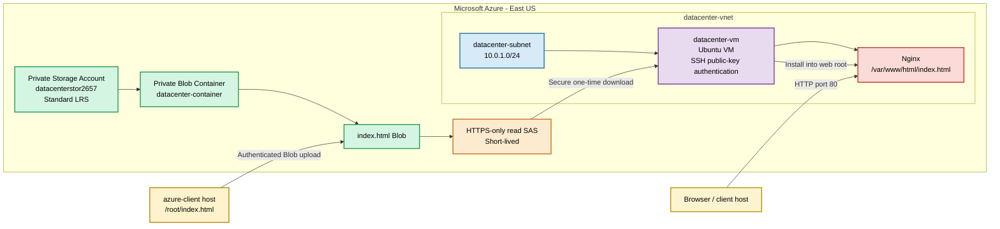

# Azure Storage and Nginx Static Content Environment

The Storage Account remains private with anonymous Blob access disabled. The VM downloads `index.html` using a short-lived, HTTPS-only, read-only SAS URL. Static Website is disabled and the Storage Account is not mounted.

## Prerequisites

- Run from the `azure-client` host.
- Azure CLI must be installed and authenticated.
- `/root/index.html` must exist.
- An existing resource group must be available.
- Permissions to create network, storage, VM and NSG resources.
- Internet connectivity for VM package installation.
- SSH and `curl` must be installed on the client host.

## OTS Script

Save as `ots.sh`. Copy only from `#!/usr/bin/env bash`.

```bash
#!/usr/bin/env bash

set -Eeuo pipefail

LOCATION="eastus"

VNET_NAME="datacenter-vnet"
VNET_PREFIX="10.0.0.0/16"
SUBNET_NAME="datacenter-subnet"
SUBNET_PREFIX="10.0.1.0/24"

STORAGE_ACCOUNT="datacenterstor2657"
CONTAINER_NAME="datacenter-container"
LOCAL_INDEX="/root/index.html"
BLOB_NAME="index.html"

VM_NAME="datacenter-vm"
VM_ADMIN="azureuser"
VM_SIZE="Standard_B1s"
VM_IMAGE="Ubuntu2204"
PUBLIC_IP_NAME="datacenter-vm-ip"
NSG_NAME="datacenter-vm-nsg"

SSH_PRIVATE_KEY="/root/.ssh/id_rsa"
SSH_PUBLIC_KEY="/root/.ssh/id_rsa.pub"

REMOTE_TEMP_FILE="/tmp/index.html"
NGINX_INDEX="/var/www/html/index.html"

step() {
    echo
    echo "============================================================"
    echo "$1"
    echo "============================================================"
}

info() { echo "INFO: $1"; }
success() { echo "SUCCESS: $1"; }
fail() { echo "ERROR: $1" >&2; exit 1; }

trap 'echo "ERROR: OTS failed at line ${LINENO}." >&2' ERR

echo "============================================================"
echo "Azure Storage and Nginx Static Content OTS"
echo "============================================================"

step "[1/11] Validating prerequisites"

command -v az >/dev/null 2>&1 ||
    fail "Azure CLI is not installed."

command -v ssh >/dev/null 2>&1 ||
    fail "SSH client is not installed."

command -v curl >/dev/null 2>&1 ||
    fail "curl is not installed."

az account show >/dev/null 2>&1 ||
    fail "Azure authentication failed. Run az login."

[[ -f "$LOCAL_INDEX" ]] ||
    fail "${LOCAL_INDEX} does not exist."

[[ -s "$LOCAL_INDEX" ]] ||
    fail "${LOCAL_INDEX} is empty."

RG="${RESOURCE_GROUP:-$(az group list --query '[0].name' -o tsv)}"

[[ -n "$RG" ]] ||
    fail "No existing resource group was found."

info "Resource group: $RG"
info "Required region: East US"
success "Prerequisites validated."

step "[2/11] Creating or validating the SSH key"

mkdir -p /root/.ssh
chmod 700 /root/.ssh

if [[ -f "$SSH_PRIVATE_KEY" && -f "$SSH_PUBLIC_KEY" ]]; then
    info "Existing SSH public key will be used."
else
    ssh-keygen \
        -t rsa \
        -b 4096 \
        -f "$SSH_PRIVATE_KEY" \
        -N "" \
        -C "azureuser@datacenter-vm"
fi

chmod 600 "$SSH_PRIVATE_KEY"
chmod 644 "$SSH_PUBLIC_KEY"

[[ -s "$SSH_PUBLIC_KEY" ]] ||
    fail "SSH public key was not created."

info "SSH public key:"
cat "$SSH_PUBLIC_KEY"

success "SSH public key is ready."

step "[3/11] Creating or validating the VNet"

if az network vnet show \
    -g "$RG" \
    -n "$VNET_NAME" \
    >/dev/null 2>&1; then

    VNET_LOCATION="$(az network vnet show \
        -g "$RG" \
        -n "$VNET_NAME" \
        --query location \
        -o tsv)"

    [[ "${VNET_LOCATION,,}" == "$LOCATION" ]] ||
        fail "VNet is not in East US."

    info "VNet already exists."
else
    az network vnet create \
        -g "$RG" \
        -n "$VNET_NAME" \
        -l "$LOCATION" \
        --address-prefixes "$VNET_PREFIX" \
        --only-show-errors \
        >/dev/null
fi

if az network vnet subnet show \
    -g "$RG" \
    --vnet-name "$VNET_NAME" \
    -n "$SUBNET_NAME" \
    >/dev/null 2>&1; then

    info "Subnet already exists."
else
    az network vnet subnet create \
        -g "$RG" \
        --vnet-name "$VNET_NAME" \
        -n "$SUBNET_NAME" \
        --address-prefixes "$SUBNET_PREFIX" \
        --only-show-errors \
        >/dev/null
fi

success "VNet and subnet are available."

step "[4/11] Creating or validating the private Storage Account"

if az storage account show \
    -g "$RG" \
    -n "$STORAGE_ACCOUNT" \
    >/dev/null 2>&1; then

    STORAGE_LOCATION="$(az storage account show \
        -g "$RG" \
        -n "$STORAGE_ACCOUNT" \
        --query location \
        -o tsv)"

    [[ "${STORAGE_LOCATION,,}" == "$LOCATION" ]] ||
        fail "Storage Account is not in East US."

    az storage account update \
        -g "$RG" \
        -n "$STORAGE_ACCOUNT" \
        --sku Standard_LRS \
        --allow-blob-public-access false \
        --only-show-errors \
        >/dev/null

    info "Storage Account already exists."
else
    az storage account create \
        -g "$RG" \
        -n "$STORAGE_ACCOUNT" \
        -l "$LOCATION" \
        --sku Standard_LRS \
        --kind StorageV2 \
        --allow-blob-public-access false \
        --https-only true \
        --min-tls-version TLS1_2 \
        --only-show-errors \
        >/dev/null
fi

STORAGE_KEY="$(az storage account keys list \
    -g "$RG" \
    -n "$STORAGE_ACCOUNT" \
    --query '[0].value' \
    -o tsv)"

[[ -n "$STORAGE_KEY" ]] ||
    fail "Unable to retrieve the Storage Account key."

STORAGE_SKU="$(az storage account show \
    -g "$RG" \
    -n "$STORAGE_ACCOUNT" \
    --query sku.name \
    -o tsv)"

PUBLIC_ACCESS="$(az storage account show \
    -g "$RG" \
    -n "$STORAGE_ACCOUNT" \
    --query allowBlobPublicAccess \
    -o tsv)"

[[ "$STORAGE_SKU" == "Standard_LRS" ]] ||
    fail "Storage redundancy is not Standard_LRS."

[[ "$PUBLIC_ACCESS" == "false" ]] ||
    fail "Anonymous Blob access is not disabled."

success "Private LRS Storage Account is available."

step "[5/11] Creating the private container and uploading index.html"

CONTAINER_EXISTS="$(az storage container exists \
    --account-name "$STORAGE_ACCOUNT" \
    --account-key "$STORAGE_KEY" \
    --name "$CONTAINER_NAME" \
    --query exists \
    -o tsv)"

if [[ "$CONTAINER_EXISTS" == "true" ]]; then
    info "Blob container already exists."
else
    az storage container create \
        --account-name "$STORAGE_ACCOUNT" \
        --account-key "$STORAGE_KEY" \
        --name "$CONTAINER_NAME" \
        --public-access off \
        --only-show-errors \
        >/dev/null
fi

az storage container set-permission \
    --account-name "$STORAGE_ACCOUNT" \
    --account-key "$STORAGE_KEY" \
    --name "$CONTAINER_NAME" \
    --public-access off \
    --only-show-errors \
    >/dev/null

info "Disabling the Storage Static Website feature."

az storage blob service-properties update \
    --account-name "$STORAGE_ACCOUNT" \
    --account-key "$STORAGE_KEY" \
    --static-website false \
    --only-show-errors \
    >/dev/null

info "Uploading ${LOCAL_INDEX}."

az storage blob upload \
    --account-name "$STORAGE_ACCOUNT" \
    --account-key "$STORAGE_KEY" \
    --container-name "$CONTAINER_NAME" \
    --name "$BLOB_NAME" \
    --file "$LOCAL_INDEX" \
    --overwrite true \
    --only-show-errors \
    >/dev/null

BLOB_EXISTS="$(az storage blob exists \
    --account-name "$STORAGE_ACCOUNT" \
    --account-key "$STORAGE_KEY" \
    --container-name "$CONTAINER_NAME" \
    --name "$BLOB_NAME" \
    --query exists \
    -o tsv)"

[[ "$BLOB_EXISTS" == "true" ]] ||
    fail "index.html was not uploaded."

BLOB_SIZE="$(az storage blob show \
    --account-name "$STORAGE_ACCOUNT" \
    --account-key "$STORAGE_KEY" \
    --container-name "$CONTAINER_NAME" \
    --name "$BLOB_NAME" \
    --query properties.contentLength \
    -o tsv)"

[[ -n "$BLOB_SIZE" && "$BLOB_SIZE" -gt 0 ]] ||
    fail "Uploaded index.html is empty."

success "index.html uploaded to the private Blob container."

step "[6/11] Creating the Network Security Group"

CLIENT_IP="$(curl -fsS --max-time 10 https://api.ipify.org || true)"

if [[ "$CLIENT_IP" =~ ^[0-9]+\.[0-9]+\.[0-9]+\.[0-9]+$ ]]; then
    SSH_SOURCE="${CLIENT_IP}/32"
else
    SSH_SOURCE="Internet"
    info "Client public IP could not be detected."
fi

if az network nsg show \
    -g "$RG" \
    -n "$NSG_NAME" \
    >/dev/null 2>&1; then

    info "Network Security Group already exists."
else
    az network nsg create \
        -g "$RG" \
        -n "$NSG_NAME" \
        -l "$LOCATION" \
        --only-show-errors \
        >/dev/null
fi

az network nsg rule create \
    -g "$RG" \
    --nsg-name "$NSG_NAME" \
    -n Allow-SSH \
    --priority 1000 \
    --access Allow \
    --protocol Tcp \
    --direction Inbound \
    --source-address-prefixes "$SSH_SOURCE" \
    --source-port-ranges '*' \
    --destination-address-prefixes '*' \
    --destination-port-ranges 22 \
    --only-show-errors \
    >/dev/null

az network nsg rule create \
    -g "$RG" \
    --nsg-name "$NSG_NAME" \
    -n Allow-HTTP \
    --priority 1010 \
    --access Allow \
    --protocol Tcp \
    --direction Inbound \
    --source-address-prefixes Internet \
    --source-port-ranges '*' \
    --destination-address-prefixes '*' \
    --destination-port-ranges 80 \
    --only-show-errors \
    >/dev/null

success "SSH and HTTP NSG rules are configured."

step "[7/11] Creating or validating the VM"

if az vm show \
    -g "$RG" \
    -n "$VM_NAME" \
    >/dev/null 2>&1; then

    VM_LOCATION="$(az vm show \
        -g "$RG" \
        -n "$VM_NAME" \
        --query location \
        -o tsv)"

    [[ "${VM_LOCATION,,}" == "$LOCATION" ]] ||
        fail "VM is not in East US."

    VM_SUBNET_ID="$(az vm show \
        -g "$RG" \
        -n "$VM_NAME" \
        --query networkProfile.networkInterfaces[0].id \
        -o tsv |
        xargs -I{} az network nic show \
            --ids {} \
            --query ipConfigurations[0].subnet.id \
            -o tsv)"

    [[ "$VM_SUBNET_ID" == *"/virtualNetworks/${VNET_NAME}/subnets/${SUBNET_NAME}" ]] ||
        fail "Existing VM is not using the required VNet and subnet."

    info "VM already exists."
else
    info "Creating VM with a Standard LRS OS disk."

    az vm create \
        -g "$RG" \
        -n "$VM_NAME" \
        -l "$LOCATION" \
        --image "$VM_IMAGE" \
        --size "$VM_SIZE" \
        --admin-username "$VM_ADMIN" \
        --authentication-type ssh \
        --ssh-key-values "$SSH_PUBLIC_KEY" \
        --vnet-name "$VNET_NAME" \
        --subnet "$SUBNET_NAME" \
        --nsg "$NSG_NAME" \
        --public-ip-address "$PUBLIC_IP_NAME" \
        --public-ip-sku Standard \
        --storage-sku Standard_LRS \
        --os-disk-size-gb 30 \
        --only-show-errors \
        >/dev/null
fi

VM_STATE="$(az vm get-instance-view \
    -g "$RG" \
    -n "$VM_NAME" \
    --query "instanceView.statuses[?starts_with(code,'PowerState/')].displayStatus | [0]" \
    -o tsv)"

if [[ "$VM_STATE" != "VM running" ]]; then
    az vm start \
        -g "$RG" \
        -n "$VM_NAME" \
        --only-show-errors
fi

VM_IP="$(az vm show \
    -g "$RG" \
    -n "$VM_NAME" \
    -d \
    --query publicIps \
    -o tsv)"

[[ -n "$VM_IP" ]] ||
    fail "VM public IP was not found."

success "VM is running at ${VM_IP}."

step "[8/11] Waiting for SSH"

SSH_OPTIONS=(
    -o StrictHostKeyChecking=no
    -o UserKnownHostsFile=/dev/null
    -o ConnectTimeout=10
    -i "$SSH_PRIVATE_KEY"
)

SSH_READY="false"

for ATTEMPT in {1..30}; do
    if ssh "${SSH_OPTIONS[@]}" \
        "${VM_ADMIN}@${VM_IP}" \
        "echo ready" \
        >/dev/null 2>&1; then

        SSH_READY="true"
        break
    fi

    echo "SSH attempt ${ATTEMPT}/30"
    sleep 10
done

[[ "$SSH_READY" == "true" ]] ||
    fail "Unable to connect to the VM."

success "SSH connection is available."

step "[9/11] Generating a secure read-only SAS"

SAS_EXPIRY="$(date -u -d '+2 hours' '+%Y-%m-%dT%H:%MZ')"

BLOB_SAS="$(az storage blob generate-sas \
    --account-name "$STORAGE_ACCOUNT" \
    --account-key "$STORAGE_KEY" \
    --container-name "$CONTAINER_NAME" \
    --name "$BLOB_NAME" \
    --permissions r \
    --expiry "$SAS_EXPIRY" \
    --https-only \
    -o tsv)"

[[ -n "$BLOB_SAS" ]] ||
    fail "Unable to generate the Blob SAS."

BLOB_SAS_URL="https://${STORAGE_ACCOUNT}.blob.core.windows.net/${CONTAINER_NAME}/${BLOB_NAME}?${BLOB_SAS}"

success "Short-lived HTTPS-only read SAS generated."

step "[10/11] Installing Nginx and downloading index.html"

ssh "${SSH_OPTIONS[@]}" \
    "${VM_ADMIN}@${VM_IP}" \
    "BLOB_URL='$BLOB_SAS_URL' bash -s" <<'REMOTE'
set -Eeuo pipefail

echo "Installing Nginx and curl..."
sudo apt-get update -y

sudo DEBIAN_FRONTEND=noninteractive apt-get install -y \
    nginx \
    curl \
    ca-certificates

echo "Downloading index.html using the read-only SAS URL."

curl \
    --proto '=https' \
    --tlsv1.2 \
    --fail \
    --silent \
    --show-error \
    --location \
    "$BLOB_URL" \
    --output /tmp/index.html

test -s /tmp/index.html

echo "Installing index.html atomically into the Nginx web root."

sudo install \
    --owner=root \
    --group=root \
    --mode=0644 \
    /tmp/index.html \
    /var/www/html/index.html

sudo nginx -t
sudo systemctl enable nginx
sudo systemctl restart nginx

systemctl is-active --quiet nginx
test -r /var/www/html/index.html
REMOTE

success "Nginx installed and index.html deployed."

step "[11/11] Validating security and application access"

LOCAL_HASH="$(sha256sum "$LOCAL_INDEX" | awk '{print $1}')"

REMOTE_HASH="$(ssh "${SSH_OPTIONS[@]}" \
    "${VM_ADMIN}@${VM_IP}" \
    "sha256sum '$NGINX_INDEX' | awk '{print \$1}'")"

[[ "$LOCAL_HASH" == "$REMOTE_HASH" ]] ||
    fail "Nginx index.html does not match the uploaded file."

ANONYMOUS_URL="https://${STORAGE_ACCOUNT}.blob.core.windows.net/${CONTAINER_NAME}/${BLOB_NAME}"

ANONYMOUS_STATUS="$(curl \
    --silent \
    --output /dev/null \
    --write-out '%{http_code}' \
    "$ANONYMOUS_URL" || true)"

[[ "$ANONYMOUS_STATUS" != "200" ]] ||
    fail "The Blob is anonymously accessible."

APPLICATION_URL="http://${VM_IP}"
HTTP_STATUS=""
APPLICATION_READY="false"

for ATTEMPT in {1..30}; do
    HTTP_STATUS="$(curl \
        --silent \
        --connect-timeout 5 \
        --max-time 10 \
        --output /tmp/datacenter-response.html \
        --write-out '%{http_code}' \
        "$APPLICATION_URL" || true)"

    echo "Application check ${ATTEMPT}/30: HTTP ${HTTP_STATUS}"

    if [[ "$HTTP_STATUS" == "200" ]]; then
        APPLICATION_READY="true"
        break
    fi

    sleep 10
done

[[ "$APPLICATION_READY" == "true" ]] ||
    fail "Nginx is not serving index.html successfully."

RESPONSE_HASH="$(sha256sum /tmp/datacenter-response.html | awk '{print $1}')"

[[ "$RESPONSE_HASH" == "$LOCAL_HASH" ]] ||
    fail "Nginx response does not match /root/index.html."

echo
echo "============================================================"
echo "Deployment completed successfully"
echo "============================================================"
echo "Region                : East US"
echo "VNet                  : $VNET_NAME"
echo "Subnet                : $SUBNET_NAME"
echo "Storage Account       : $STORAGE_ACCOUNT"
echo "Storage redundancy    : Standard_LRS"
echo "Anonymous Blob access : Disabled"
echo "Static Website        : Disabled"
echo "Blob Container        : $CONTAINER_NAME"
echo "Blob                  : $BLOB_NAME"
echo "VM                    : $VM_NAME"
echo "VM public IP          : $VM_IP"
echo "Authentication        : SSH public key"
echo "Web server            : Nginx"
echo "Nginx document        : $NGINX_INDEX"
echo "Application URL       : $APPLICATION_URL"
echo "HTTP status           : $HTTP_STATUS"
echo "Content checksum      : Verified"
echo "============================================================"
```

Run:

```bash
chmod +x ots.sh
bash -n ots.sh && echo "Syntax OK"
./ots.sh
```

## Runbook

### Validate input

```bash
ls -lh /root/index.html
sha256sum /root/index.html
```

### Execute the deployment

```bash
chmod +x ots.sh
bash -n ots.sh
./ots.sh
```

### Verify the VNet and subnet

```bash
RG="$(az group list --query '[0].name' -o tsv)"

az network vnet show \
  -g "$RG" \
  -n datacenter-vnet \
  --query '{Name:name,Location:location,Prefixes:addressSpace.addressPrefixes}' \
  -o table

az network vnet subnet show \
  -g "$RG" \
  --vnet-name datacenter-vnet \
  -n datacenter-subnet \
  --query '{Name:name,Prefix:addressPrefix}' \
  -o table
```

### Verify private Storage configuration

```bash
az storage account show \
  -g "$RG" \
  -n datacenterstor2657 \
  --query '{
    Location:location,
    SKU:sku.name,
    HTTPSOnly:enableHttpsTrafficOnly,
    TLS:minimumTlsVersion,
    AnonymousAccess:allowBlobPublicAccess
  }' \
  -o table
```

Expected:

- Location: `eastus`
- SKU: `Standard_LRS`
- HTTPS only: `True`
- Minimum TLS: `TLS1_2`
- Anonymous access: `False`

### Verify the Blob

```bash
KEY="$(az storage account keys list \
  -g "$RG" \
  -n datacenterstor2657 \
  --query '[0].value' \
  -o tsv)"

az storage blob show \
  --account-name datacenterstor2657 \
  --account-key "$KEY" \
  --container-name datacenter-container \
  --name index.html \
  --query '{Name:name,Size:properties.contentLength}' \
  -o table
```

### Verify the VM

```bash
VM_IP="$(az vm show \
  -g "$RG" \
  -n datacenter-vm \
  -d \
  --query publicIps \
  -o tsv)"

az vm show \
  -g "$RG" \
  -n datacenter-vm \
  -d \
  --query '{
    Name:name,
    Location:location,
    Power:powerState,
    PublicIP:publicIps
  }' \
  -o table
```

### Verify Nginx

```bash
ssh -i ~/.ssh/id_rsa azureuser@"$VM_IP" \
  'systemctl is-active nginx;
   ls -l /var/www/html/index.html;
   curl -I http://localhost'
```

### Verify content integrity

```bash
sha256sum /root/index.html

ssh -i ~/.ssh/id_rsa azureuser@"$VM_IP" \
  'sha256sum /var/www/html/index.html'
```

The checksums must match.

### Verify browser access

```bash
curl -i "http://${VM_IP}"
```

Open:

```text
http://VM_PUBLIC_IP
```

## Colored Mermaid Diagram

