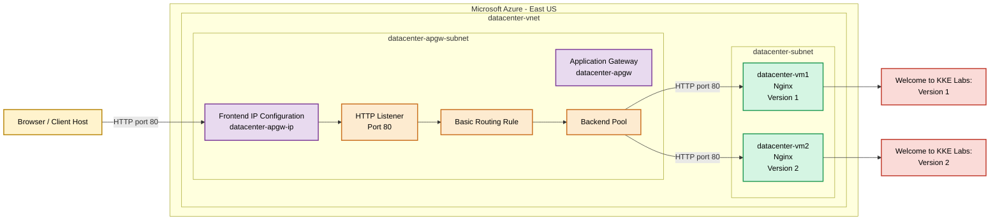

# Azure Application Gateway with Two Nginx Backends

## Prerequisites

- Run from the `azure-client` host.
- Azure CLI installed and authenticated.
- Existing Azure resource group.
- Permission to create networking, VM, public IP and Application Gateway resources.
- SSH and `curl` installed.
- Application Gateway subnet must remain dedicated to the gateway.

## OTS Script

Save as `ots.sh`. Copy only from `#!/usr/bin/env bash`.

```bash
#!/usr/bin/env bash

set -Eeuo pipefail

LOCATION="eastus"

VNET_NAME="datacenter-vnet"
VNET_PREFIX="10.0.0.0/16"
VM_SUBNET="datacenter-subnet"
VM_SUBNET_PREFIX="10.0.1.0/24"
APGW_SUBNET="datacenter-apgw-subnet"
APGW_SUBNET_PREFIX="10.0.2.0/24"

VM1="datacenter-vm1"
VM2="datacenter-vm2"
VM_ADMIN="azureuser"
VM_IMAGE="Ubuntu2204"
VM_SIZE="Standard_B1s"

SSH_PRIVATE_KEY="/root/.ssh/id_rsa"
SSH_PUBLIC_KEY="/root/.ssh/id_rsa.pub"

APGW_NAME="datacenter-apgw"
APGW_PUBLIC_IP="datacenter-apgw-ip"
APGW_FRONTEND_IP="datacenter-apgw-ip"
APGW_GATEWAY_IP_CONFIG="datacenter-apgw-ipconfig"
BACKEND_POOL="datacenter-backend-pool"
FRONTEND_PORT="datacenter-frontend-port"
HTTP_SETTINGS="datacenter-http-settings"
HTTP_LISTENER="datacenter-listener"
ROUTING_RULE="datacenter-routing-rule"

ARM_TEMPLATE="/tmp/datacenter-apgw-template.json"

step() {
    echo
    echo "============================================================"
    echo "$1"
    echo "============================================================"
}

info() { echo "INFO: $1"; }
success() { echo "SUCCESS: $1"; }
fail() { echo "ERROR: $1" >&2; exit 1; }

trap 'echo "ERROR: OTS failed at line ${LINENO}." >&2' ERR

echo "============================================================"
echo "Azure Application Gateway OTS"
echo "============================================================"

step "[1/10] Validating prerequisites"

command -v az >/dev/null 2>&1 ||
    fail "Azure CLI is not installed."

command -v curl >/dev/null 2>&1 ||
    fail "curl is not installed."

az account show >/dev/null 2>&1 ||
    fail "Azure authentication failed. Run az login."

RG="${RESOURCE_GROUP:-$(az group list --query '[0].name' -o tsv)}"

[[ -n "$RG" ]] ||
    fail "No existing resource group was found."

SUBSCRIPTION_ID="$(az account show --query id -o tsv)"

info "Resource group: $RG"
info "Subscription: $SUBSCRIPTION_ID"
info "Required region: East US"

success "Prerequisites validated."

step "[2/10] Creating or validating the SSH key"

mkdir -p /root/.ssh
chmod 700 /root/.ssh

if [[ -f "$SSH_PRIVATE_KEY" && -f "$SSH_PUBLIC_KEY" ]]; then
    info "Existing SSH key will be used."
else
    ssh-keygen \
        -t rsa \
        -b 4096 \
        -f "$SSH_PRIVATE_KEY" \
        -N "" \
        -C "azureuser@datacenter"
fi

chmod 600 "$SSH_PRIVATE_KEY"
chmod 644 "$SSH_PUBLIC_KEY"

success "SSH public key is ready."

step "[3/10] Creating or validating the VNet"

if az network vnet show \
    -g "$RG" \
    -n "$VNET_NAME" \
    >/dev/null 2>&1; then

    VNET_LOCATION="$(az network vnet show \
        -g "$RG" \
        -n "$VNET_NAME" \
        --query location \
        -o tsv)"

    [[ "${VNET_LOCATION,,}" == "$LOCATION" ]] ||
        fail "Existing VNet is not in East US."

    info "VNet already exists."
else
    az network vnet create \
        -g "$RG" \
        -n "$VNET_NAME" \
        -l "$LOCATION" \
        --address-prefixes "$VNET_PREFIX" \
        --only-show-errors \
        >/dev/null
fi

if ! az network vnet subnet show \
    -g "$RG" \
    --vnet-name "$VNET_NAME" \
    -n "$VM_SUBNET" \
    >/dev/null 2>&1; then

    az network vnet subnet create \
        -g "$RG" \
        --vnet-name "$VNET_NAME" \
        -n "$VM_SUBNET" \
        --address-prefixes "$VM_SUBNET_PREFIX" \
        --only-show-errors \
        >/dev/null
fi

if ! az network vnet subnet show \
    -g "$RG" \
    --vnet-name "$VNET_NAME" \
    -n "$APGW_SUBNET" \
    >/dev/null 2>&1; then

    az network vnet subnet create \
        -g "$RG" \
        --vnet-name "$VNET_NAME" \
        -n "$APGW_SUBNET" \
        --address-prefixes "$APGW_SUBNET_PREFIX" \
        --only-show-errors \
        >/dev/null
fi

success "VNet and both required subnets are available."

step "[4/10] Preparing Nginx cloud-init files"

cat > /tmp/datacenter-vm1-cloud-init.yaml <<'CLOUDINIT1'
#cloud-config
package_update: true
packages:
  - nginx
write_files:
  - path: /var/www/html/index.html
    owner: root:root
    permissions: '0644'
    content: |
      Welcome to KKE Labs:Version 1
runcmd:
  - systemctl enable nginx
  - systemctl restart nginx
CLOUDINIT1

cat > /tmp/datacenter-vm2-cloud-init.yaml <<'CLOUDINIT2'
#cloud-config
package_update: true
packages:
  - nginx
write_files:
  - path: /var/www/html/index.html
    owner: root:root
    permissions: '0644'
    content: |
      Welcome to KKE Labs:Version 2
runcmd:
  - systemctl enable nginx
  - systemctl restart nginx
CLOUDINIT2

success "Nginx cloud-init configurations created."

step "[5/10] Creating or validating datacenter-vm1"

if az vm show -g "$RG" -n "$VM1" >/dev/null 2>&1; then
    VM1_LOCATION="$(az vm show \
        -g "$RG" \
        -n "$VM1" \
        --query location \
        -o tsv)"

    [[ "${VM1_LOCATION,,}" == "$LOCATION" ]] ||
        fail "${VM1} is not in East US."

    info "${VM1} already exists."
else
    az vm create \
        -g "$RG" \
        -n "$VM1" \
        -l "$LOCATION" \
        --image "$VM_IMAGE" \
        --size "$VM_SIZE" \
        --admin-username "$VM_ADMIN" \
        --authentication-type ssh \
        --ssh-key-values "$SSH_PUBLIC_KEY" \
        --vnet-name "$VNET_NAME" \
        --subnet "$VM_SUBNET" \
        --public-ip-address "" \
        --nsg "" \
        --storage-sku Standard_LRS \
        --os-disk-size-gb 30 \
        --custom-data /tmp/datacenter-vm1-cloud-init.yaml \
        --only-show-errors \
        >/dev/null
fi

VM1_IP="$(az vm list-ip-addresses \
    -g "$RG" \
    -n "$VM1" \
    --query '[0].virtualMachine.network.privateIpAddresses[0]' \
    -o tsv)"

[[ -n "$VM1_IP" ]] ||
    fail "Unable to retrieve ${VM1} private IP."

success "${VM1} is available at ${VM1_IP}."

step "[6/10] Creating or validating datacenter-vm2"

if az vm show -g "$RG" -n "$VM2" >/dev/null 2>&1; then
    VM2_LOCATION="$(az vm show \
        -g "$RG" \
        -n "$VM2" \
        --query location \
        -o tsv)"

    [[ "${VM2_LOCATION,,}" == "$LOCATION" ]] ||
        fail "${VM2} is not in East US."

    info "${VM2} already exists."
else
    az vm create \
        -g "$RG" \
        -n "$VM2" \
        -l "$LOCATION" \
        --image "$VM_IMAGE" \
        --size "$VM_SIZE" \
        --admin-username "$VM_ADMIN" \
        --authentication-type ssh \
        --ssh-key-values "$SSH_PUBLIC_KEY" \
        --vnet-name "$VNET_NAME" \
        --subnet "$VM_SUBNET" \
        --public-ip-address "" \
        --nsg "" \
        --storage-sku Standard_LRS \
        --os-disk-size-gb 30 \
        --custom-data /tmp/datacenter-vm2-cloud-init.yaml \
        --only-show-errors \
        >/dev/null
fi

VM2_IP="$(az vm list-ip-addresses \
    -g "$RG" \
    -n "$VM2" \
    --query '[0].virtualMachine.network.privateIpAddresses[0]' \
    -o tsv)"

[[ -n "$VM2_IP" ]] ||
    fail "Unable to retrieve ${VM2} private IP."

success "${VM2} is available at ${VM2_IP}."

step "[7/10] Creating the Application Gateway public IP"

if az network public-ip show \
    -g "$RG" \
    -n "$APGW_PUBLIC_IP" \
    >/dev/null 2>&1; then

    PUBLIC_IP_LOCATION="$(az network public-ip show \
        -g "$RG" \
        -n "$APGW_PUBLIC_IP" \
        --query location \
        -o tsv)"

    [[ "${PUBLIC_IP_LOCATION,,}" == "$LOCATION" ]] ||
        fail "Application Gateway public IP is not in East US."

    info "Application Gateway public IP already exists."
else
    az network public-ip create \
        -g "$RG" \
        -n "$APGW_PUBLIC_IP" \
        -l "$LOCATION" \
        --sku Standard \
        --allocation-method Static \
        --only-show-errors \
        >/dev/null
fi

PUBLIC_IP_ID="$(az network public-ip show \
    -g "$RG" \
    -n "$APGW_PUBLIC_IP" \
    --query id \
    -o tsv)"

APGW_SUBNET_ID="$(az network vnet subnet show \
    -g "$RG" \
    --vnet-name "$VNET_NAME" \
    -n "$APGW_SUBNET" \
    --query id \
    -o tsv)"

success "Application Gateway frontend public IP is available."

step "[8/10] Creating or updating the Application Gateway"

cat > "$ARM_TEMPLATE" <<'ARM'
{
  "$schema": "https://schema.management.azure.com/schemas/2019-04-01/deploymentTemplate.json#",
  "contentVersion": "1.0.0.0",
  "parameters": {
    "location": {"type": "string"},
    "applicationGatewayName": {"type": "string"},
    "applicationGatewaySubnetId": {"type": "string"},
    "publicIpId": {"type": "string"},
    "backendIp1": {"type": "string"},
    "backendIp2": {"type": "string"}
  },
  "resources": [
    {
      "type": "Microsoft.Network/applicationGateways",
      "apiVersion": "2024-10-01",
      "name": "[parameters('applicationGatewayName')]",
      "location": "[parameters('location')]",
      "sku": {
        "name": "Basic",
        "tier": "Basic",
        "capacity": 1
      },
      "properties": {
        "gatewayIPConfigurations": [
          {
            "name": "datacenter-apgw-ipconfig",
            "properties": {
              "subnet": {
                "id": "[parameters('applicationGatewaySubnetId')]"
              }
            }
          }
        ],
        "frontendIPConfigurations": [
          {
            "name": "datacenter-apgw-ip",
            "properties": {
              "publicIPAddress": {
                "id": "[parameters('publicIpId')]"
              }
            }
          }
        ],
        "frontendPorts": [
          {
            "name": "datacenter-frontend-port",
            "properties": {
              "port": 80
            }
          }
        ],
        "backendAddressPools": [
          {
            "name": "datacenter-backend-pool",
            "properties": {
              "backendAddresses": [
                {
                  "ipAddress": "[parameters('backendIp1')]"
                },
                {
                  "ipAddress": "[parameters('backendIp2')]"
                }
              ]
            }
          }
        ],
        "backendHttpSettingsCollection": [
          {
            "name": "datacenter-http-settings",
            "properties": {
              "port": 80,
              "protocol": "Http",
              "cookieBasedAffinity": "Disabled",
              "requestTimeout": 30
            }
          }
        ],
        "httpListeners": [
          {
            "name": "datacenter-listener",
            "properties": {
              "frontendIPConfiguration": {
                "id": "[concat(resourceId('Microsoft.Network/applicationGateways', parameters('applicationGatewayName')), '/frontendIPConfigurations/datacenter-apgw-ip')]"
              },
              "frontendPort": {
                "id": "[concat(resourceId('Microsoft.Network/applicationGateways', parameters('applicationGatewayName')), '/frontendPorts/datacenter-frontend-port')]"
              },
              "protocol": "Http"
            }
          }
        ],
        "requestRoutingRules": [
          {
            "name": "datacenter-routing-rule",
            "properties": {
              "ruleType": "Basic",
              "priority": 100,
              "httpListener": {
                "id": "[concat(resourceId('Microsoft.Network/applicationGateways', parameters('applicationGatewayName')), '/httpListeners/datacenter-listener')]"
              },
              "backendAddressPool": {
                "id": "[concat(resourceId('Microsoft.Network/applicationGateways', parameters('applicationGatewayName')), '/backendAddressPools/datacenter-backend-pool')]"
              },
              "backendHttpSettings": {
                "id": "[concat(resourceId('Microsoft.Network/applicationGateways', parameters('applicationGatewayName')), '/backendHttpSettingsCollection/datacenter-http-settings')]"
              }
            }
          }
        ]
      }
    }
  ]
}
ARM

info "Deploying Application Gateway."
info "This operation can take several minutes."

az deployment group create \
    -g "$RG" \
    -n datacenter-apgw-deployment \
    --template-file "$ARM_TEMPLATE" \
    --parameters \
        location="$LOCATION" \
        applicationGatewayName="$APGW_NAME" \
        applicationGatewaySubnetId="$APGW_SUBNET_ID" \
        publicIpId="$PUBLIC_IP_ID" \
        backendIp1="$VM1_IP" \
        backendIp2="$VM2_IP" \
    --only-show-errors \
    >/dev/null

success "Application Gateway deployment completed."

step "[9/10] Waiting for Application Gateway readiness"

APGW_STATE=""
APGW_OPERATIONAL=""

for ATTEMPT in {1..60}; do
    APGW_STATE="$(az network application-gateway show \
        -g "$RG" \
        -n "$APGW_NAME" \
        --query provisioningState \
        -o tsv 2>/dev/null || true)"

    APGW_OPERATIONAL="$(az network application-gateway show \
        -g "$RG" \
        -n "$APGW_NAME" \
        --query operationalState \
        -o tsv 2>/dev/null || true)"

    echo "Check ${ATTEMPT}/60: Provisioning=${APGW_STATE}, Operational=${APGW_OPERATIONAL}"

    if [[ "$APGW_STATE" == "Succeeded" &&
          "$APGW_OPERATIONAL" == "Running" ]]; then
        break
    fi

    [[ "$APGW_STATE" == "Failed" ]] &&
        fail "Application Gateway deployment failed."

    sleep 30
done

[[ "$APGW_STATE" == "Succeeded" ]] ||
    fail "Application Gateway did not reach Succeeded state."

[[ "$APGW_OPERATIONAL" == "Running" ]] ||
    fail "Application Gateway is not running."

APGW_IP="$(az network public-ip show \
    -g "$RG" \
    -n "$APGW_PUBLIC_IP" \
    --query ipAddress \
    -o tsv)"

[[ -n "$APGW_IP" ]] ||
    fail "Application Gateway public IP was not assigned."

success "Application Gateway is running at ${APGW_IP}."

step "[10/10] Verifying load balancing"

VERSION1_FOUND="false"
VERSION2_FOUND="false"

info "Waiting for Nginx and backend health."

for ATTEMPT in {1..60}; do
    RESPONSE="$(curl \
        --silent \
        --connect-timeout 5 \
        --max-time 10 \
        --header 'Connection: close' \
        "http://${APGW_IP}/?request=${ATTEMPT}-${RANDOM}" || true)"

    echo "Request ${ATTEMPT}: ${RESPONSE}"

    [[ "$RESPONSE" == *"Welcome to KKE Labs:Version 1"* ]] &&
        VERSION1_FOUND="true"

    [[ "$RESPONSE" == *"Welcome to KKE Labs:Version 2"* ]] &&
        VERSION2_FOUND="true"

    if [[ "$VERSION1_FOUND" == "true" &&
          "$VERSION2_FOUND" == "true" ]]; then
        break
    fi

    sleep 10
done

[[ "$VERSION1_FOUND" == "true" ]] ||
    fail "No response was received from datacenter-vm1."

[[ "$VERSION2_FOUND" == "true" ]] ||
    fail "No response was received from datacenter-vm2."

echo
echo "============================================================"
echo "Application Gateway deployment completed successfully"
echo "============================================================"
echo "Region                : East US"
echo "VNet                  : $VNET_NAME"
echo "VM subnet             : $VM_SUBNET"
echo "Gateway subnet        : $APGW_SUBNET"
echo "VM1                   : $VM1"
echo "VM1 private IP        : $VM1_IP"
echo "VM1 content           : Welcome to KKE Labs:Version 1"
echo "VM2                   : $VM2"
echo "VM2 private IP        : $VM2_IP"
echo "VM2 content           : Welcome to KKE Labs:Version 2"
echo "Application Gateway   : $APGW_NAME"
echo "Frontend IP config    : $APGW_FRONTEND_IP"
echo "Backend pool          : $BACKEND_POOL"
echo "Routing rule          : $ROUTING_RULE"
echo "Routing rule type     : Basic"
echo "Application Gateway IP: $APGW_IP"
echo "Application URL       : http://${APGW_IP}"
echo "VM1 response verified : $VERSION1_FOUND"
echo "VM2 response verified : $VERSION2_FOUND"
echo "============================================================"
```

Run:

```bash
chmod +x ots.sh
bash -n ots.sh && echo "Syntax OK"
./ots.sh
```

## Runbook

### Validate the network

```bash
RG="$(az group list --query '[0].name' -o tsv)"

az network vnet show \
  -g "$RG" \
  -n datacenter-vnet \
  --query '{Name:name,Location:location,Prefixes:addressSpace.addressPrefixes}' \
  -o table

az network vnet subnet list \
  -g "$RG" \
  --vnet-name datacenter-vnet \
  --query '[].{Name:name,Prefix:addressPrefix}' \
  -o table
```

Expected subnets:

```text
datacenter-subnet
datacenter-apgw-subnet
```

### Verify the VMs

```bash
az vm list \
  -g "$RG" \
  --show-details \
  --query "[?name=='datacenter-vm1' || name=='datacenter-vm2'].{
    Name:name,
    Location:location,
    State:powerState,
    PrivateIP:privateIps,
    PublicIP:publicIps
  }" \
  -o table
```

The VMs should have private IP addresses and no public IP addresses.

### Verify Application Gateway

```bash
az network application-gateway show \
  -g "$RG" \
  -n datacenter-apgw \
  --query '{
    Name:name,
    Location:location,
    Provisioning:provisioningState,
    Operational:operationalState,
    Frontend:frontendIPConfigurations[].name,
    BackendPools:backendAddressPools[].name,
    Listeners:httpListeners[].name,
    Rules:requestRoutingRules[].name
  }' \
  -o json
```

### Verify backend pool members

```bash
az network application-gateway show \
  -g "$RG" \
  -n datacenter-apgw \
  --query 'backendAddressPools[].backendAddresses[].ipAddress' \
  -o tsv
```

Both VM private IP addresses should be displayed.

### Verify backend health

```bash
az network application-gateway show-backend-health \
  -g "$RG" \
  -n datacenter-apgw \
  -o table
```

### Verify load balancing

```bash
APGW_IP="$(az network public-ip show \
  -g "$RG" \
  -n datacenter-apgw-ip \
  --query ipAddress \
  -o tsv)"

for i in {1..20}; do
    curl -s \
      -H 'Connection: close' \
      "http://${APGW_IP}/?request=${i}-${RANDOM}"

    echo
    sleep 1
done
```

Expected responses:

```text
Welcome to KKE Labs:Version 1
Welcome to KKE Labs:Version 2
```

## Colored Mermaid Diagram

