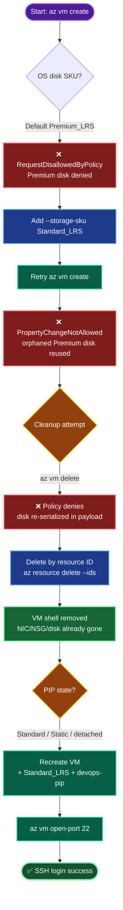

Here's the complete documentation.

# Azure VM Deployment — `devops-vm` with Static IP `devops-pip`
### Incident + Resolution Runbook

---

## Overview

Task: deploy `devops-vm` (Standard_B1s, Ubuntu 22.04) in **Central US**, attach static public IP `devops-pip`, enable SSH via a key generated on `azure-client`. Deployment failed twice on an **Azure Policy** blocking Premium OS disks, then the failed VM shell blocked all retries until removed via delete-by-ID.

---

## Flow Diagram



---

## TODO

| # | Task | Status |
|---|------|--------|
| 1 | Log in, set `RG` / `LOC` vars | ✅ |
| 2 | Generate SSH key on `azure-client` | ✅ |
| 3 | Create static PIP `devops-pip` | ✅ |
| 4 | Create VM — *failed on Premium disk policy* | ❌→ fixed |
| 5 | Add `--storage-sku Standard_LRS` — *failed on orphaned disk* | ❌→ fixed |
| 6 | Clean up orphaned VM/NIC/NSG/disk | ✅ |
| 7 | Delete failed VM shell via `--ids` | ✅ |
| 8 | Confirm `devops-pip` detached | ✅ |
| 9 | Recreate VM clean | ⬜ (final step) |
| 10 | Open port 22 + SSH verify | ⬜ |

---

## OTS (One-Line-To-Ship)

**Cleanup (delete-by-ID, policy-safe):**
```bash
VM_ID=$(az vm show -g "$RG" -n devops-vm --query id -o tsv); az resource delete --ids "$VM_ID"
```

**Recreate + open + verify:**
```bash
az vm create -g "$RG" -n devops-vm --image Ubuntu2204 --size Standard_B1s --admin-username azureuser --ssh-key-values ~/.ssh/id_rsa.pub --public-ip-address devops-pip --storage-sku Standard_LRS --location "$LOC" && \
az vm open-port -g "$RG" -n devops-vm --port 22 && \
ssh -o StrictHostKeyChecking=no azureuser@$(az vm list-ip-addresses -g "$RG" -n devops-vm --query "[0].virtualMachine.network.publicIpAddresses[0].ipAddress" -o tsv)
```

---

## Runbook

### Phase 1 — Setup
```bash
az login -u '<user>' -p '<pass>'
RG=$(az group list --query "[0].name" -o tsv)
LOC=centralus
ssh-keygen -t rsa -b 4096 -f ~/.ssh/id_rsa -N "" -q
az network public-ip create -g "$RG" -n devops-pip --sku Standard --allocation-method Static --location "$LOC"
```

### Phase 2 — Cleanup (when a create fails)
Delete in reverse dependency order, **by resource ID** to bypass the deny policy:
```bash
# Grab IDs (empty vars = already gone; that's fine)
VM_ID=$(az vm show -g "$RG" -n devops-vm --query id -o tsv 2>/dev/null)
NIC_ID=$(az network nic show -g "$RG" -n devops-vmVMNic --query id -o tsv 2>/dev/null)
NSG_ID=$(az network nsg show -g "$RG" -n devops-vmNSG --query id -o tsv 2>/dev/null)

# Delete VM first, then dependents
az resource delete --ids "$VM_ID"
az resource delete --ids "$NIC_ID"   # skip if empty
az resource delete --ids "$NSG_ID"   # skip if empty

# Fallback if policy still blocks: raw ARM DELETE
az rest --method delete --url "https://management.azure.com${VM_ID}?api-version=2023-09-01"
```

### Phase 3 — Pre-recreate checks
```bash
az resource list --query "[?contains(name,'devops')].{name:name,type:type}" -o table
# Expect only: devops-pip, devops-vmVNET
az network public-ip show -g "$RG" -n devops-pip --query "{sku:sku.name, alloc:publicIPAllocationMethod, ipConfig:ipConfiguration}" -o table
# ipConfig must be null
```

### Phase 4 — Recreate
```bash
az vm create -g "$RG" -n devops-vm \
  --image Ubuntu2204 --size Standard_B1s \
  --admin-username azureuser \
  --ssh-key-values ~/.ssh/id_rsa.pub \
  --public-ip-address devops-pip \
  --storage-sku Standard_LRS \
  --location "$LOC"

az vm open-port -g "$RG" -n devops-vm --port 22
```

### Phase 5 — Verify
```bash
PIP=$(az vm list-ip-addresses -g "$RG" -n devops-vm \
  --query "[0].virtualMachine.network.publicIpAddresses[0].ipAddress" -o tsv)
ssh -o StrictHostKeyChecking=no azureuser@"$PIP"
```

---

## Concept Behind It

**1. Why the disk policy fired.** `Standard_B1s` is premium-storage-capable, so Azure CLI defaults its OS disk to `Premium_LRS`. The lab's Azure Policy denies any Compute disk that is Premium or >128 GB. Force `--storage-sku Standard_LRS` to comply. Disk SKU is chosen at **create time**.

**2. Why immutability bit on retry.** A managed disk's `storageAccountType` is **immutable** — you cannot flip `Premium_LRS → Standard_LRS` in place. `az vm create` is **not transactional**: resources provisioned before the failure point (PIP, VNET, NSG, NIC, sometimes the disk) survive as orphans using deterministic names. The retry reuses the same disk name with a new SKU → `PropertyChangeNotAllowed`.

**3. Why `az vm delete` itself got policy-denied.** Deny policies evaluate the **ARM request payload**. Depending on CLI version and disk delete-options, `az vm delete` can send a PUT/PATCH that re-serializes the VM's disk config (`Premium_LRS`) as part of teardown. The policy sees the disallowed value and rejects the whole request — so the delete never completes.

**4. The escape hatch.** `az resource delete --ids` (and `az rest --method delete`) issue a **bare ARM DELETE with no resource body** — the deny rule has nothing to match against, so deletion succeeds. This "delete-by-ID to escape a deny policy" pattern is the standard fix whenever a wrapper command re-sends disallowed properties during an otherwise-valid operation.

**5. Idempotency by cleanup.** Because create isn't transactional, safe re-runs require tearing down the dependent chain in reverse order (VM → NIC/disk → NSG), preserving independent resources you want to keep (`devops-pip`, VNET), then recreating with compliant parameters from the start.

---

## Key Takeaways

- **`--storage-sku Standard_LRS`** is mandatory for `Standard_B*` VMs under Standard-storage-only policies.
- **Pre-create the static PIP** and pass it by name so the VM binds `devops-pip` (not an auto-named IP).
- **`az vm open-port 22`** is required — Standard SKU IPs deny inbound by default.
- **When a wrapper command trips a deny policy, drop to `--ids` / `az rest`.**

Run Phase 4 to finish — paste the output and I'll confirm completion.