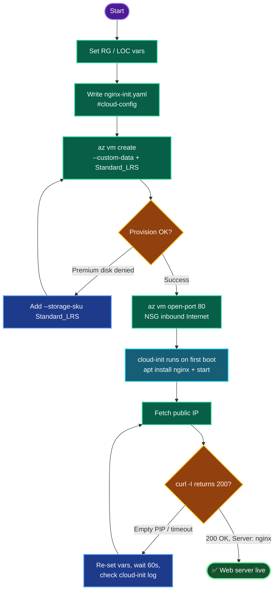

# Azure VM Web Server — `devops-vm` with Nginx (cloud-init)
### Deployment Documentation

---

## TODO

| # | Task | Status |
|---|------|--------|
| 1 | Set `RG` / `LOC` variables | ✅ |
| 2 | Write cloud-init file (install + start Nginx) | ✅ |
| 3 | Create `devops-vm` (Ubuntu, Standard_LRS disk) with `--custom-data` | ✅ |
| 4 | Open NSG inbound port 80 from Internet | ✅ |
| 5 | Fetch public IP + `curl` verify 200 OK | ⬜ (final) |

---

## Concept

**1. Custom Script vs User Data (cloud-init).** Azure offers two bootstrap mechanisms. The *Custom Script Extension* is a post-deploy VM extension that downloads and runs a script. *User Data / cloud-init* runs natively on first boot and is simpler, faster, and version-controllable. For "install a package + start a service," **cloud-init (`--custom-data`) is the cleaner choice** — no extension resource, no external script storage.

**2. Why `#cloud-config`.** The file must start with `#cloud-config` for cloud-init to parse it as declarative YAML. `packages:` handles `apt install`; `runcmd:` runs shell commands on first boot to enable and start the service. cloud-init runs **after** the VM reports "created," so there's a 30–60s lag before Nginx answers.

**3. NSG and internet access.** A VM is only reachable on a port if the NSG has an inbound allow rule for it. `az vm open-port --port 80` injects a rule (source `Internet`) into the VM's auto-created `devops-vmNSG`. Without this, Nginx runs but the port is filtered from outside.

**4. Policy carry-over.** This lab enforces an Azure Policy denying Premium OS disks. `Standard_B1s` defaults to `Premium_LRS`, so `--storage-sku Standard_LRS` is mandatory — same fix as the prior task.

---

## Runbook

### Phase 1 — Variables
```bash
RG=$(az group list --query "[0].name" -o tsv)
LOC=centralus
echo "RG=$RG LOC=$LOC"
```

### Phase 2 — cloud-init file
```bash
cat > nginx-init.yaml <<'EOF'
#cloud-config
package_update: true
packages:
  - nginx
runcmd:
  - systemctl enable nginx
  - systemctl start nginx
EOF
```

### Phase 3 — Create the VM
```bash
az vm create \
  --resource-group "$RG" \
  --name devops-vm \
  --image Ubuntu2204 \
  --size Standard_B1s \
  --admin-username azureuser \
  --generate-ssh-keys \
  --custom-data nginx-init.yaml \
  --storage-sku Standard_LRS \
  --location "$LOC"
```

### Phase 4 — Open port 80
```bash
az vm open-port \
  --resource-group "$RG" \
  --name devops-vm \
  --port 80 \
  --priority 900
```

### Phase 5 — Verify
```bash
PIP=$(az vm list-ip-addresses -g "$RG" -n devops-vm \
        --query "[0].virtualMachine.network.publicIpAddresses[0].ipAddress" -o tsv)
echo "PIP=$PIP"

curl -I http://"$PIP"     # expect HTTP/1.1 200 OK, Server: nginx
```

---

## OTS (One-Line-To-Ship)

**Full deploy (assumes `nginx-init.yaml` exists):**
```bash
RG=$(az group list --query "[0].name" -o tsv); LOC=centralus; \
az vm create -g "$RG" -n devops-vm --image Ubuntu2204 --size Standard_B1s --admin-username azureuser --generate-ssh-keys --custom-data nginx-init.yaml --storage-sku Standard_LRS --location "$LOC" && \
az vm open-port -g "$RG" -n devops-vm --port 80 --priority 900 && \
sleep 60 && \
curl -I http://$(az vm list-ip-addresses -g "$RG" -n devops-vm --query "[0].virtualMachine.network.publicIpAddresses[0].ipAddress" -o tsv)
```

---

## Mermaid



---

## Troubleshooting

| Symptom | Cause | Fix |
|---------|-------|-----|
| `curl: (3) ... missing URL` | `$PIP` empty — shell var lost on new session | Re-run `RG=` and `PIP=` assignments in current shell |
| `RequestDisallowedByPolicy` (disk) | `Standard_B1s` defaulted OS disk to `Premium_LRS` | Add `--storage-sku Standard_LRS` |
| `curl` connection refused / timeout | NSG missing port 80 rule | `az vm open-port --port 80 --priority 900` |
| `curl` returns nothing right after create | cloud-init still running (runs post-create) | Wait 60s; then retry |
| Priority 900 already in use | NSG rule collision | Bump `--priority` to 910 |
| `Ubuntu2204` image not found | Alias unavailable in region | `az vm image list --publisher Canonical --all -o table`, pick a URN |
| Need to confirm bootstrap ran | Verify cloud-init execution | SSH in → `sudo cat /var/log/cloud-init-output.log` |
| Nginx not responding but port open | Service didn't start | SSH → `sudo systemctl status nginx && sudo systemctl start nginx` |

---

**Next step:** run Phase 5 (or the `sleep 60 && curl` in OTS). A `200 OK` with `Server: nginx` confirms all four requirements met — VM named `devops-vm`, Ubuntu image, cloud-init installed+started Nginx, and NSG allows HTTP/80 from the internet.