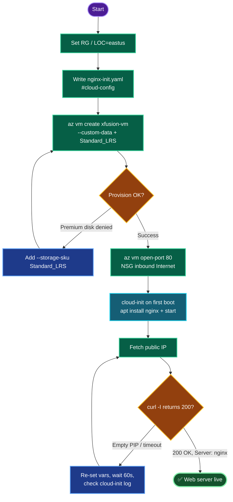

# Azure VM Web Server — `xfusion-vm` with Nginx (cloud-init, East US)
### Deployment Documentation

---

## TODO

| # | Task | Status |
|---|------|--------|
| 1 | Set `RG` / `LOC=eastus` variables | ✅ |
| 2 | Write cloud-init file (install + start Nginx) | ✅ |
| 3 | Create `xfusion-vm` (Ubuntu, Standard_LRS disk) with `--custom-data` | ✅ |
| 4 | Open NSG inbound port 80 from Internet | ✅ |
| 5 | Fetch public IP + `curl` verify 200 OK | ⬜ (final) |

---

## Concept

**1. User Data / cloud-init over Custom Script Extension.** For "install a package + start a service," cloud-init via `--custom-data` is the cleaner path — it runs natively on first boot, needs no extension resource or external script storage, and is fully version-controllable. The file must begin with `#cloud-config`; `packages:` performs the `apt install`, and `runcmd:` enables and starts the service.

**2. cloud-init timing.** cloud-init executes **after** the VM reports "created," so there's a 30–60s window before Nginx answers. A `curl` fired immediately after create can fail even though the deployment is correct.

**3. NSG gates internet access.** Nginx listening on 80 is not enough — the NSG must have an inbound allow rule for TCP 80 from `Internet`. `az vm open-port --port 80` injects that rule into the auto-created `xfusion-vmNSG`.

**4. Policy carry-over — Premium disk denial.** This subscription enforces an Azure Policy rejecting Premium OS disks. `Standard_B1s` defaults to `Premium_LRS`, so `--storage-sku Standard_LRS` is mandatory to pass provisioning.

**5. Region scoping.** All resources must land in **East US** (`eastus`). If the default resource group is pinned to another region, create a new one in East US so the VM, NIC, NSG, and PIP all co-locate.

---

## Runbook

### Phase 1 — Variables
```bash
RG=$(az group list --query "[0].name" -o tsv)
LOC=eastus
echo "RG=$RG LOC=$LOC"
# If default RG isn't East US:
# az group create -n nautilus-rg -l eastus && RG=nautilus-rg
```

### Phase 2 — cloud-init file
```bash
cat > nginx-init.yaml <<'EOF'
#cloud-config
package_update: true
packages:
  - nginx
runcmd:
  - systemctl enable nginx
  - systemctl start nginx
EOF
```

### Phase 3 — Create the VM
```bash
az vm create \
  --resource-group "$RG" \
  --name xfusion-vm \
  --image Ubuntu2204 \
  --size Standard_B1s \
  --admin-username azureuser \
  --generate-ssh-keys \
  --custom-data nginx-init.yaml \
  --storage-sku Standard_LRS \
  --location "$LOC"
```

### Phase 4 — Open port 80
```bash
az vm open-port \
  --resource-group "$RG" \
  --name xfusion-vm \
  --port 80 \
  --priority 900
```

### Phase 5 — Verify
```bash
PIP=$(az vm list-ip-addresses -g "$RG" -n xfusion-vm \
        --query "[0].virtualMachine.network.publicIpAddresses[0].ipAddress" -o tsv)
echo "PIP=$PIP"

sleep 60
curl -I http://"$PIP"     # expect HTTP/1.1 200 OK, Server: nginx
```

---

## OTS (One-Line-To-Ship)

**Full deploy (assumes `nginx-init.yaml` exists):**
```bash
RG=$(az group list --query "[0].name" -o tsv); LOC=eastus; \
az vm create -g "$RG" -n xfusion-vm --image Ubuntu2204 --size Standard_B1s --admin-username azureuser --generate-ssh-keys --custom-data nginx-init.yaml --storage-sku Standard_LRS --location "$LOC" && \
az vm open-port -g "$RG" -n xfusion-vm --port 80 --priority 900 && \
sleep 60 && \
curl -I http://$(az vm list-ip-addresses -g "$RG" -n xfusion-vm --query "[0].virtualMachine.network.publicIpAddresses[0].ipAddress" -o tsv)
```

---

## Mermaid



---

## Troubleshooting

| Symptom | Cause | Fix |
|---------|-------|-----|
| `curl: (3) ... missing URL` | `$PIP` empty — shell var lost on new session | Re-run `RG=` and `PIP=` in current shell |
| `RequestDisallowedByPolicy` (disk) | `Standard_B1s` defaulted to `Premium_LRS` | Add `--storage-sku Standard_LRS` |
| VM created in wrong region | Default RG pinned outside East US | `az group create -n nautilus-rg -l eastus`, set `RG=nautilus-rg` |
| `curl` refused / timeout | NSG missing port 80 rule | `az vm open-port --port 80 --priority 900` |
| `curl` empty right after create | cloud-init still running (post-create) | Wait 60s, retry |
| Priority 900 in use | NSG rule collision | Bump `--priority` to 910 |
| `Ubuntu2204` not found | Alias unavailable in region | `az vm image list --publisher Canonical --all -o table`, pick a URN |
| Nginx down but port open | Service didn't start | SSH → `sudo systemctl status nginx && sudo systemctl start nginx` |
| Confirm bootstrap ran | Verify cloud-init | SSH → `sudo cat /var/log/cloud-init-output.log` |

---

**Definition of done:** `xfusion-vm` running in East US, Ubuntu image, cloud-init installed and started Nginx, NSG allows HTTP/80 from the internet, and `curl -I http://<PIP>` returns `200 OK` with `Server: nginx`.