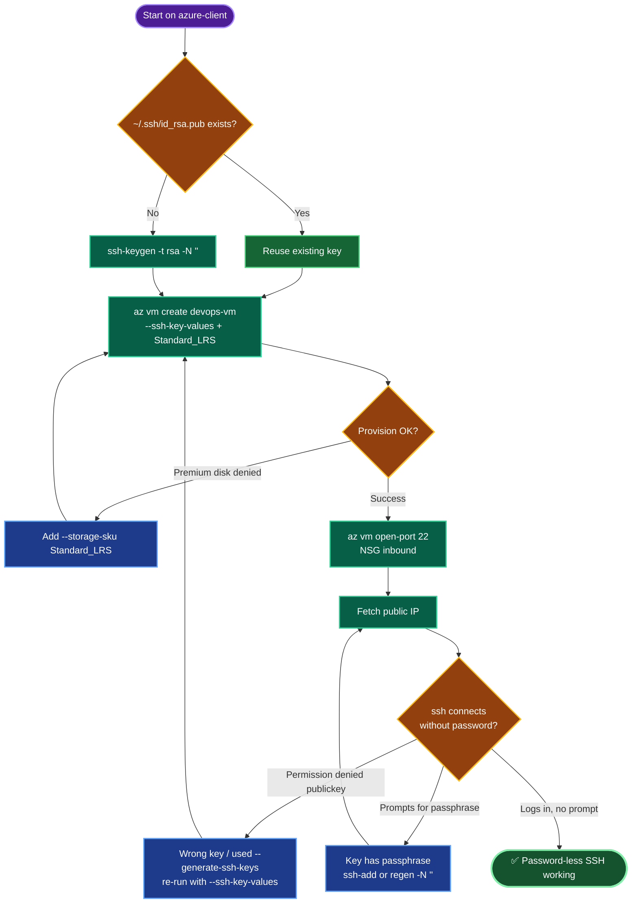

# Azure VM — `devops-vm` Password-less SSH (westus)
### Deployment Documentation

---

## TODO

| # | Task | Status |
|---|------|--------|
| 1 | Log in, set `RG` / `LOC=westus` | ✅ |
| 2 | Check for existing SSH key; create only if missing | ✅ |
| 3 | Create `devops-vm` (Standard_B1s, Standard_LRS) with client public key | ✅ |
| 4 | Open NSG inbound port 22 | ✅ |
| 5 | SSH from azure-client → verify password-less login | ⬜ (final) |

---

## Concept

**1. Asymmetric key auth.** SSH password-less access relies on a keypair: the **private** key stays on `azure-client` (`~/.ssh/id_rsa`), the **public** key (`~/.ssh/id_rsa.pub`) goes into `azureuser`'s `~/.ssh/authorized_keys` on the VM. The server challenges with data only the matching private key can sign — no password ever crosses the wire.

**2. Check-before-create.** The task explicitly requires checking for an existing key first. Regenerating unconditionally would overwrite a key that other hosts may already trust. The `if [ -f ~/.ssh/id_rsa.pub ]` guard is idempotent — safe to run repeatedly.

**3. `--ssh-key-values` vs `--generate-ssh-keys`.** `--ssh-key-values ~/.ssh/id_rsa.pub` injects *your* existing client key into the VM — this is what enables password-less login *from azure-client*. `--generate-ssh-keys` would create a brand-new key on the control host and may not match the client's key, breaking the requirement. Always pass the explicit key file here.

**4. Empty passphrase.** `-N ""` creates the key with no passphrase, so `ssh` connects non-interactively. A key made *with* a passphrase still prompts (for the passphrase, not a password) unless loaded into an agent.

**5. NSG + policy carry-over.** Port 22 must be allowed inbound via the NSG (`az vm open-port`). And this subscription's Azure Policy denies Premium OS disks, so `--storage-sku Standard_LRS` remains mandatory for `Standard_B1s`.

---

## Runbook

### Phase 1 — Login + variables
```bash
showcreds
az login -u '<username>' -p '<password>'
RG=$(az group list --query "[0].name" -o tsv)
LOC=westus
echo "RG=$RG LOC=$LOC"
```

### Phase 2 — Check / create SSH key
```bash
if [ -f ~/.ssh/id_rsa.pub ]; then
  echo "SSH key already exists:"; ls -l ~/.ssh/id_rsa*
else
  echo "No key found — generating..."
  ssh-keygen -t rsa -b 4096 -f ~/.ssh/id_rsa -N "" -q
  ls -l ~/.ssh/id_rsa*
fi
```

### Phase 3 — Create the VM
```bash
az vm create \
  --resource-group "$RG" \
  --name devops-vm \
  --image Ubuntu2204 \
  --size Standard_B1s \
  --admin-username azureuser \
  --ssh-key-values ~/.ssh/id_rsa.pub \
  --storage-sku Standard_LRS \
  --location "$LOC"
```

### Phase 4 — Open port 22
```bash
az vm open-port --resource-group "$RG" --name devops-vm --port 22 --priority 900
```

### Phase 5 — Verify
```bash
PIP=$(az vm list-ip-addresses -g "$RG" -n devops-vm \
        --query "[0].virtualMachine.network.publicIpAddresses[0].ipAddress" -o tsv)
echo "PIP=$PIP"
ssh -o StrictHostKeyChecking=no azureuser@"$PIP"    # no password prompt = success
```

---

## OTS (One-Line-To-Ship)

```bash
RG=$(az group list --query "[0].name" -o tsv); LOC=westus; \
[ -f ~/.ssh/id_rsa.pub ] || ssh-keygen -t rsa -b 4096 -f ~/.ssh/id_rsa -N "" -q; \
az vm create -g "$RG" -n devops-vm --image Ubuntu2204 --size Standard_B1s --admin-username azureuser --ssh-key-values ~/.ssh/id_rsa.pub --storage-sku Standard_LRS --location "$LOC" && \
az vm open-port -g "$RG" -n devops-vm --port 22 --priority 900 && \
ssh -o StrictHostKeyChecking=no azureuser@$(az vm list-ip-addresses -g "$RG" -n devops-vm --query "[0].virtualMachine.network.publicIpAddresses[0].ipAddress" -o tsv)
```

---

## Mermaid



---

## Troubleshooting

| Symptom | Cause | Fix |
|---------|-------|-----|
| `Permission denied (publickey)` | Wrong key injected, or `--generate-ssh-keys` overwrote client key | Recreate VM with `--ssh-key-values ~/.ssh/id_rsa.pub` |
| SSH prompts for a passphrase | Existing key was created *with* a passphrase | `ssh-add ~/.ssh/id_rsa`, or regenerate with `-N ""` |
| `RequestDisallowedByPolicy` (disk) | `Standard_B1s` defaulted to `Premium_LRS` | Add `--storage-sku Standard_LRS` |
| `ssh: connect ... timed out` | NSG missing port 22 rule | `az vm open-port --port 22 --priority 900` |
| `curl: (3)` / empty `$PIP` | Shell var lost on new session | Re-run `RG=` and `PIP=` assignments |
| Priority 900 in use | NSG rule collision | Bump `--priority` to 910 |
| `Host key verification failed` | Stale entry from a prior VM at same IP | `ssh-keygen -R <PIP>` then retry |
| VM in wrong region | Default RG pinned elsewhere | `az group create -n nautilus-rg -l westus`, set `RG=nautilus-rg` |

---

**Definition of done:** `devops-vm` running in westus (Standard_B1s), the azure-client SSH public key present in `azureuser`'s `authorized_keys`, port 22 open, and `ssh azureuser@<PIP>` logs in from azure-client **without** a password prompt.