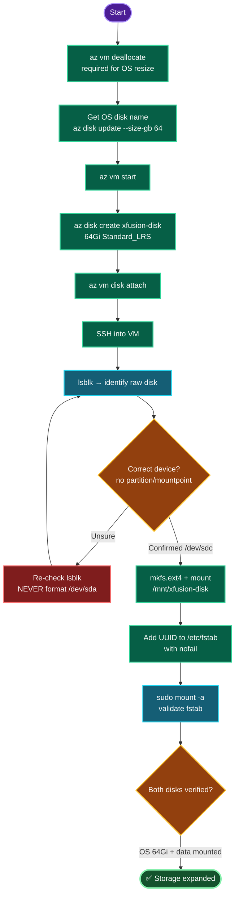

# Azure VM Storage Expansion — `xfusion-vm` OS Resize + Data Disk (East US)
### Storage Operations Documentation

---

## TODO

| # | Task | Status |
|---|------|--------|
| 1 | Set `RG` / `LOC=eastus` | ✅ |
| 2 | Deallocate VM (required for OS resize) | ✅ |
| 3 | Resize OS disk 32Gi → 64Gi, restart VM | ✅ |
| 4 | Create Standard HDD `xfusion-disk` (64Gi) | ✅ |
| 5 | Attach data disk to `xfusion-vm` | ✅ |
| 6 | Format + mount at `/mnt/xfusion-disk` | ✅ |
| 7 | Persist in `/etc/fstab` + verify | ⬜ (final) |

---

## Concept

**1. OS disk resize needs deallocation.** Azure only permits changing an OS disk's size while the VM is **stopped-deallocated**. `az disk update --size-gb` on a running VM fails. Flow: deallocate → resize → start.

**2. Disks grow only, never shrink.** Managed disks are one-way expandable. 32→64 is valid; there is no supported path back to 32. Plan sizes deliberately.

**3. Disk size vs filesystem size.** Resizing the *disk* (block device) does not automatically resize the *filesystem* on it. Ubuntu cloud images usually auto-grow root via `cloud-initramfs-growroot` on boot; otherwise `growpart` + `resize2fs` are needed. The new data disk arrives raw — it must be partitioned/formatted before use.

**4. Data disk lifecycle = three layers.** (a) *Create* the managed disk in Azure, (b) *attach* it to the VM (assigns a LUN, surfaces a block device like `/dev/sdc`), (c) *mount* it in the OS (format → mount → fstab). All three are required; attach alone gives an unusable raw device.

**5. Device naming & the destructive risk.** `/dev/sda` = OS disk, `/dev/sdb` = ephemeral temp disk, `/dev/sdc` = first data disk (typical). Always confirm via `lsblk` — the target is the device with **no partitions and no mountpoint**. Formatting the wrong device destroys data.

**6. Persistent mounts use UUID + `nofail`.** Device names (`/dev/sdc`) can reorder across reboots — mount by **UUID** instead. `nofail` prevents a missing/failed disk from blocking boot. Always `sudo mount -a` to validate fstab before rebooting.

**7. Policy carry-over.** `--sku Standard_LRS` = Standard HDD, which also satisfies the subscription's no-Premium-disk policy.

---

## Runbook

### Phase 1 — Variables
```bash
RG=$(az group list --query "[0].name" -o tsv)
LOC=eastus
echo "RG=$RG LOC=$LOC"
```

### Phase 2 — Expand OS disk (32Gi → 64Gi)
```bash
az vm deallocate -g "$RG" -n xfusion-vm

OSDISK=$(az vm show -g "$RG" -n xfusion-vm --query "storageProfile.osDisk.name" -o tsv)
echo "OS disk: $OSDISK"

az disk update -g "$RG" -n "$OSDISK" --size-gb 64

az vm start -g "$RG" -n xfusion-vm
```

### Phase 3 — Create + attach data disk
```bash
az disk create -g "$RG" -n xfusion-disk --size-gb 64 --sku Standard_LRS --location "$LOC"

az vm disk attach -g "$RG" --vm-name xfusion-vm --name xfusion-disk
```

### Phase 4 — Format + mount (on the VM)
```bash
PIP=$(az vm list-ip-addresses -g "$RG" -n xfusion-vm \
        --query "[0].virtualMachine.network.publicIpAddresses[0].ipAddress" -o tsv)
ssh -o StrictHostKeyChecking=no azureuser@"$PIP"
```
Then inside the VM:
```bash
lsblk                                  # identify the raw disk (no mountpoint, e.g. /dev/sdc)
sudo mkfs.ext4 /dev/sdc
sudo mkdir -p /mnt/xfusion-disk
sudo mount /dev/sdc /mnt/xfusion-disk
df -h /mnt/xfusion-disk
```

### Phase 5 — Persist + verify
```bash
UUID=$(sudo blkid -s UUID -o value /dev/sdc)
echo "UUID=$UUID /mnt/xfusion-disk ext4 defaults,nofail 0 2" | sudo tee -a /etc/fstab
sudo mount -a          # must return cleanly

lsblk
df -h /mnt/xfusion-disk
```
Back on azure-client:
```bash
az vm show -g "$RG" -n xfusion-vm \
  --query "{osDisk:storageProfile.osDisk.diskSizeGb, dataDisks:storageProfile.dataDisks[].{name:name,size:diskSizeGb,lun:lun}}" -o json
```

---

## OTS (One-Line-To-Ship)

**Azure side (resize + create + attach):**
```bash
RG=$(az group list --query "[0].name" -o tsv); LOC=eastus; \
az vm deallocate -g "$RG" -n xfusion-vm && \
OSDISK=$(az vm show -g "$RG" -n xfusion-vm --query "storageProfile.osDisk.name" -o tsv) && \
az disk update -g "$RG" -n "$OSDISK" --size-gb 64 && \
az vm start -g "$RG" -n xfusion-vm && \
az disk create -g "$RG" -n xfusion-disk --size-gb 64 --sku Standard_LRS --location "$LOC" && \
az vm disk attach -g "$RG" --vm-name xfusion-vm --name xfusion-disk
```

**In-VM side (format + mount + persist):**
```bash
sudo mkfs.ext4 /dev/sdc && sudo mkdir -p /mnt/xfusion-disk && \
sudo mount /dev/sdc /mnt/xfusion-disk && \
UUID=$(sudo blkid -s UUID -o value /dev/sdc) && \
echo "UUID=$UUID /mnt/xfusion-disk ext4 defaults,nofail 0 2" | sudo tee -a /etc/fstab && \
sudo mount -a && df -h /mnt/xfusion-disk
```

---

## Mermaid



---

## Troubleshooting

| Symptom | Cause | Fix |
|---------|-------|-----|
| `az disk update` fails: disk in use / operation not allowed | VM still running | `az vm deallocate` first, then resize |
| Can't shrink disk | Azure disks grow only | Not supported — must create new smaller disk + migrate |
| New disk not visible in `lsblk` | Attach not completed / SSH session predates attach | Re-run `az vm disk attach`; re-check `lsblk` |
| Formatted wrong device (OS gone) | `mkfs` on `/dev/sda` | **Prevention only** — always verify with `lsblk` before `mkfs` |
| Mount lost after reboot | Not added to `/etc/fstab` | Add UUID entry with `nofail` |
| Boot hangs after fstab edit | Bad fstab entry, no `nofail` | Boot to recovery, fix `/etc/fstab`; always `mount -a` to pre-validate |
| OS disk 64Gi but `df` shows 32G root | Filesystem not grown | `sudo growpart /dev/sda 1 && sudo resize2fs /dev/sda1` |
| `RequestDisallowedByPolicy` on disk create | SKU Premium | Use `--sku Standard_LRS` |
| Wrong device name after reboot | Device letters reordered | Mounting by UUID (already done) avoids this |

---

**Definition of done:** `xfusion-vm` OS disk expanded to **64Gi**, a Standard HDD data disk **`xfusion-disk` (64Gi)** attached, formatted, and mounted at **`/mnt/xfusion-disk`**, with a UUID-based `/etc/fstab` entry so the mount survives reboots. `az vm show` confirms both sizes; `df -h` confirms the mount.