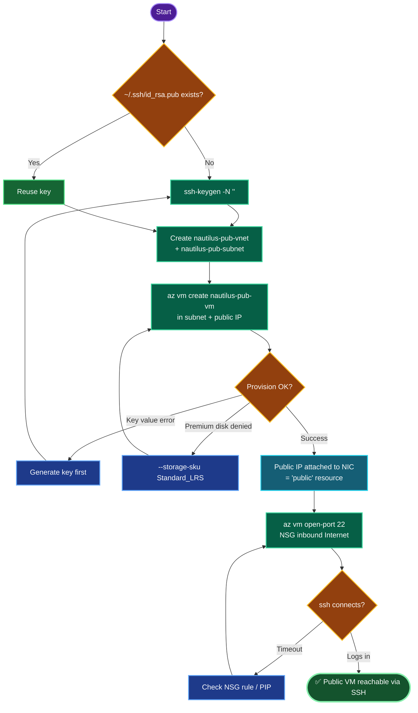

# Azure Public VNet + VM — `nautilus-pub-vnet` / `nautilus-pub-vm`
### Public Networking Deployment Documentation

---

## TODO

| # | Task | Status |
|---|------|--------|
| 1 | Set `RG` / `LOC` (per lab region) | ✅ |
| 2 | Generate SSH key on azure-client (if missing) | ✅ |
| 3 | Create `nautilus-pub-vnet` + `nautilus-pub-subnet` | ✅ |
| 4 | Create `nautilus-pub-vm` in that subnet w/ auto public IP | ✅ |
| 5 | Open NSG inbound port 22 | ✅ |
| 6 | SSH verify over the internet | ⬜ (final) |

---

## Concept

**1. Azure "public subnet" ≠ AWS public subnet.** Azure has **no subnet-level "auto-assign public IP" toggle** like AWS. Internet reachability is granted at the **NIC/VM level** by attaching a public IP to the VM's network interface. So "public subnet with auto-assigned public IPs" is satisfied by creating VMs in the subnet *with a public IP attached* — which `az vm create` does by default.

**2. Outbound vs inbound.** A public IP gives the VM an internet-routable address. **Inbound** access still requires an NSG rule — `az vm open-port --port 22` adds the allow rule. Without it, the VM has a public IP but SSH is filtered.

**3. VNet → subnet → NIC → public IP chain.** The VNet defines the address space (`10.0.0.0/16`); the subnet carves a range (`10.0.0.0/24`); the VM's NIC gets a private IP from the subnet and a separate public IP for internet ingress. All four layers must line up.

**4. Standard SKU public IP is secure-by-default.** Standard public IPs deny all inbound unless an NSG explicitly allows it — hence the mandatory port-22 rule. (Basic SKU is being retired, so Standard is correct.)

**5. Key + policy carry-overs.** `--ssh-key-values ~/.ssh/id_rsa.pub` injects the azure-client key for password-less login; the key must exist first (`ssh-keygen`). `--storage-sku Standard_LRS` avoids the lab's Premium-disk policy denial.

---

## Runbook

### Phase 1 — Variables + login
```bash
showcreds
az login -u '<username>' -p '<password>'
RG=$(az group list --query "[0].name" -o tsv)
LOC=<lab-region>       # e.g. eastus
echo "RG=$RG LOC=$LOC"
```

### Phase 2 — SSH key (check / create)
```bash
[ -f ~/.ssh/id_rsa.pub ] && ls -l ~/.ssh/id_rsa* || ssh-keygen -t rsa -b 4096 -f ~/.ssh/id_rsa -N "" -q
```

### Phase 3 — VNet + subnet
```bash
az network vnet create \
  --resource-group "$RG" \
  --name nautilus-pub-vnet \
  --location "$LOC" \
  --address-prefix 10.0.0.0/16 \
  --subnet-name nautilus-pub-subnet \
  --subnet-prefix 10.0.0.0/24
```

### Phase 4 — VM (auto public IP)
```bash
az vm create \
  --resource-group "$RG" \
  --name nautilus-pub-vm \
  --image Ubuntu2204 \
  --size Standard_B1s \
  --admin-username azureuser \
  --ssh-key-values ~/.ssh/id_rsa.pub \
  --vnet-name nautilus-pub-vnet \
  --subnet nautilus-pub-subnet \
  --public-ip-sku Standard \
  --storage-sku Standard_LRS \
  --location "$LOC"
```

### Phase 5 — Open port 22
```bash
az vm open-port -g "$RG" -n nautilus-pub-vm --port 22 --priority 900
```

### Phase 6 — Verify
```bash
PIP=$(az vm list-ip-addresses -g "$RG" -n nautilus-pub-vm \
        --query "[0].virtualMachine.network.publicIpAddresses[0].ipAddress" -o tsv)
echo "PIP=$PIP"
ssh -o StrictHostKeyChecking=no azureuser@"$PIP"
```

---

## OTS (One-Line-To-Ship)

```bash
RG=$(az group list --query "[0].name" -o tsv); LOC=<lab-region>; \
[ -f ~/.ssh/id_rsa.pub ] || ssh-keygen -t rsa -b 4096 -f ~/.ssh/id_rsa -N "" -q; \
az network vnet create -g "$RG" -n nautilus-pub-vnet -l "$LOC" --address-prefix 10.0.0.0/16 --subnet-name nautilus-pub-subnet --subnet-prefix 10.0.0.0/24 && \
az vm create -g "$RG" -n nautilus-pub-vm --image Ubuntu2204 --size Standard_B1s --admin-username azureuser --ssh-key-values ~/.ssh/id_rsa.pub --vnet-name nautilus-pub-vnet --subnet nautilus-pub-subnet --public-ip-sku Standard --storage-sku Standard_LRS --location "$LOC" && \
az vm open-port -g "$RG" -n nautilus-pub-vm --port 22 --priority 900 && \
ssh -o StrictHostKeyChecking=no azureuser@$(az vm list-ip-addresses -g "$RG" -n nautilus-pub-vm --query "[0].virtualMachine.network.publicIpAddresses[0].ipAddress" -o tsv)
```

---

## Mermaid



---

## Troubleshooting

| Symptom | Cause | Fix |
|---------|-------|-----|
| `An RSA key file or key value must be supplied` | `~/.ssh/id_rsa.pub` doesn't exist | `ssh-keygen -t rsa -b 4096 -f ~/.ssh/id_rsa -N "" -q` then re-run |
| `RequestDisallowedByPolicy` (disk) | `Standard_B1s` → `Premium_LRS` default | Add `--storage-sku Standard_LRS` |
| `ssh: connect ... timed out` | NSG missing port 22 | `az vm open-port --port 22 --priority 900` |
| `Permission denied (publickey)` | Wrong/absent key injected | Recreate with `--ssh-key-values ~/.ssh/id_rsa.pub` |
| Empty `$PIP` | Shell var lost, or no public IP attached | Re-run `PIP=` assignment; confirm `--public-ip-sku` was set |
| Subnet name mismatch at grade | Default subnet not renamed (Portal) | Ensure subnet is exactly `nautilus-pub-subnet` |
| Grader wants subnet auto-IP flag | Azure has no such toggle | Public IP is per-NIC; VM-with-PIP satisfies intent |
| VNet already exists error | Re-run collision | Reuse it: skip vnet create, or delete + recreate |
| Priority 900 in use | NSG rule collision | Bump `--priority` to 910 |

---

**Definition of done:** `nautilus-pub-vnet` with subnet `nautilus-pub-subnet` created; `nautilus-pub-vm` (Standard_B1s, Ubuntu) launched inside that subnet with a Standard public IP attached; NSG allows inbound TCP 22 from the internet; and `ssh azureuser@<PIP>` from azure-client connects successfully.