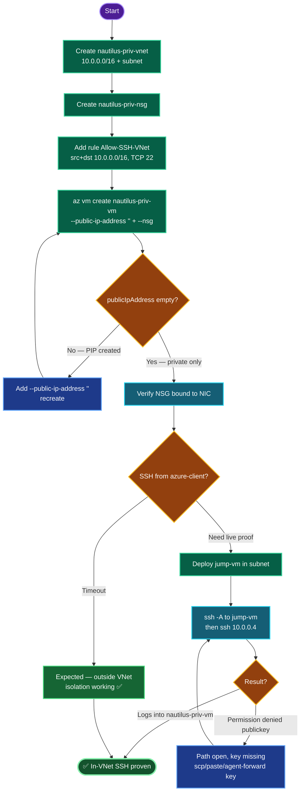

# Azure Private VNet + VM — `nautilus-priv-vnet` / `nautilus-priv-vm` (Central US)
### Private Networking Deployment Documentation

---

## TODO

| # | Task | Status |
|---|------|--------|
| 1 | Login, set `RG` / `LOC=centralus` / `VNET_CIDR=10.0.0.0/16` | ✅ |
| 2 | Generate SSH key on azure-client (if missing) | ✅ |
| 3 | Create `nautilus-priv-vnet` (10.0.0.0/16) + `nautilus-priv-subnet` | ✅ |
| 4 | Create NSG `nautilus-priv-nsg` | ✅ |
| 5 | Add inbound SSH rule: src `10.0.0.0/16`, dst `10.0.0.0/16`, TCP 22, Allow | ✅ |
| 6 | Create `nautilus-priv-vm` (no public IP) bound to NSG | ✅ |
| 7 | Verify: no public IP, rule params, NSG→NIC binding | ✅ |
| 8 | (Optional) Prove in-VNet SSH via jump host | ⬜ |

---

## Concept

**1. Private by design = no public IP.** `--public-ip-address ""` tells CLI not to create or attach any public IP. The VM gets only a private `10.0.0.x` address, unroutable from the internet. This is the core of the isolation requirement.

**2. NSG source *and* destination scoping.** The rule restricts SSH to traffic where **both** endpoints sit inside `10.0.0.0/16`. Source `10.0.0.0/16` blocks any external origin; destination `10.0.0.0/16` scopes the allow to in-VNet targets. Together they permit only intra-VNet SSH — exactly the task spec.

**3. `Permission denied (publickey)` ≠ blocked.** When SSH reaches the daemon and returns a key challenge, the **network path is open** — the NSG allowed it. A *timeout* means the NSG blocked it. This distinction is the fastest way to tell a networking failure from an auth failure.

**4. Why azure-client can't SSH directly.** azure-client lives outside `10.0.0.0/16` and has no route to a private Azure address; the NSG source rule also denies it. The hang/timeout from azure-client is *proof* the isolation works, not a bug.

**5. Jump host pattern for verification.** To SSH into a private VM you connect from a host *inside* the VNet. A jump VM in the same subnet (with a public IP for your entry) can reach `10.0.0.4` because it satisfies the source-CIDR rule. The private key must travel to the jump host (scp/paste) or be agent-forwarded (`ssh -A`) — the NSG opens the path, but authentication still needs the key.

**6. Policy carry-over.** Central US enforces the no-Premium-disk policy → `--storage-sku Standard_LRS` remains mandatory.

---

## Runbook

### Phase 1 — Login + variables
```bash
showcreds
az login -u '<username>' -p '<password>'
RG=$(az group list --query "[0].name" -o tsv)
LOC=centralus
VNET_CIDR=10.0.0.0/16
echo "RG=$RG LOC=$LOC CIDR=$VNET_CIDR"
```

### Phase 2 — SSH key (check / create)
```bash
[ -f ~/.ssh/id_rsa.pub ] && ls -l ~/.ssh/id_rsa* || ssh-keygen -t rsa -b 4096 -f ~/.ssh/id_rsa -N "" -q
```

### Phase 3 — VNet + subnet
```bash
az network vnet create \
  --resource-group "$RG" \
  --name nautilus-priv-vnet \
  --location "$LOC" \
  --address-prefix "$VNET_CIDR" \
  --subnet-name nautilus-priv-subnet \
  --subnet-prefix 10.0.0.0/24
```

### Phase 4 — NSG
```bash
az network nsg create -g "$RG" -n nautilus-priv-nsg --location "$LOC"
```

### Phase 5 — Inbound SSH rule (src + dst = VNet CIDR)
```bash
az network nsg rule create \
  --resource-group "$RG" \
  --nsg-name nautilus-priv-nsg \
  --name Allow-SSH-VNet \
  --priority 100 \
  --direction Inbound \
  --access Allow \
  --protocol Tcp \
  --destination-port-ranges 22 \
  --source-address-prefixes 10.0.0.0/16 \
  --destination-address-prefixes 10.0.0.0/16
```

### Phase 6 — Private VM (no public IP)
```bash
az vm create \
  --resource-group "$RG" \
  --name nautilus-priv-vm \
  --image Ubuntu2204 \
  --size Standard_B1s \
  --admin-username azureuser \
  --ssh-key-values ~/.ssh/id_rsa.pub \
  --vnet-name nautilus-priv-vnet \
  --subnet nautilus-priv-subnet \
  --nsg nautilus-priv-nsg \
  --public-ip-address "" \
  --storage-sku Standard_LRS \
  --location "$LOC"
```

### Phase 7 — Verify config
```bash
# No public IP
az vm list-ip-addresses -g "$RG" -n nautilus-priv-vm \
  --query "[0].virtualMachine.network.{private:privateIpAddresses, public:publicIpAddresses}" -o json

# Rule params
az network nsg rule show -g "$RG" --nsg-name nautilus-priv-nsg -n Allow-SSH-VNet \
  --query "{src:sourceAddressPrefix, dst:destinationAddressPrefix, port:destinationPortRange, protocol:protocol, access:access, dir:direction}" -o table

# NSG bound to NIC
NIC=$(az vm show -g "$RG" -n nautilus-priv-vm --query "networkProfile.networkInterfaces[0].id" -o tsv)
az network nic show --ids "$NIC" --query "networkSecurityGroup.id" -o tsv
```

### Phase 8 — (Optional) prove in-VNet SSH
```bash
# Throwaway jump host in same subnet
az vm create -g "$RG" -n jump-vm --image Ubuntu2204 --size Standard_B1s \
  --admin-username azureuser --ssh-key-values ~/.ssh/id_rsa.pub \
  --vnet-name nautilus-priv-vnet --subnet nautilus-priv-subnet \
  --public-ip-sku Standard --storage-sku Standard_LRS --location "$LOC"
az vm open-port -g "$RG" -n jump-vm --port 22 --priority 900

# From azure-client, hop in with agent forwarding
eval $(ssh-agent); ssh-add ~/.ssh/id_rsa
JUMP=$(az vm list-ip-addresses -g "$RG" -n jump-vm --query "[0].virtualMachine.network.publicIpAddresses[0].ipAddress" -o tsv)
ssh -A azureuser@"$JUMP"
#   on jump-vm:  ssh azureuser@10.0.0.4   → logs into nautilus-priv-vm

# Cleanup
az vm delete -g "$RG" -n jump-vm --yes
```

---

## OTS (One-Line-To-Ship)

```bash
RG=$(az group list --query "[0].name" -o tsv); LOC=centralus; CIDR=10.0.0.0/16; \
[ -f ~/.ssh/id_rsa.pub ] || ssh-keygen -t rsa -b 4096 -f ~/.ssh/id_rsa -N "" -q; \
az network vnet create -g "$RG" -n nautilus-priv-vnet -l "$LOC" --address-prefix "$CIDR" --subnet-name nautilus-priv-subnet --subnet-prefix 10.0.0.0/24 && \
az network nsg create -g "$RG" -n nautilus-priv-nsg -l "$LOC" && \
az network nsg rule create -g "$RG" --nsg-name nautilus-priv-nsg -n Allow-SSH-VNet --priority 100 --direction Inbound --access Allow --protocol Tcp --destination-port-ranges 22 --source-address-prefixes "$CIDR" --destination-address-prefixes "$CIDR" && \
az vm create -g "$RG" -n nautilus-priv-vm --image Ubuntu2204 --size Standard_B1s --admin-username azureuser --ssh-key-values ~/.ssh/id_rsa.pub --vnet-name nautilus-priv-vnet --subnet nautilus-priv-subnet --nsg nautilus-priv-nsg --public-ip-address "" --storage-sku Standard_LRS --location "$LOC"
```

---

## Mermaid



---

## Troubleshooting

| Symptom | Cause | Fix |
|---------|-------|-----|
| VM got a public IP | `--public-ip-address ""` omitted | Recreate with the empty-string flag |
| `An RSA key file... must be supplied` | No `~/.ssh/id_rsa.pub` | `ssh-keygen -t rsa -b 4096 -f ~/.ssh/id_rsa -N "" -q` |
| SSH from azure-client times out | azure-client outside VNet — **expected** | Not a bug; use a jump host to test |
| `Permission denied (publickey)` from jump-vm | Path open, private key not on jump-vm | `scp` key from azure-client, or `ssh -A` agent forwarding |
| `scp` from jump-vm fails | Key lives on azure-client; copy must originate there | Push from azure-client, or paste key manually |
| Rule shows `dst: *` | Destination not set to CIDR | `az network nsg rule update ... --destination-address-prefixes 10.0.0.0/16` |
| `--source-address-prefixes` not recognized | Older CLI | Use singular `--source-address-prefix` / `--destination-address-prefix` |
| NSG rule exists but not enforced | NSG not bound to NIC | Confirm NIC's `networkSecurityGroup.id` ends in `nautilus-priv-nsg` |
| `RequestDisallowedByPolicy` (disk) | Premium disk | `--storage-sku Standard_LRS` |
| Extra resource at grade | Left `jump-vm` behind | `az vm delete -g "$RG" -n jump-vm --yes` |

---

**Definition of done:** In **Central US** — `nautilus-priv-vnet` (10.0.0.0/16) with `nautilus-priv-subnet`; `nautilus-priv-vm` running with **no public IP** (private `10.0.0.4`); `nautilus-priv-nsg` bound to the VM's NIC carrying inbound rule `Allow-SSH-VNet` (source `10.0.0.0/16`, destination `10.0.0.0/16`, TCP 22, Allow). SSH works only from within the VNet — verified via jump host, and confirmed blocked from azure-client.