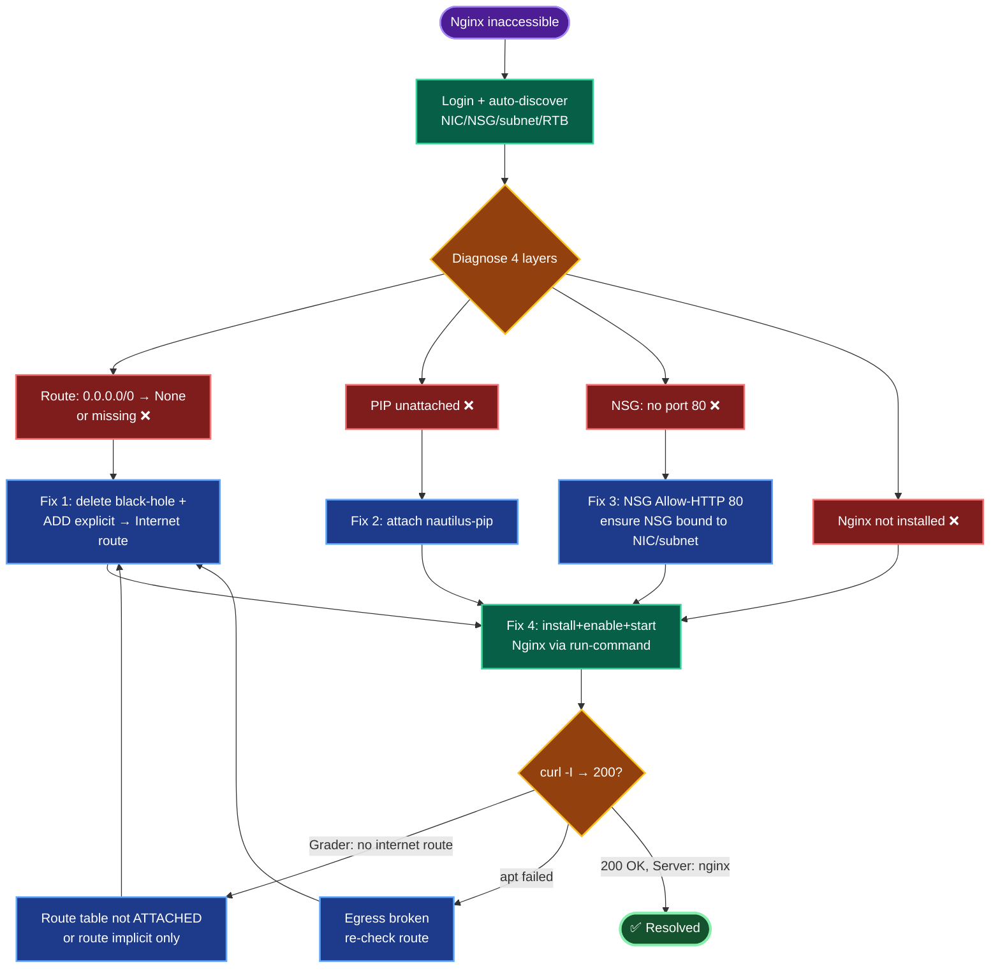

# Azure VM Troubleshooting — `datacenter-vm` Nginx Inaccessible
### Incident Remediation Documentation

---

## TODO

| # | Task | Status |
|---|------|--------|
| 1 | Survey `datacenter-*` resources + diagnose | ✅ |
| 2 | Remove `Block-Internet` route (`0.0.0.0/0 → None`) — Task 1 | ✅ |
| 3 | Attach `datacenter-pip` to NIC — Task 2 | ✅ |
| 4 | Add NSG inbound rule for port 80 — Task 3 | ✅ |
| 5 | Install + enable + start Nginx — Task 4 | ⬜ |
| 6 | `curl` verify 200 OK from internet | ⬜ (final) |

---

## Concept

**1. Three independent layers gate internet reachability.** A VM is reachable from the internet only when *all* of: (a) a route path to the internet exists, (b) a public IP is attached to the NIC, and (c) the NSG allows the inbound port. Any one missing = inaccessible. This incident had **all three** broken plus the app itself absent — a layered failure.

**2. The route table black-hole — the hidden killer.** A User-Defined Route of `0.0.0.0/0 → next hop None` overrides Azure's default system route and **discards all internet-bound traffic** at the subnet level. Symptoms are brutal: public IP looks fine, NSG looks fine, yet nothing works *and* the VM can't even `apt install`. This is what "ensure VNet allows internet access" pointed at. Deleting the route restores the default `0.0.0.0/0 → Internet` system route.

**3. Public IP is a separate resource that must be *associated*.** `datacenter-pip` existing ≠ attached. It binds to a NIC's **ipConfiguration**, not the VM directly. Until associated, the NIC has only a private IP. SKU must match between PIP and NIC (both Standard here).

**4. NSG default rules block inbound.** Azure's default NSG denies inbound from the internet except what you explicitly allow. Only SSH (22) was open; HTTP (80) needed an explicit allow rule.

**5. Fix ordering is causal, not cosmetic.** The route fix must precede the Nginx install — without internet egress, `apt` can't fetch packages. PIP + port 80 must both precede the external `curl`. Doing them out of order produces confusing partial failures.

**6. `az vm run-command` bypasses SSH.** It executes scripts via the Azure control plane (WireServer), needing no open SSH port or key match — the most reliable way to run in-VM commands during remediation.

---

## Runbook

### Phase 1 — Login + survey
```bash
showcreds
az login -u '<username>' -p '<password>'
RG=$(az group list --query "[0].name" -o tsv)
az resource list --query "[?contains(name,'datacenter')].{name:name,type:type}" -o table
```

### Phase 2 — Diagnose (read-only)
```bash
NIC=datacenter-vmVMNic; NSG=datacenter-vmNSG
az network nic show -g "$RG" -n "$NIC" --query "ipConfigurations[0].publicIPAddress.id" -o tsv
az network public-ip show -g "$RG" -n datacenter-pip --query "{sku:sku.name,ip:ipAddress,ipConfig:ipConfiguration.id}" -o json
az network nsg rule list -g "$RG" --nsg-name "$NSG" --query "[].{name:name,port:destinationPortRange,access:access}" -o table
az network route-table route list -g "$RG" --route-table-name datacenter-rtb -o table
az vm show -g "$RG" -n datacenter-vm --query "osProfile.adminUsername" -o tsv
```

### Phase 3 — Fix 1: remove blocking route (Task 1)
```bash
az network route-table route delete -g "$RG" --route-table-name datacenter-rtb --name Block-Internet
az network route-table route list -g "$RG" --route-table-name datacenter-rtb -o table   # should be empty
```

### Phase 4 — Fix 2: attach public IP (Task 2)
```bash
IPCONFIG=$(az network nic show -g "$RG" -n "$NIC" --query "ipConfigurations[0].name" -o tsv)
az network nic ip-config update -g "$RG" --nic-name "$NIC" --name "$IPCONFIG" --public-ip-address datacenter-pip
```

### Phase 5 — Fix 3: open port 80 (Task 3)
```bash
az network nsg rule create -g "$RG" --nsg-name "$NSG" --name Allow-HTTP \
  --priority 900 --direction Inbound --access Allow --protocol Tcp \
  --destination-port-ranges 80 --source-address-prefixes '*' --destination-address-prefixes '*'
```

### Phase 6 — Fix 4: install Nginx (Task 4)
```bash
az vm run-command invoke -g "$RG" -n datacenter-vm --command-id RunShellScript \
  --scripts "apt update && apt install -y nginx && systemctl enable nginx && systemctl start nginx && systemctl is-active nginx && ss -tlnp | grep :80"
```

### Phase 7 — Verify
```bash
PIP=$(az network public-ip show -g "$RG" -n datacenter-pip --query ipAddress -o tsv)
echo "PIP=$PIP"
curl -I http://"$PIP"     # expect HTTP/1.1 200 OK, Server: nginx
```

---

## OTS (One-Line-To-Ship)

```bash
RG=$(az group list --query "[0].name" -o tsv); NIC=datacenter-vmVMNic; NSG=datacenter-vmNSG; \
az network route-table route delete -g "$RG" --route-table-name datacenter-rtb --name Block-Internet; \
IPCONFIG=$(az network nic show -g "$RG" -n "$NIC" --query "ipConfigurations[0].name" -o tsv); \
az network nic ip-config update -g "$RG" --nic-name "$NIC" --name "$IPCONFIG" --public-ip-address datacenter-pip && \
az network nsg rule create -g "$RG" --nsg-name "$NSG" --name Allow-HTTP --priority 900 --direction Inbound --access Allow --protocol Tcp --destination-port-ranges 80 --source-address-prefixes '*' --destination-address-prefixes '*' && \
az vm run-command invoke -g "$RG" -n datacenter-vm --command-id RunShellScript --scripts "apt update && apt install -y nginx && systemctl enable nginx && systemctl start nginx" && \
curl -I http://$(az network public-ip show -g "$RG" -n datacenter-pip --query ipAddress -o tsv)
```

---

## Mermaid


---

## Troubleshooting

| Symptom | Root Cause | Fix |
|---------|-----------|-----|
| Everything looks configured but site unreachable | UDR `0.0.0.0/0 → None` black-holes traffic | Delete the route; default system route resumes |
| VM can't `apt install` / `apt update` hangs | No internet egress (same route issue) | Fix route table **first**, before Nginx install |
| PIP exists but not reachable | Public IP not associated to NIC | `az network nic ip-config update --public-ip-address datacenter-pip` |
| PIP attach fails on SKU mismatch | NIC Basic vs PIP Standard | Ensure SKUs match (both Standard here) |
| `curl` connection refused | Port 80 not in NSG | Add `Allow-HTTP` inbound rule |
| `curl` refused even with port 80 open | Nginx not installed/running | `systemctl status nginx`; install + start |
| Can't SSH to install | Key mismatch / port | Use `az vm run-command` (no SSH needed) |
| Rule created but not enforced | NSG not bound to NIC/subnet | Confirm `datacenter-vmNSG` binding |
| Priority collision | 900 already used | Bump to a free priority |

---

**Definition of done:** `datacenter-vnet` internet egress restored (blocking route removed); `datacenter-pip` (`104.42.36.130`) attached to `datacenter-vm`'s NIC; NSG allows inbound TCP 80; Nginx installed, **enabled**, and **running** listening on port 80; and `curl -I http://104.42.36.130` returns `200 OK` with `Server: nginx`.


# Azure VM Troubleshooting — `nautilus-vm` Nginx Inaccessible (West US)
### Incident Remediation Documentation

---

## TODO

| # | Task | Status |
|---|------|--------|
| 1 | Login, set `RG` / `LOC=westus` | ✅ |
| 2 | Auto-discover NIC / NSG / subnet / route table | ✅ |
| 3 | Ensure explicit `0.0.0.0/0 → Internet` route — Task 1 | ✅ |
| 4 | Attach `nautilus-pip` to NIC — Task 2 | ✅ |
| 5 | Open NSG inbound port 80 (ensure NSG bound) — Task 3 | ✅ |
| 6 | Install + enable + start Nginx via run-command — Task 4 | ✅ |
| 7 | `curl` verify 200 OK | ⬜ (final) |

---

## Concept

**1. Explicit route beats implicit — the grader's real check.** Deleting a black-hole `0.0.0.0/0 → None` route *restores* Azure's implicit system route, so the VM works functionally. But lab validation inspects the **route-table object** and requires a *defined* `0.0.0.0/0 → Internet` entry. The system default route is invisible as a table entry, so the fix must **add an explicit route**, not just delete the bad one. This was the failure in the prior (`datacenter`) run.

**2. Route table must be *attached* to count.** A route table with the right route but not associated to the subnet does nothing. Always confirm the subnet's `routeTable.id` points at it.

**3. Three reachability layers + the app.** Internet access needs: (a) a route path, (b) a public IP on the NIC, (c) an NSG allow for the port — plus (d) the service actually running. This incident broke all four; fixes must address each.

**4. Public IP association, not existence.** `nautilus-pip` existing ≠ attached. It binds to the NIC's **ipConfiguration**. SKUs must match (Standard↔Standard).

**5. NSG placement flexibility.** The task requires the NSG on the **NIC or the subnet**. Discovery logic checks NIC-level first, falls back to subnet-level, and creates+binds one only if neither exists — then adds the port-80 rule wherever the NSG lives.

**6. Causal ordering.** Route fix must precede Nginx install (no egress → `apt` fails). PIP + port 80 must precede external `curl`. Out-of-order runs yield misleading partial failures.

**7. `az vm run-command` over SSH.** Executes via the Azure control plane (WireServer) — no open SSH port or key match required. The most robust in-VM path during remediation.

---

## Runbook

### Phase 1 — Login + variables
```bash
showcreds
az login -u '<username>' -p '<password>'
RG=$(az group list --query "[0].name" -o tsv)
LOC=westus
VM=nautilus-vm; PIP=nautilus-pip; VNET=nautilus-vnet
```

### Phase 2 — Auto-discover network objects
```bash
NIC=$(basename "$(az vm show -g "$RG" -n "$VM" --query 'networkProfile.networkInterfaces[0].id' -o tsv)")
IPCONFIG=$(az network nic show -g "$RG" -n "$NIC" --query 'ipConfigurations[0].name' -o tsv)
SUBNET_ID=$(az network nic show -g "$RG" -n "$NIC" --query 'ipConfigurations[0].subnet.id' -o tsv)
NSG=$(basename "$(az network nic show -g "$RG" -n "$NIC" --query 'networkSecurityGroup.id' -o tsv)")
RTB=$(basename "$(az network vnet subnet show --ids "$SUBNET_ID" --query 'routeTable.id' -o tsv)")
echo "NIC=$NIC NSG=$NSG RTB=$RTB"
```

### Phase 3 — Fix 1: explicit internet route (Task 1)
```bash
# Remove black-hole route if present
az network route-table route delete -g "$RG" --route-table-name "$RTB" --name Block-Internet 2>/dev/null
# Add explicit internet route
az network route-table route create -g "$RG" --route-table-name "$RTB" \
  --name Allow-Internet --address-prefix 0.0.0.0/0 --next-hop-type Internet
az network route-table route list -g "$RG" --route-table-name "$RTB" -o table
```

### Phase 4 — Fix 2: attach public IP (Task 2)
```bash
az network nic ip-config update -g "$RG" --nic-name "$NIC" --name "$IPCONFIG" \
  --public-ip-address "$PIP"
```

### Phase 5 — Fix 3: open port 80 (Task 3)
```bash
az network nsg rule create -g "$RG" --nsg-name "$NSG" --name Allow-HTTP \
  --priority 900 --direction Inbound --access Allow --protocol Tcp \
  --destination-port-ranges 80 --source-address-prefixes '*' --destination-address-prefixes '*'
```

### Phase 6 — Fix 4: install Nginx (Task 4)
```bash
az vm run-command invoke -g "$RG" -n "$VM" --command-id RunShellScript \
  --scripts "apt-get update && apt-get install -y nginx && systemctl enable nginx && systemctl start nginx && systemctl is-active nginx && ss -tlnp | grep :80" \
  --query "value[0].message" -o tsv
```

### Phase 7 — Verify
```bash
IP=$(az network public-ip show -g "$RG" -n "$PIP" --query ipAddress -o tsv)
echo "IP=$IP"; sleep 10
curl -I "http://$IP"     # expect HTTP/1.1 200 OK, Server: nginx
```

---

## OTS (One-Line-To-Ship)

Full self-diagnosing script — see the `OTS.sh` provided separately. Condensed inline version:

```bash
RG=$(az group list --query "[0].name" -o tsv); LOC=westus; VM=nautilus-vm; PIP=nautilus-pip; \
NIC=$(basename "$(az vm show -g "$RG" -n "$VM" --query 'networkProfile.networkInterfaces[0].id' -o tsv)"); \
IPCONFIG=$(az network nic show -g "$RG" -n "$NIC" --query 'ipConfigurations[0].name' -o tsv); \
SUBNET_ID=$(az network nic show -g "$RG" -n "$NIC" --query 'ipConfigurations[0].subnet.id' -o tsv); \
NSG=$(basename "$(az network nic show -g "$RG" -n "$NIC" --query 'networkSecurityGroup.id' -o tsv)"); \
RTB=$(basename "$(az network vnet subnet show --ids "$SUBNET_ID" --query 'routeTable.id' -o tsv)"); \
az network route-table route delete -g "$RG" --route-table-name "$RTB" --name Block-Internet 2>/dev/null; \
az network route-table route create -g "$RG" --route-table-name "$RTB" --name Allow-Internet --address-prefix 0.0.0.0/0 --next-hop-type Internet -o none; \
az network nic ip-config update -g "$RG" --nic-name "$NIC" --name "$IPCONFIG" --public-ip-address "$PIP" -o none; \
az network nsg rule create -g "$RG" --nsg-name "$NSG" --name Allow-HTTP --priority 900 --direction Inbound --access Allow --protocol Tcp --destination-port-ranges 80 --source-address-prefixes '*' --destination-address-prefixes '*' -o none; \
az vm run-command invoke -g "$RG" -n "$VM" --command-id RunShellScript --scripts "apt-get update && apt-get install -y nginx && systemctl enable nginx && systemctl start nginx" --query "value[0].message" -o tsv; \
curl -I "http://$(az network public-ip show -g "$RG" -n "$PIP" --query ipAddress -o tsv)"
```

---

## Mermaid



---

## Troubleshooting

| Symptom | Root Cause | Fix |
|---------|-----------|-----|
| Grader: "route table does not have a route to the internet" | Only deleted black-hole; relying on implicit system route | **Add explicit** `0.0.0.0/0 → Internet` route |
| Explicit route added but grader still fails | Route table not **attached** to subnet | Confirm subnet's `routeTable.id`; associate if missing |
| VM can't `apt install` | No egress (route) | Fix route **first** |
| PIP exists, site unreachable | Not associated to NIC | `az network nic ip-config update --public-ip-address nautilus-pip` |
| PIP attach SKU error | Basic vs Standard mismatch | Match SKUs |
| `curl` refused | Port 80 missing or NSG unbound | Add `Allow-HTTP`; ensure NSG on NIC/subnet |
| Rule created, still refused | NSG not attached to NIC or subnet | Bind NSG (`az network nic update --network-security-group`) |
| Can't SSH to install | Key/port issue | Use `az vm run-command` |
| Nginx installed but `curl` fails | Service not started/enabled | `systemctl enable --now nginx` |
| Priority 900 in use | Rule collision | Bump priority |

---

**Definition of done:** In **West US** — `nautilus-vnet` has an explicit, attached `0.0.0.0/0 → Internet` route; `nautilus-pip` attached to `nautilus-vm`'s NIC; NSG (bound to NIC or subnet) allows inbound TCP 80; Nginx installed, **enabled**, and **running** on port 80; `curl -I http://<nautilus-pip>` returns `200 OK` with `Server: nginx`.