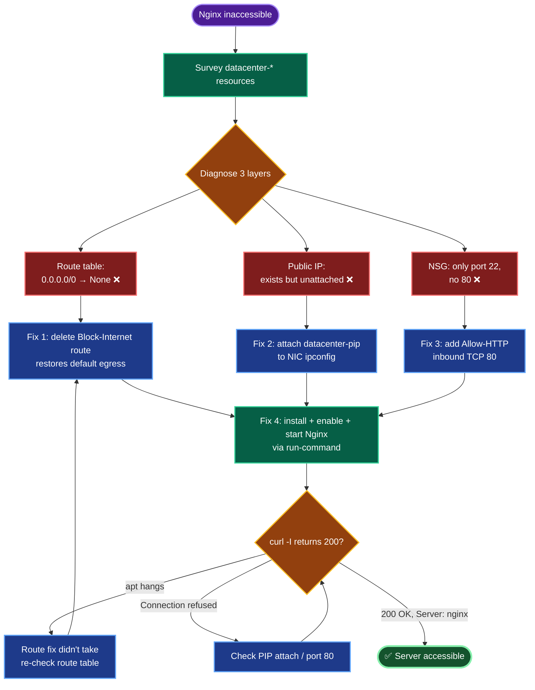

# Azure VM Troubleshooting — `datacenter-vm` Nginx Inaccessible
### Incident Remediation Documentation

---

## TODO

| # | Task | Status |
|---|------|--------|
| 1 | Survey `datacenter-*` resources + diagnose | ✅ |
| 2 | Remove `Block-Internet` route (`0.0.0.0/0 → None`) — Task 1 | ✅ |
| 3 | Attach `datacenter-pip` to NIC — Task 2 | ✅ |
| 4 | Add NSG inbound rule for port 80 — Task 3 | ✅ |
| 5 | Install + enable + start Nginx — Task 4 | ⬜ |
| 6 | `curl` verify 200 OK from internet | ⬜ (final) |

---

## Concept

**1. Three independent layers gate internet reachability.** A VM is reachable from the internet only when *all* of: (a) a route path to the internet exists, (b) a public IP is attached to the NIC, and (c) the NSG allows the inbound port. Any one missing = inaccessible. This incident had **all three** broken plus the app itself absent — a layered failure.

**2. The route table black-hole — the hidden killer.** A User-Defined Route of `0.0.0.0/0 → next hop None` overrides Azure's default system route and **discards all internet-bound traffic** at the subnet level. Symptoms are brutal: public IP looks fine, NSG looks fine, yet nothing works *and* the VM can't even `apt install`. This is what "ensure VNet allows internet access" pointed at. Deleting the route restores the default `0.0.0.0/0 → Internet` system route.

**3. Public IP is a separate resource that must be *associated*.** `datacenter-pip` existing ≠ attached. It binds to a NIC's **ipConfiguration**, not the VM directly. Until associated, the NIC has only a private IP. SKU must match between PIP and NIC (both Standard here).

**4. NSG default rules block inbound.** Azure's default NSG denies inbound from the internet except what you explicitly allow. Only SSH (22) was open; HTTP (80) needed an explicit allow rule.

**5. Fix ordering is causal, not cosmetic.** The route fix must precede the Nginx install — without internet egress, `apt` can't fetch packages. PIP + port 80 must both precede the external `curl`. Doing them out of order produces confusing partial failures.

**6. `az vm run-command` bypasses SSH.** It executes scripts via the Azure control plane (WireServer), needing no open SSH port or key match — the most reliable way to run in-VM commands during remediation.

---

## Runbook

### Phase 1 — Login + survey
```bash
showcreds
az login -u '<username>' -p '<password>'
RG=$(az group list --query "[0].name" -o tsv)
az resource list --query "[?contains(name,'datacenter')].{name:name,type:type}" -o table
```

### Phase 2 — Diagnose (read-only)
```bash
NIC=datacenter-vmVMNic; NSG=datacenter-vmNSG
az network nic show -g "$RG" -n "$NIC" --query "ipConfigurations[0].publicIPAddress.id" -o tsv
az network public-ip show -g "$RG" -n datacenter-pip --query "{sku:sku.name,ip:ipAddress,ipConfig:ipConfiguration.id}" -o json
az network nsg rule list -g "$RG" --nsg-name "$NSG" --query "[].{name:name,port:destinationPortRange,access:access}" -o table
az network route-table route list -g "$RG" --route-table-name datacenter-rtb -o table
az vm show -g "$RG" -n datacenter-vm --query "osProfile.adminUsername" -o tsv
```

### Phase 3 — Fix 1: remove blocking route (Task 1)
```bash
az network route-table route delete -g "$RG" --route-table-name datacenter-rtb --name Block-Internet
az network route-table route list -g "$RG" --route-table-name datacenter-rtb -o table   # should be empty
```

### Phase 4 — Fix 2: attach public IP (Task 2)
```bash
IPCONFIG=$(az network nic show -g "$RG" -n "$NIC" --query "ipConfigurations[0].name" -o tsv)
az network nic ip-config update -g "$RG" --nic-name "$NIC" --name "$IPCONFIG" --public-ip-address datacenter-pip
```

### Phase 5 — Fix 3: open port 80 (Task 3)
```bash
az network nsg rule create -g "$RG" --nsg-name "$NSG" --name Allow-HTTP \
  --priority 900 --direction Inbound --access Allow --protocol Tcp \
  --destination-port-ranges 80 --source-address-prefixes '*' --destination-address-prefixes '*'
```

### Phase 6 — Fix 4: install Nginx (Task 4)
```bash
az vm run-command invoke -g "$RG" -n datacenter-vm --command-id RunShellScript \
  --scripts "apt update && apt install -y nginx && systemctl enable nginx && systemctl start nginx && systemctl is-active nginx && ss -tlnp | grep :80"
```

### Phase 7 — Verify
```bash
PIP=$(az network public-ip show -g "$RG" -n datacenter-pip --query ipAddress -o tsv)
echo "PIP=$PIP"
curl -I http://"$PIP"     # expect HTTP/1.1 200 OK, Server: nginx
```

---

## OTS (One-Line-To-Ship)

```bash
RG=$(az group list --query "[0].name" -o tsv); NIC=datacenter-vmVMNic; NSG=datacenter-vmNSG; \
az network route-table route delete -g "$RG" --route-table-name datacenter-rtb --name Block-Internet; \
IPCONFIG=$(az network nic show -g "$RG" -n "$NIC" --query "ipConfigurations[0].name" -o tsv); \
az network nic ip-config update -g "$RG" --nic-name "$NIC" --name "$IPCONFIG" --public-ip-address datacenter-pip && \
az network nsg rule create -g "$RG" --nsg-name "$NSG" --name Allow-HTTP --priority 900 --direction Inbound --access Allow --protocol Tcp --destination-port-ranges 80 --source-address-prefixes '*' --destination-address-prefixes '*' && \
az vm run-command invoke -g "$RG" -n datacenter-vm --command-id RunShellScript --scripts "apt update && apt install -y nginx && systemctl enable nginx && systemctl start nginx" && \
curl -I http://$(az network public-ip show -g "$RG" -n datacenter-pip --query ipAddress -o tsv)
```

---

## Mermaid



---

## Troubleshooting

| Symptom | Root Cause | Fix |
|---------|-----------|-----|
| Everything looks configured but site unreachable | UDR `0.0.0.0/0 → None` black-holes traffic | Delete the route; default system route resumes |
| VM can't `apt install` / `apt update` hangs | No internet egress (same route issue) | Fix route table **first**, before Nginx install |
| PIP exists but not reachable | Public IP not associated to NIC | `az network nic ip-config update --public-ip-address datacenter-pip` |
| PIP attach fails on SKU mismatch | NIC Basic vs PIP Standard | Ensure SKUs match (both Standard here) |
| `curl` connection refused | Port 80 not in NSG | Add `Allow-HTTP` inbound rule |
| `curl` refused even with port 80 open | Nginx not installed/running | `systemctl status nginx`; install + start |
| Can't SSH to install | Key mismatch / port | Use `az vm run-command` (no SSH needed) |
| Rule created but not enforced | NSG not bound to NIC/subnet | Confirm `datacenter-vmNSG` binding |
| Priority collision | 900 already used | Bump to a free priority |

---

**Definition of done:** `datacenter-vnet` internet egress restored (blocking route removed); `datacenter-pip` (`104.42.36.130`) attached to `datacenter-vm`'s NIC; NSG allows inbound TCP 80; Nginx installed, **enabled**, and **running** listening on port 80; and `curl -I http://104.42.36.130` returns `200 OK` with `Server: nginx`.