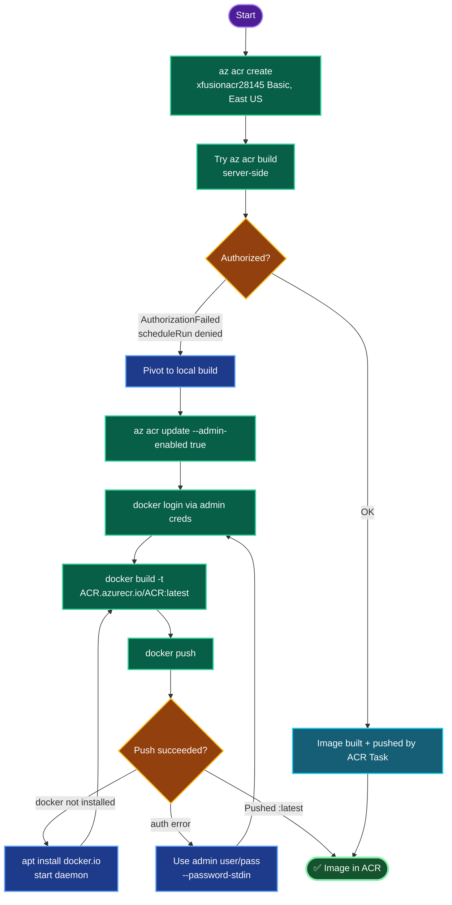

# Azure Container Registry — `xfusionacr28145` Build & Push (East US)
### Container Deployment Documentation

---

## TODO

| # | Task | Status |
|---|------|--------|
| 1 | Login, set `RG` / `LOC=eastus` / `ACR` | ✅ |
| 2 | Create ACR `xfusionacr28145` (Basic tier) | ✅ |
| 3 | Attempt `az acr build` — *failed: no scheduleRun perm* | ❌→ pivoted |
| 4 | Enable admin user + docker login | ✅ |
| 5 | Local `docker build` from `/root/pyapp/Dockerfile` | ✅ |
| 6 | `docker push` as `xfusionacr28145:latest` | ✅ |
| 7 | Verify repo + tag in ACR | ⬜ (final) |

---

## Concept

**1. Two ways to build for ACR — different permissions.** `az acr build` schedules the build **on Azure's ACR Task runners** (server-side), requiring `Microsoft.ContainerRegistry/registries/scheduleRun/action`. Local `docker build` + `docker push` builds **on azure-client** and needs only image *push* rights (`AcrPush`). Lab roles typically grant push but **not** scheduleRun — hence the pivot.

**2. `AuthorizationFailed` on scheduleRun ≠ registry problem.** The registry was created fine; the error is purely about the *build-scheduling* action. Recognizing this steers you to the local path instead of debugging the ACR itself.

**3. ACR authentication paths.** `az acr login` exchanges your AAD token for a Docker credential. When AAD-based login is restricted, the **admin user** (a registry-scoped username/password) is the fallback — enabled via `--admin-enabled true`, then used with `docker login`.

**4. Image naming: registry vs repository vs tag.** Full reference = `<registry>.azurecr.io/<repository>:<tag>`. Here the task sets repository = registry name, so it's `xfusionacr28145.azurecr.io/xfusionacr28145:latest`. The `docker build -t` must use the full login-server-qualified name so `docker push` knows where to send it.

**5. Basic SKU.** Sets the pricing plan — lowest cost, sufficient for a single-repo lab. Chosen at create time via `--sku Basic`.

---

## Runbook

### Phase 1 — Login + variables
```bash
showcreds
az login -u '<username>' -p '<password>'
RG=$(az group list --query "[0].name" -o tsv)
LOC=eastus
ACR=xfusionacr28145
echo "RG=$RG LOC=$LOC ACR=$ACR"
```

### Phase 2 — Create the ACR (Basic, East US)
```bash
az acr create --resource-group "$RG" --name "$ACR" --sku Basic --location "$LOC"
```

### Phase 3 — Enable admin user + docker login
```bash
az acr update --name "$ACR" --admin-enabled true
az acr login --name "$ACR"

# Fallback if az acr login fails:
ACR_USER=$(az acr credential show --name "$ACR" --query username -o tsv)
ACR_PASS=$(az acr credential show --name "$ACR" --query "passwords[0].value" -o tsv)
echo "$ACR_PASS" | docker login "$ACR.azurecr.io" --username "$ACR_USER" --password-stdin
```

### Phase 4 — Build locally + push
```bash
cd /root/pyapp
docker build -t "$ACR.azurecr.io/$ACR:latest" -f Dockerfile .
docker push "$ACR.azurecr.io/$ACR:latest"
```

### Phase 5 — Verify
```bash
az acr repository list --name "$ACR" -o table
az acr repository show-tags --name "$ACR" --repository "$ACR" -o table
```

---

## OTS (One-Line-To-Ship)

```bash
RG=$(az group list --query "[0].name" -o tsv); LOC=eastus; ACR=xfusionacr28145; \
az acr create -g "$RG" -n "$ACR" --sku Basic -l "$LOC" && \
az acr update -n "$ACR" --admin-enabled true && \
ACR_USER=$(az acr credential show -n "$ACR" --query username -o tsv) && \
ACR_PASS=$(az acr credential show -n "$ACR" --query "passwords[0].value" -o tsv) && \
echo "$ACR_PASS" | docker login "$ACR.azurecr.io" --username "$ACR_USER" --password-stdin && \
cd /root/pyapp && \
docker build -t "$ACR.azurecr.io/$ACR:latest" -f Dockerfile . && \
docker push "$ACR.azurecr.io/$ACR:latest" && \
az acr repository show-tags -n "$ACR" --repository "$ACR" -o table
```

---

## Mermaid



---

## Troubleshooting

| Symptom | Root Cause | Fix |
|---------|-----------|-----|
| `AuthorizationFailed ... scheduleRun` | Lab role lacks ACR Tasks build permission | Build locally: `docker build` + `docker push` |
| `az acr login` auth error | AAD token login restricted | Enable admin user, `docker login` with admin creds |
| `docker: command not found` | Docker not installed on azure-client | `sudo apt install -y docker.io && sudo systemctl start docker` |
| `permission denied` on docker socket | User not in `docker` group | Prefix with `sudo`, or add to `docker` group |
| `denied: requested access to the resource is denied` | Not logged in / wrong registry name | Re-run `docker login` to `$ACR.azurecr.io` |
| `unauthorized: authentication required` on push | Token expired | Re-run `az acr login` / `docker login` |
| Push tag wrong at grade | Built with short name (`pyapp`) | Tag as `$ACR.azurecr.io/$ACR:latest` exactly |
| ACR name rejected | Not globally unique / has hyphens-underscores | ACR names are alphanumeric + globally unique |
| `Dockerfile not found` | Wrong filename/path | Confirm `/root/pyapp/Dockerfile`; adjust `-f` |

---

**Definition of done:** ACR `xfusionacr28145` created in **East US** on the **Basic** tier; a Docker image built from `/root/pyapp/Dockerfile` on azure-client; pushed as **`xfusionacr28145:latest`** (`xfusionacr28145.azurecr.io/xfusionacr28145:latest`); and `az acr repository show-tags` lists the `latest` tag under the `xfusionacr28145` repository.