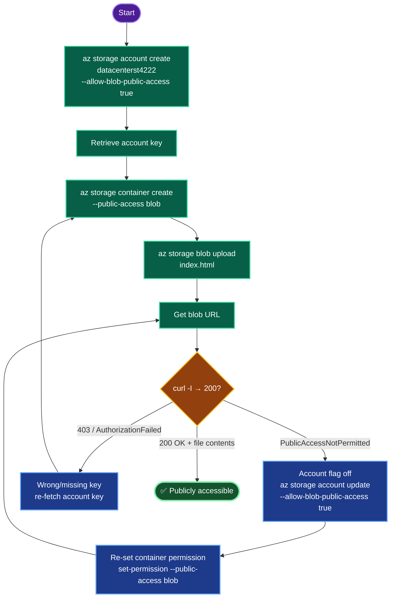

# Azure Blob Storage — `datacenterst4222` Public Artifact Storage (Central US)
### Storage Provisioning Documentation

---

## TODO

| # | Task | Status |
|---|------|--------|
| 1 | Determine RG, set `LOC=centralus` | ✅ |
| 2 | Create storage account `datacenterst4222` (public access enabled) | ✅ |
| 3 | Retrieve account key | ✅ |
| 4 | Create container `datacenter-site-18981` with public blob read | ✅ |
| 5 | Upload `/root/pyapp/index.html` via CLI | ✅ |
| 6 | Verify blob URL is publicly accessible | ⬜ (final) |

---

## Concept

**1. Public access is a two-level gate.** Anonymous blob access requires **both**: (a) the *storage account* flag `allowBlobPublicAccess = true`, and (b) the *container* ACL set to `blob`. The account flag is the master switch — if it's off, setting container public access silently yields no anonymous access (`PublicAccessNotPermitted`). Order matters: enable the account flag first.

**2. Container access levels.** `--public-access` takes: `off` (private, default), `blob` (anonymous **read of blobs**, no listing), or `container` (anonymous read **+ listing**). For serving files, `blob` is the correct, least-privilege choice.

**3. Blob URL structure.** Every blob is addressable at `https://<account>.blob.core.windows.net/<container>/<blob>`. With public read, this URL works with no SAS token or auth header — which is exactly what the "publicly accessible" verification checks.

**4. Authentication for CLI operations.** Data-plane commands (container/blob) need auth: an **account key** (`--account-key`), a **SAS token**, or **AAD** (`--auth-mode login`). The key is simplest for lab automation and implies `--auth-mode key`.

**5. Naming constraints.** Storage account: 3–24 chars, lowercase alphanumeric, globally unique (`datacenterst4222` ✅). Container: 3–63 chars, lowercase alphanumeric + hyphens (`datacenter-site-18981` ✅).

**6. Policy carry-over.** `Standard_LRS` satisfies the subscription's standard-storage policy.

---

## Runbook

### Phase 1 — Login + variables
```bash
showcreds
az login -u '<username>' -p '<password>'
RG=$(az group list --query '[].name' -o tsv | head -1)
LOC=centralus
ST=datacenterst4222
CONTAINER=datacenter-site-18981
echo "RG=$RG LOC=$LOC ST=$ST"
```

### Phase 2 — Create storage account (public access enabled)
```bash
az storage account create \
  --resource-group "$RG" \
  --name "$ST" \
  --location "$LOC" \
  --sku Standard_LRS \
  --kind StorageV2 \
  --allow-blob-public-access true
```

### Phase 3 — Retrieve account key
```bash
KEY=$(az storage account keys list -g "$RG" --account-name "$ST" --query "[0].value" -o tsv)
```

### Phase 4 — Create container (public blob read)
```bash
az storage container create \
  --name "$CONTAINER" \
  --account-name "$ST" \
  --account-key "$KEY" \
  --public-access blob
```

### Phase 5 — Upload index.html
```bash
az storage blob upload \
  --account-name "$ST" \
  --account-key "$KEY" \
  --container-name "$CONTAINER" \
  --name index.html \
  --file /root/pyapp/index.html \
  --overwrite
```

### Phase 6 — Get URL + verify
```bash
URL=$(az storage blob url --account-name "$ST" --container-name "$CONTAINER" --name index.html -o tsv)
echo "Blob URL: $URL"
curl -I "$URL"     # expect HTTP/1.1 200 OK
curl "$URL"        # prints index.html contents
```

---

## OTS (One-Line-To-Ship)

```bash
RG=$(az group list --query '[].name' -o tsv | head -1); LOC=centralus; ST=datacenterst4222; CONTAINER=datacenter-site-18981; \
az storage account create -g "$RG" -n "$ST" -l "$LOC" --sku Standard_LRS --kind StorageV2 --allow-blob-public-access true && \
KEY=$(az storage account keys list -g "$RG" --account-name "$ST" --query "[0].value" -o tsv) && \
az storage container create -n "$CONTAINER" --account-name "$ST" --account-key "$KEY" --public-access blob && \
az storage blob upload --account-name "$ST" --account-key "$KEY" --container-name "$CONTAINER" --name index.html --file /root/pyapp/index.html --overwrite && \
URL=$(az storage blob url --account-name "$ST" --container-name "$CONTAINER" --name index.html -o tsv) && \
echo "URL=$URL" && curl -I "$URL"
```

---

## Mermaid



---

## Troubleshooting

| Symptom | Root Cause | Fix |
|---------|-----------|-----|
| `curl` → `PublicAccessNotPermitted` | Account `allowBlobPublicAccess` = false | `az storage account update -g $RG -n $ST --allow-blob-public-access true`, then re-set container permission |
| Container public but blob 404 | Wrong blob name/path | Confirm `--name index.html` and container name |
| `AuthorizationFailed` on container/blob cmd | Missing/expired key | Re-fetch: `az storage account keys list` |
| CLI warns about auth mode | Ambiguous auth | Add `--auth-mode key` (implied by `--account-key`) |
| Account name rejected | >24 chars / uppercase / not unique | Lowercase alphanumeric, 3–24 chars, globally unique |
| Container name rejected | Invalid chars | Lowercase alphanumeric + hyphens, 3–63 chars |
| `curl` lists forbidden on container root | `blob` doesn't allow listing (expected) | Access individual blob URLs, not container root |
| Upload `--overwrite` needed | Blob already exists | Keep `--overwrite` flag |

---

**Definition of done:** Storage account `datacenterst4222` created in **centralus** with public blob access enabled; container `datacenter-site-18981` set to public blob read; `/root/pyapp/index.html` uploaded via Azure CLI; and its blob URL (`https://datacenterst4222.blob.core.windows.net/datacenter-site-18981/index.html`) returns `200 OK` with the file contents when accessed anonymously.