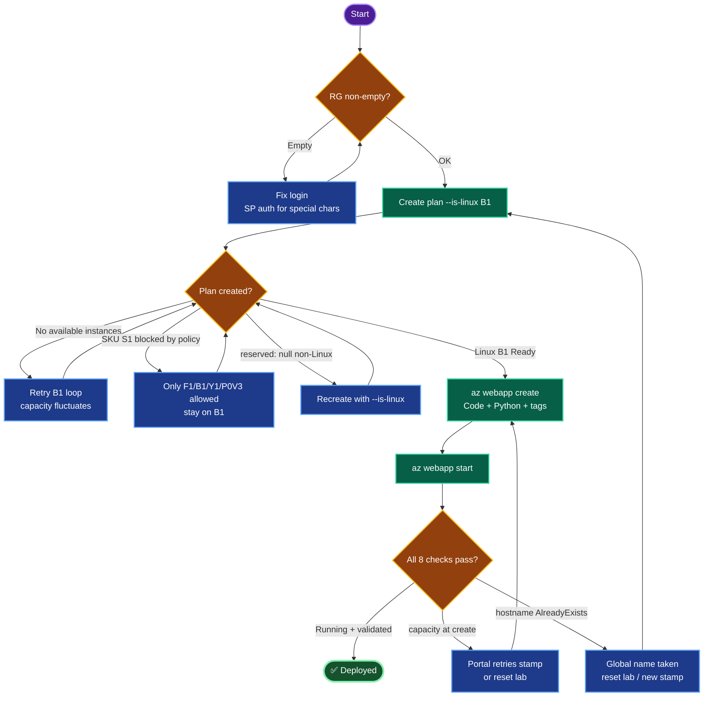

# Azure Python Web App — `nautilus-webapp` (South Central US)
### Deployment Documentation + Lessons Learned

---

## TODO

| # | Task | Status |
|---|------|--------|
| 1 | Login (SP auth preferred for special-char passwords) | ✅ |
| 2 | Verify `RG` is non-empty | ✅ |
| 3 | Create Linux App Service Plan `nautilus-learn-python` (B1) | ✅ |
| 4 | Create Web App `nautilus-webapp` (Code, Python/Linux) | ✅ |
| 5 | Disable App Insights + add tags | ✅ |
| 6 | Confirm Running + validate all 8 requirements | ✅ |

---

## Concept

**1. App Service = two resources.** A Web App runs on an App Service Plan (the compute tier). Plan first, app second. The plan's OS (`--is-linux` → `reserved: true`) must match the app's runtime — a Python/Linux app cannot sit on a non-Linux plan.

**2. Publish "Code" vs "Container."** Code publish = Azure runs your source on a managed runtime. It's the default for `az webapp create --runtime`. Passing a container image flag flips it to Container. `kind: app,linux` confirms Code on Linux.

**3. App Insights is opt-in.** Not linking an Insights component at create = "disabled." Verified by zero `APPINSIGHTS*` app settings.

**4. Tags are two key/value pairs.** `Name=WebAppLearning` and `Environment=Dev` are *two separate tags* — not one tag `WebAppLearning=Dev`. The Portal's left box is the key, right box the value.

**5. Region capacity is real and variable.** "No available instances" is a per-region, per-stamp capacity shortage — independent of your config. A different region (or a fresh lab stamp) resolves it; a new resource group in the same region does not.

---

## Runbook

### Phase 1 — Login + variables
```bash
showcreds
# Service-principal login is more reliable when the password has special chars:
az login --service-principal --username <clientId> --password '<secret>' \
  --tenant azurekmlprodkodekloud.onmicrosoft.com
RG=$(az group list --query "[0].name" -o tsv)
LOC=southcentralus; PLAN=nautilus-learn-python; APP=nautilus-webapp
echo "RG=$RG"   # MUST be non-empty
```

### Phase 2 — Linux B1 plan (capacity retry)
```bash
for i in $(seq 1 10); do
  az appservice plan create -g "$RG" -n "$PLAN" -l "$LOC" --sku B1 --is-linux && break
  echo "capacity busy, retry in 90s"; sleep 90
done
az appservice plan show -g "$RG" -n "$PLAN" --query "{sku:sku.name,linux:reserved,loc:location}" -o json
```

### Phase 3 — Web App
```bash
az webapp create -g "$RG" --plan "$PLAN" -n "$APP" \
  --runtime "PYTHON:3.12" --tags Name=WebAppLearning Environment=Dev
az webapp start -g "$RG" -n "$APP"
```

### Phase 4 — Validate
```bash
az webapp show -g "$RG" -n "$APP" --query "{name:name,state:state,linux:reserved,tags:tags}" -o json
az webapp config show -g "$RG" -n "$APP" --query linuxFxVersion -o tsv
az appservice plan show -g "$RG" -n "$PLAN" --query "[sku.name,sku.tier]" -o tsv
```

### Portal fallback (used successfully here)
App Services → Create → Web App → Basics (name, Code, Python, Linux, region, default RG, new plan B1) → Monitor+secure (App Insights = No) → Tags (two rows) → Review + create.

---

## OTS (One-Line-To-Ship)

```bash
RG=$(az group list --query "[0].name" -o tsv); LOC=southcentralus; PLAN=nautilus-learn-python; APP=nautilus-webapp; \
for i in $(seq 1 10); do az appservice plan create -g "$RG" -n "$PLAN" -l "$LOC" --sku B1 --is-linux && break; sleep 90; done && \
az webapp create -g "$RG" --plan "$PLAN" -n "$APP" --runtime "PYTHON:3.12" --tags Name=WebAppLearning Environment=Dev && \
az webapp start -g "$RG" -n "$APP" && sleep 10 && \
az webapp show -g "$RG" -n "$APP" --query "{name:name,state:state,linux:reserved,tags:tags}" -o json
```

---

## Mermaid



---

## Troubleshooting

| Symptom | Root Cause | Fix |
|---------|-----------|-----|
| `AADSTS50126` login fail | Password special chars mangled in shell | Use SP login (`--service-principal`) or interactive `az login` |
| Malformed scope `resourceGroups/providers/...` | `$RG` empty in shell | Re-set `RG=$(az group list ...)`, verify with `echo` |
| Plan `reserved: null` | Created without `--is-linux` | Delete + recreate with `--is-linux` |
| Fake "already exists / can't retrieve details" | Non-Linux plan OR empty `$RG` | Fix plan OS / re-set `$RG` |
| `checkNameAvailability: AlreadyExists` | Hostname globally registered | Reset lab (fresh stamp); can't claim a taken global hostname |
| S1 create `RequestDisallowedByPolicy` | Policy allows only F1/B1/Y1/P0V3 | Stay on B1; no SKU-swap workaround |
| `Conflict: No available instances` | Regional B1 Linux capacity shortage | Retry (CLI/Portal); if persistent, reset lab for new stamp |
| ARM-PUT app not Running | Raw PUT doesn't auto-start | `az webapp start` |
| Tags missing after Portal create | Entered as one tag `WebAppLearning=Dev` | Two rows: `Name`/`WebAppLearning`, `Environment`/`Dev` |

---

## Lessons Learned

**1. Always verify `$RG` before any write.** An empty shell variable produced a malformed ARM scope that surfaced as a misleading `AuthorizationFailed` — not a permissions problem at all. `echo "RG=$RG"` as a mandatory gate would have saved the most time across this whole session. Shell vars don't survive new sessions; re-set them every time.

**2. `--is-linux` at plan creation is non-negotiable for Linux apps.** A plan created without it comes back `reserved: null` and produces a *misleading* "already exists / can't retrieve details" error on the app create — the CLI aborts on an OS mismatch instead of saying so clearly. Create the plan Linux from the start; verify `reserved: true` before touching the app.

**3. Read the error's *policy detail*, not just the headline.** The S1 fallback failed with a policy block whose detail listed the allowed SKUs (F1/B1/Y1/P0V3). That single detail killed the SKU-swap workaround and confirmed B1 was both required and permitted — narrowing the real issue to pure capacity.

**4. `checkNameAvailability` is authoritative for global name collisions.** When two different fixed names failed on two fresh labs, the ARM name-availability API confirmed the hostnames were genuinely taken in Azure's global namespace — not a local bug. No create method (CLI, ARM PUT, Portal) can claim a globally-registered hostname; the only fix is a fresh environment.

**5. Capacity errors are infrastructure, not config.** "No available instances" persisted across CLI, ARM, and Portal in Central US — proving the config was correct and the region/stamp was simply exhausted. The resolution was a fresh lab that landed on **South Central US** with capacity. A new resource group in the *same* region would not have helped (same stamp) and would have broken the "default RG" requirement.

**6. Don't fight a fixed name when the platform says no.** Significant time went into ARM-PUT and rename attempts to force a taken hostname. The right move, recognized late, was: confirm with `checkNameAvailability`, then reset the lab. Escalate to environment reset early once the API confirms a genuine collision or capacity wall.

**7. Portal succeeds where CLI's pre-checks abort.** The Portal's create flow retries stamp placement and doesn't run the CLI's over-cautious name pre-check — it completed the deployment cleanly once a region with capacity was available. For App Service specifically, the Portal is a strong fallback.

**8. "Basic / Small" in the Portal = B1.** The Portal labels the B1 instance as SKU `Basic`, Size `Small` — not literally "B1." Verified via CLI as `sku.name = B1`. Don't second-guess the Portal's label.

**9. Requirement says "Python," not a version.** The app landed on `PYTHON|3.14` (Portal default) versus the `3.12` in the runbook — still compliant, because the spec pins only the *stack*, not the minor version. Match requirements to their actual specificity; don't invent constraints.

---

**Definition of done:** `nautilus-webapp` created in **South Central US** under the default RG; Code publish on a **Linux** plan `nautilus-learn-python` (**Basic B1**); Python runtime; App Insights disabled; tags `Name=WebAppLearning` + `Environment=Dev`; **state Running** — all eight verified via CLI.