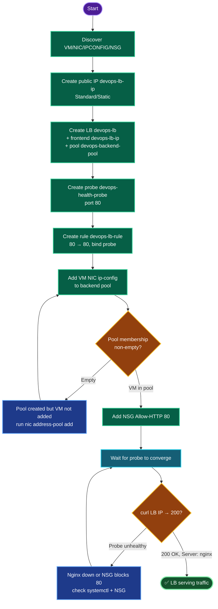

# Azure Load Balancer — `devops-lb` fronting Nginx VM
### Load Balancer Deployment Documentation

---

## TODO

| # | Task | Status |
|---|------|--------|
| 1 | Login, discover VM / NIC / NSG | ✅ |
| 2 | Create public IP `devops-lb-ip` | ✅ |
| 3 | Create LB `devops-lb` + frontend `devops-lb-ip` + pool `devops-backend-pool` | ✅ |
| 4 | Create health probe `devops-health-probe` (port 80) | ✅ |
| 5 | Create LB rule `devops-lb-rule` (80→80) | ✅ |
| 6 | Add VM's NIC to backend pool | ✅ |
| 7 | Add NSG inbound rule for port 80 | ✅ |
| 8 | Verify via `curl` through the LB | ⬜ (final) |

---

## Concept

**1. A Load Balancer is five linked sub-resources.** Frontend IP config (where traffic enters) → backend pool (where it goes) → health probe (which backends are alive) → LB rule (the mapping frontend:port → backend:port, bound to a probe). Missing any link breaks the path. Create in dependency order.

**2. Creating a pool ≠ adding the VM.** `az network lb create --backend-pool-name` makes an *empty* pool. The VM joins separately by associating its **NIC ip-config** with the pool (`nic ip-config address-pool add`). This is the single most-missed step — verify `backendIpConfigurations` is non-empty afterward.

**3. Health probe gates traffic.** The LB only forwards to backends the probe marks healthy. A probe on port 80 needs Nginx *listening* on 80 **and** the NSG *allowing* 80 — otherwise the backend stays unhealthy and the LB returns nothing. Probe health takes a few intervals to converge after setup.

**4. SKU consistency.** Standard LB pairs with Standard public IP. The VM in the backend pool doesn't need its own public IP — it's reached through the LB's frontend. Standard is the modern default throughout.

**5. NSG is still the gatekeeper.** Even with a perfect LB, the VM's NSG must allow inbound 80 — for both the probe and client traffic. Without it, probes fail and the pool is effectively empty of healthy targets.

---

## Runbook

### Phase 1 — Discover VM/NIC/NSG
```bash
RG=$(az group list --query "[0].name" -o tsv)
LOC=$(az group show -n "$RG" --query location -o tsv)
VM=$(az vm list -g "$RG" --query "[0].name" -o tsv)
NIC=$(basename "$(az vm show -g "$RG" -n "$VM" --query 'networkProfile.networkInterfaces[0].id' -o tsv)")
IPCONFIG=$(az network nic show -g "$RG" -n "$NIC" --query 'ipConfigurations[0].name' -o tsv)
NSG=$(basename "$(az network nic show -g "$RG" -n "$NIC" --query 'networkSecurityGroup.id' -o tsv)")
echo "VM=$VM NIC=$NIC IPCONFIG=$IPCONFIG NSG=$NSG LOC=$LOC"
```

### Phase 2 — Public IP
```bash
az network public-ip create -g "$RG" -n devops-lb-ip --sku Standard --allocation-method Static -l "$LOC"
```

### Phase 3 — LB + frontend + backend pool
```bash
az network lb create -g "$RG" -n devops-lb --sku Standard -l "$LOC" \
  --frontend-ip-name devops-lb-ip \
  --public-ip-address devops-lb-ip \
  --backend-pool-name devops-backend-pool
```

### Phase 4 — Health probe
```bash
az network lb probe create -g "$RG" --lb-name devops-lb \
  --name devops-health-probe --protocol Tcp --port 80
```

### Phase 5 — LB rule (80 → 80)
```bash
az network lb rule create -g "$RG" --lb-name devops-lb --name devops-lb-rule \
  --protocol Tcp --frontend-port 80 --backend-port 80 \
  --frontend-ip-name devops-lb-ip --backend-pool-name devops-backend-pool \
  --probe-name devops-health-probe
```

### Phase 6 — Add VM to backend pool
```bash
az network nic ip-config address-pool add \
  -g "$RG" --nic-name "$NIC" --ip-config-name "$IPCONFIG" \
  --lb-name devops-lb --address-pool devops-backend-pool
```

### Phase 7 — NSG inbound port 80
```bash
az network nsg rule create -g "$RG" --nsg-name "$NSG" --name Allow-HTTP \
  --priority 900 --direction Inbound --access Allow --protocol Tcp \
  --destination-port-ranges 80 --source-address-prefixes '*' --destination-address-prefixes '*'
```

### Phase 8 — Verify
```bash
LB_IP=$(az network public-ip show -g "$RG" -n devops-lb-ip --query ipAddress -o tsv)
az network lb address-pool show -g "$RG" --lb-name devops-lb --name devops-backend-pool \
  --query "backendIpConfigurations[].id" -o tsv     # must be non-empty
sleep 30
curl -I "http://$LB_IP"     # expect HTTP/1.1 200 OK, Server: nginx
```

---

## OTS (One-Line-To-Ship)

```bash
RG=$(az group list --query "[0].name" -o tsv); LOC=$(az group show -n "$RG" --query location -o tsv); \
VM=$(az vm list -g "$RG" --query "[0].name" -o tsv); \
NIC=$(basename "$(az vm show -g "$RG" -n "$VM" --query 'networkProfile.networkInterfaces[0].id' -o tsv)"); \
IPCONFIG=$(az network nic show -g "$RG" -n "$NIC" --query 'ipConfigurations[0].name' -o tsv); \
NSG=$(basename "$(az network nic show -g "$RG" -n "$NIC" --query 'networkSecurityGroup.id' -o tsv)"); \
az network public-ip create -g "$RG" -n devops-lb-ip --sku Standard --allocation-method Static -l "$LOC" && \
az network lb create -g "$RG" -n devops-lb --sku Standard -l "$LOC" --frontend-ip-name devops-lb-ip --public-ip-address devops-lb-ip --backend-pool-name devops-backend-pool && \
az network lb probe create -g "$RG" --lb-name devops-lb --name devops-health-probe --protocol Tcp --port 80 && \
az network lb rule create -g "$RG" --lb-name devops-lb --name devops-lb-rule --protocol Tcp --frontend-port 80 --backend-port 80 --frontend-ip-name devops-lb-ip --backend-pool-name devops-backend-pool --probe-name devops-health-probe && \
az network nic ip-config address-pool add -g "$RG" --nic-name "$NIC" --ip-config-name "$IPCONFIG" --lb-name devops-lb --address-pool devops-backend-pool && \
az network nsg rule create -g "$RG" --nsg-name "$NSG" --name Allow-HTTP --priority 900 --direction Inbound --access Allow --protocol Tcp --destination-port-ranges 80 --source-address-prefixes '*' --destination-address-prefixes '*' && \
sleep 30 && curl -I "http://$(az network public-ip show -g "$RG" -n devops-lb-ip --query ipAddress -o tsv)"
```

---

## Mermaid



---

## Troubleshooting

| Symptom | Root Cause | Fix |
|---------|-----------|-----|
| `curl` to LB IP times out | VM not in backend pool | `az network nic ip-config address-pool add ...`; verify `backendIpConfigurations` non-empty |
| Backend healthy count 0 | Probe failing — Nginx down or NSG blocks 80 | Confirm `systemctl is-active nginx`; add NSG Allow-HTTP |
| `curl` refused right after setup | Probe hasn't converged yet | Wait ~30s for probe intervals |
| LB create SKU error | Standard LB with Basic IP | Use Standard public IP (matching SKU) |
| Rule create fails: frontend/pool not found | Names mismatch | Match `--frontend-ip-name` / `--backend-pool-name` to LB's actual names |
| Probe create rejected | Wrong protocol/port combo | TCP/80, or HTTP/80 with `--path /` |
| VM has no public IP concern | Not needed | Backend VMs reach clients via LB frontend |
| NSG rule exists but no traffic | NSG not bound to NIC/subnet | Confirm NSG association |
| Priority 900 in use | Rule collision | Bump `--priority` |

---

**Definition of done:** Standard Load Balancer `devops-lb` with frontend `devops-lb-ip` (public IP `devops-lb-ip`); backend pool `devops-backend-pool` containing the Nginx VM's NIC; health probe `devops-health-probe` on port 80; LB rule `devops-lb-rule` mapping frontend 80 → backend 80 bound to the probe; NSG inbound rule allowing TCP 80; and `curl -I http://<devops-lb-ip>` returns `200 OK` with `Server: nginx` through the load balancer.