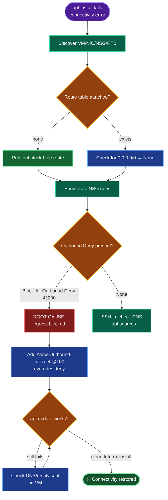

# Azure VM Connectivity — `devops-vm` Package Install Failure
### Incident Remediation Documentation + RCA

---

## TODO

| # | Task | Status |
|---|------|--------|
| 1 | Discover VM / NIC / NSG / route table | ✅ |
| 2 | Enumerate NSG rules — identify blocker | ✅ |
| 3 | Rule out DNS / routing / apt sources | ✅ |
| 4 | Fix: allow outbound internet (override deny) | ✅ |
| 5 | Verify `apt update` + install works | ⬜ (final) |

---

## Concept

**1. NSG rules are priority-ordered.** Lower number = evaluated first; the first match wins. Azure has implicit defaults including `AllowInternetOutBound` at priority **65001**. Any custom rule with a lower number overrides it — so a custom `Deny * Outbound` at 200 beats the default allow and severs egress.

**2. Package managers need outbound egress.** `apt`/`yum` fetch from external mirrors over HTTP/HTTPS. Blocking outbound = no downloads, surfacing as "connectivity issues" even though the VM is otherwise healthy and reachable inbound.

**3. Inbound ≠ outbound.** SSH/HTTP inbound working (VM reachable *from* outside) tells you nothing about *outbound*. Package failure is an egress problem — check outbound rules specifically.

**4. Override vs delete.** Two valid fixes: add an `Allow` at a *higher* priority (lower number) than the deny — least-destructive, keeps existing config — or delete the deny so the default allow resumes. Prefer the override unless the task wants the rule gone.

**5. Diagnose control-plane first.** Enumerating NSG rules (`az network nsg rule list`) often reveals the cause with **no VM login needed** — faster and cleaner than SSHing in blind.

---

## Runbook

### Phase 1 — Discover
```bash
RG=$(az group list --query "[0].name" -o tsv); VM=devops-vm
PIP=$(az vm list-ip-addresses -g "$RG" -n "$VM" --query "[0].virtualMachine.network.publicIpAddresses[0].ipAddress" -o tsv)
NIC=$(basename "$(az vm show -g "$RG" -n "$VM" --query 'networkProfile.networkInterfaces[0].id' -o tsv)")
NSG=$(basename "$(az network nic show -g "$RG" -n "$NIC" --query 'networkSecurityGroup.id' -o tsv)")
SUBNET_ID=$(az network nic show -g "$RG" -n "$NIC" --query 'ipConfigurations[0].subnet.id' -o tsv)
RTB=$(basename "$(az network vnet subnet show --ids "$SUBNET_ID" --query 'routeTable.id' -o tsv)" 2>/dev/null)
echo "PIP=$PIP NSG=$NSG RTB=${RTB:-none}"
```

### Phase 2 — Enumerate NSG rules (find the blocker)
```bash
az network nsg rule list -g "$RG" --nsg-name "$NSG" \
  --query "[].{name:name,dir:direction,access:access,proto:protocol,port:destinationPortRange,prio:priority}" -o table
```
> Root cause identified here: `Block-All-Outbound` (Outbound, Deny, *, priority 200).

### Phase 3 — Fix: override the deny
```bash
az network nsg rule create -g "$RG" --nsg-name "$NSG" --name Allow-Outbound-Internet \
  --priority 100 --direction Outbound --access Allow --protocol '*' \
  --destination-port-ranges '*' --source-address-prefixes '*' --destination-address-prefixes Internet
```
> Alternative: `az network nsg rule delete -g "$RG" --nsg-name "$NSG" --name Block-All-Outbound`

### Phase 4 — Verify
```bash
az network nsg rule list -g "$RG" --nsg-name "$NSG" \
  --query "[?direction=='Outbound'].{name:name,access:access,prio:priority}" -o table

ssh -o StrictHostKeyChecking=no -i /root/.ssh/id_rsa azureuser@"$PIP" \
  "sudo apt update && sudo apt install -y nginx && dpkg -l | grep -q nginx && echo '✅ install works'"
```

---

## OTS (One-Line-To-Ship)

```bash
RG=$(az group list --query "[0].name" -o tsv); VM=devops-vm; \
NIC=$(basename "$(az vm show -g "$RG" -n "$VM" --query 'networkProfile.networkInterfaces[0].id' -o tsv)"); \
NSG=$(basename "$(az network nic show -g "$RG" -n "$NIC" --query 'networkSecurityGroup.id' -o tsv)"); \
PIP=$(az vm list-ip-addresses -g "$RG" -n "$VM" --query "[0].virtualMachine.network.publicIpAddresses[0].ipAddress" -o tsv); \
az network nsg rule create -g "$RG" --nsg-name "$NSG" --name Allow-Outbound-Internet --priority 100 --direction Outbound --access Allow --protocol '*' --destination-port-ranges '*' --source-address-prefixes '*' --destination-address-prefixes Internet && \
ssh -o StrictHostKeyChecking=no -i /root/.ssh/id_rsa azureuser@"$PIP" "sudo apt update && sudo apt install -y nginx && echo '✅ install works'"
```

---

## Mermaid



---

## Troubleshooting

| Symptom | Root Cause | Fix |
|---------|-----------|-----|
| `apt update` connectivity error | Outbound NSG deny | Add Allow-Outbound-Internet at lower priority, or delete the deny |
| Egress still blocked after allow | Allow priority > deny priority | Ensure allow's number is *lower* than the deny's |
| VM reachable via SSH but no egress | Inbound OK, outbound denied | Fix outbound rules specifically |
| All egress fails, no NSG deny | Route table black-hole (`0.0.0.0/0 → None`) | Delete route; add `→ Internet` route |
| DNS resolves fail, IP curl works | Broken `/etc/resolv.conf` | Set `nameserver 168.63.129.16` (Azure DNS) |
| Network OK but apt fails | Corrupt `/etc/apt/sources.list` | Restore correct mirror URLs |
| Rule added but no effect | NSG not bound to NIC/subnet | Confirm NSG association |

---

## RCA — Root Cause Analysis

**Incident:** Package installation on `devops-vm` failed with connectivity errors; `apt update`/`apt install` could not reach Ubuntu repositories.

**Impact:** No packages could be installed or updated. Deployments and patching on the VM were blocked until resolved.

**Root cause:** A custom NSG rule — **`Block-All-Outbound`** (priority 200, Outbound, Deny, all protocols/ports/destinations) — on `devops-nsg` blocked **all** outbound traffic. Azure's implicit `AllowInternetOutBound` sits at priority 65001, so the custom deny at 200 was evaluated first and won, severing egress. Package managers require outbound HTTP/HTTPS to external mirrors; with egress denied, every download failed and surfaced as a "connectivity issue."

**Contributing / ruled-out factors:** No route table was attached (system routing intact — black-hole route ruled out). Inbound rules (SSH 22, HTTP 80) were healthy, so the VM was reachable *inward* — masking that the fault was strictly **outbound**. DNS and apt sources were not the cause.

**Resolution:** Added `Allow-Outbound-Internet` (priority 100, Outbound, Allow, destination `Internet`), evaluated before the deny at 200, restoring egress. Verified with a clean `apt update` and a test package install. (Deleting `Block-All-Outbound` is an equivalent alternative.)

**Detection:** `az network nsg rule list` on `devops-nsg` immediately exposed the outbound deny — root cause found from the control plane with no VM login.

**Prevention:**
- Avoid blanket `Deny * Outbound` rules; scope denies to specific ports/destinations.
- If outbound must be restricted, explicitly allow required egress (package repos, service tags like `AzureUpdateDelivery`, 80/443) at higher priority than any deny.
- Add NSG changes to change-control review; flag any all-traffic outbound deny.
- Enable NSG flow logs to detect egress drops proactively.

---

**Definition of done:** The outbound-blocking NSG rule on `devops-nsg` is overridden (or removed); `devops-vm` has restored internet egress; `apt update` fetches cleanly and a test package installs successfully — normal operations restored, with root cause documented.