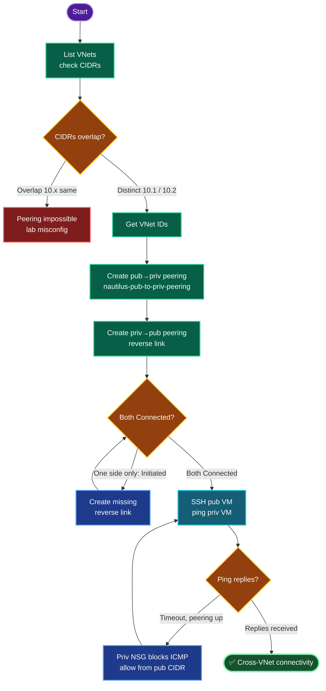

# Azure VNet Peering — `nautilus-pub-vnet` ↔ `nautilus-priv-vnet` (East US)
### VNet Peering Deployment Documentation + RCA

---

## TODO

| # | Task | Status |
|---|------|--------|
| 1 | Discover both VNets, confirm non-overlapping CIDRs | ✅ |
| 2 | Get VNet resource IDs | ✅ |
| 3 | Create peering `nautilus-pub-to-priv-peering` (pub→priv) | ✅ |
| 4 | Create reverse peering (priv→pub) | ✅ |
| 5 | Verify both links `Connected` | ✅ |
| 6 | SSH to public VM, ping private VM | ⬜ (final) |

---

## Concept

**1. Peering is two one-way links.** A VNet peering connection is created independently on *each* VNet's side. Creating only pub→priv leaves the connection in `Initiated` (not `Connected`); traffic flows only when **both** directions exist and both read `Connected`. The task names one link, but the ping test needs the pair.

**2. Non-overlapping address spaces are mandatory.** Peering requires distinct CIDRs — overlap makes routing ambiguous and Azure rejects the peering. Here pub `10.2.0.0/16` and priv `10.1.0.0/16` don't overlap, so it's valid.

**3. `--allow-vnet-access` enables the data path.** This flag permits VMs in one VNet to reach the other. Without it, the peering exists but traffic is blocked.

**4. Peering ≠ NSG bypass.** Even with peering `Connected`, the destination VM's NSG still filters inbound traffic. To ping the private VM, its NSG must allow ICMP from the peer VNet's CIDR — peering provides the *route*, NSG governs *access*.

**5. Private VM reachability.** The private VM has no public IP; it's reached over the peering by its **private** IP, from a host inside the peered VNet (the public VM). That's exactly what the ping test validates.

---

## Runbook

### Phase 1 — Discover + verify CIDRs
```bash
RG=$(az group list --query "[0].name" -o tsv)
az network vnet list -g "$RG" --query "[].{name:name,cidr:addressSpace.addressPrefixes[0]}" -o table
PUB_VNET=nautilus-pub-vnet
PRIV_VNET=nautilus-priv-vnet
```

### Phase 2 — VNet IDs
```bash
PUB_ID=$(az network vnet show -g "$RG" -n "$PUB_VNET" --query id -o tsv)
PRIV_ID=$(az network vnet show -g "$RG" -n "$PRIV_VNET" --query id -o tsv)
```

### Phase 3 — Peering pub → priv (named link)
```bash
az network vnet peering create -g "$RG" --name nautilus-pub-to-priv-peering \
  --vnet-name "$PUB_VNET" --remote-vnet "$PRIV_ID" --allow-vnet-access
```

### Phase 4 — Reverse peering priv → pub
```bash
az network vnet peering create -g "$RG" --name nautilus-priv-to-pub-peering \
  --vnet-name "$PRIV_VNET" --remote-vnet "$PUB_ID" --allow-vnet-access
```

### Phase 5 — Verify both Connected
```bash
az network vnet peering list -g "$RG" --vnet-name "$PUB_VNET"  --query "[].{name:name,state:peeringState}" -o table
az network vnet peering list -g "$RG" --vnet-name "$PRIV_VNET" --query "[].{name:name,state:peeringState}" -o table
```

### Phase 6 — Test connectivity
```bash
PUB_PIP=$(az vm list-ip-addresses -g "$RG" -n nautilus-pub-vm --query "[0].virtualMachine.network.publicIpAddresses[0].ipAddress" -o tsv)
PRIV_IP=$(az vm list-ip-addresses -g "$RG" -n nautilus-priv-vm --query "[0].virtualMachine.network.privateIpAddresses[0]" -o tsv)
echo "PUB_PIP=$PUB_PIP PRIV_IP=$PRIV_IP"
ssh -o StrictHostKeyChecking=no -i /root/.ssh/id_rsa azureuser@"$PUB_PIP"
#   on public VM:  ping -c 4 <PRIV_IP>
```

---

## OTS (One-Line-To-Ship)

```bash
RG=$(az group list --query "[0].name" -o tsv); PUB_VNET=nautilus-pub-vnet; PRIV_VNET=nautilus-priv-vnet; \
PUB_ID=$(az network vnet show -g "$RG" -n "$PUB_VNET" --query id -o tsv); \
PRIV_ID=$(az network vnet show -g "$RG" -n "$PRIV_VNET" --query id -o tsv); \
az network vnet peering create -g "$RG" --name nautilus-pub-to-priv-peering --vnet-name "$PUB_VNET" --remote-vnet "$PRIV_ID" --allow-vnet-access && \
az network vnet peering create -g "$RG" --name nautilus-priv-to-pub-peering --vnet-name "$PRIV_VNET" --remote-vnet "$PUB_ID" --allow-vnet-access && \
az network vnet peering list -g "$RG" --vnet-name "$PUB_VNET" --query "[].{name:name,state:peeringState}" -o table
```

---

## Mermaid



---

## Troubleshooting

| Symptom | Root Cause | Fix |
|---------|-----------|-----|
| Peering stuck `Initiated` | Only one side created | Create the reverse peering; both must exist |
| Peering create rejected | Overlapping CIDRs | VNets need distinct address spaces |
| Ping times out, peering `Connected` | Private VM NSG blocks ICMP | Add inbound Allow ICMP from pub VNet CIDR |
| SSH to pub VM fails | Key/port/PIP issue | Use `-i /root/.ssh/id_rsa`; confirm port 22 open |
| `PUB_ID`/`PRIV_ID` empty | Vars not set / wrong VNet name | Re-set from `az network vnet list` |
| Traffic one-way only | `--allow-vnet-access` missing on a link | Recreate link with the flag |
| Can't reach priv VM by name | No private DNS | Use the private IP directly |

**ICMP NSG fix (if ping fails despite Connected peering):**
```bash
PRIV_NSG=$(basename "$(az network nic show --ids $(az vm show -g "$RG" -n nautilus-priv-vm --query 'networkProfile.networkInterfaces[0].id' -o tsv) --query 'networkSecurityGroup.id' -o tsv)")
az network nsg rule create -g "$RG" --nsg-name "$PRIV_NSG" --name Allow-ICMP-Peer \
  --priority 200 --direction Inbound --access Allow --protocol Icmp \
  --destination-port-ranges '*' --source-address-prefixes 10.2.0.0/16 --destination-address-prefixes '*'
```

---

## RCA — Root Cause Analysis

*(Framed as the analysis you'd document if the ping test initially failed — the two classic peering failure modes.)*

**Scenario:** After creating the `nautilus-pub-to-priv-peering` link, the public VM could not ping the private VM.

**Two candidate root causes, in order of likelihood:**

**Cause 1 — One-directional peering.** Peering is two independent links. Creating only pub→priv leaves that side `Initiated` and the private side absent; the data path never completes, so it shows as `Connected` on neither end or `Initiated` on one. **Resolution:** create the reverse priv→pub link so both read `Connected`. Peering only carries traffic when both halves exist.

**Cause 2 — NSG blocking ICMP.** With both links `Connected`, the route exists — but the private VM's NSG (from the earlier private-VNet task, scoped to allow only intra-VNet SSH) does not permit ICMP from the peer's `10.2.0.0/16` range. Peering supplies the route; the NSG still enforces access, so ping is dropped at the destination NIC. **Resolution:** add an inbound Allow-ICMP rule sourced from the public VNet CIDR.

**Why not CIDR overlap:** the VNets use distinct ranges (pub `10.2.0.0/16`, priv `10.1.0.0/16`), so overlap — the other common peering blocker — was ruled out at discovery.

**Detection:** `az network vnet peering list` reveals link state (catches Cause 1); a `Connected` state with a failing ping points to Cause 2 (NSG).

**Prevention:**
- Always create and verify **both** peering links; treat `Connected` on both sides as the completion criterion, not a single create.
- When peering into a hardened/private VNet, plan the destination NSG rules (ICMP/app ports) as part of the peering change, since peering does not bypass NSGs.
- Standardize non-overlapping CIDRs across VNets up front to keep future peering possible.

---

**Definition of done:** Peering `nautilus-pub-to-priv-peering` (and its reverse) created between `nautilus-pub-vnet` and `nautilus-priv-vnet`, both links `Connected`; from `nautilus-pub-vm`, `ping <nautilus-priv-vm private IP>` returns replies — confirming cross-VNet connectivity over the peering.