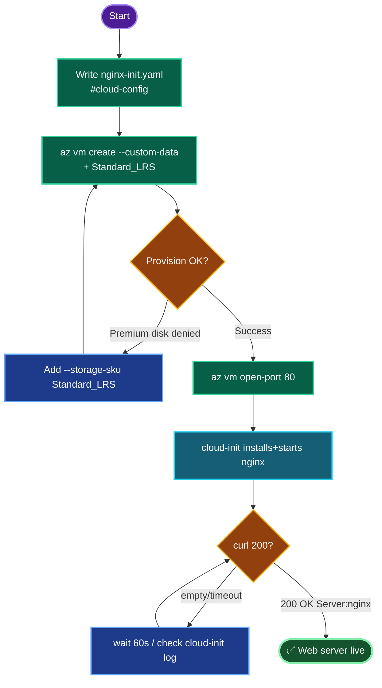
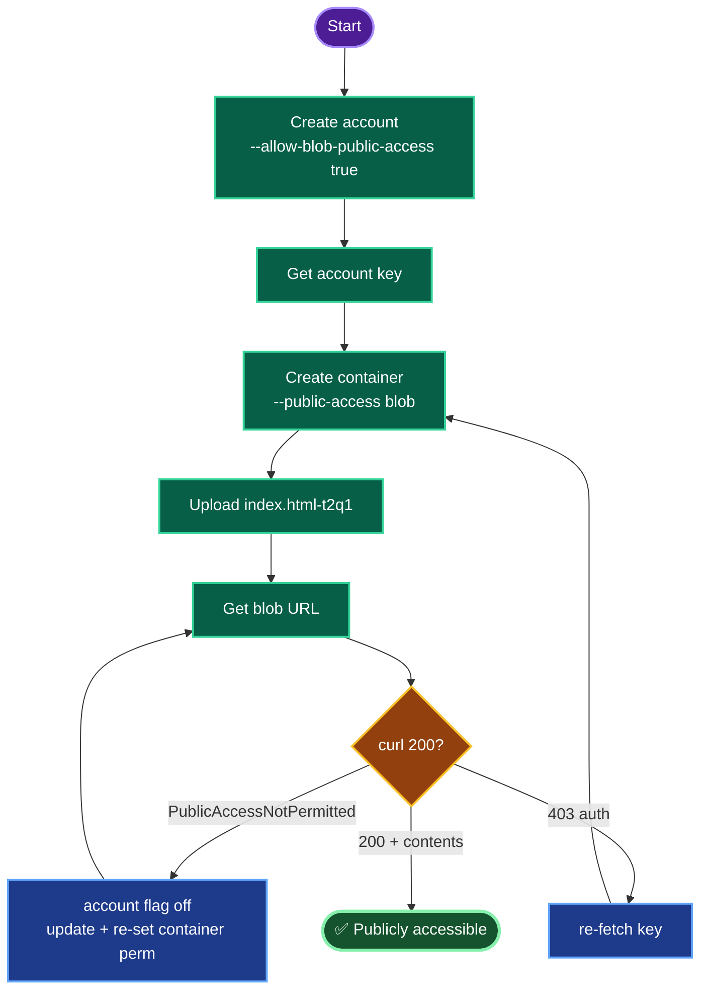
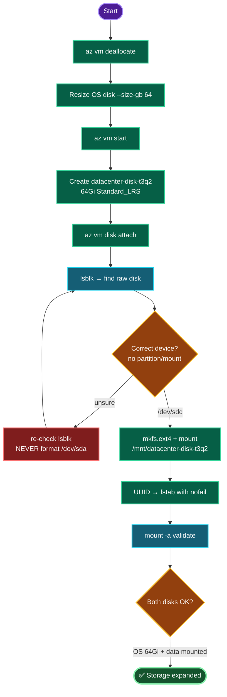

Confirmed — here's full documentation for the three `t1q1` / `t2q1` / `t3q2` tasks.

---

# ═══════════════════════════════════════════
# DOC 1 — `datacenter-vm-t1q1` Nginx Web Server (East US)
# ═══════════════════════════════════════════

## TODO

| # | Task | Status |
|---|------|--------|
| 1 | Set `RG` / `LOC=eastus` | ✅ |
| 2 | Write cloud-init (install + start Nginx) | ✅ |
| 3 | Create `datacenter-vm-t1q1` (Ubuntu, Standard_LRS) with `--custom-data` | ✅ |
| 4 | Open NSG port 80 from internet | ✅ |
| 5 | curl verify 200 OK | ⬜ |

## Concept

Cloud-init via `--custom-data` runs natively on first boot — no extension resource needed — with `#cloud-config` as the required first line, `packages:` for the install, `runcmd:` to enable/start. Cloud-init runs **after** the VM reports "created," so there's a 30–60s lag before Nginx answers. The NSG gates internet ingress: Nginx on 80 isn't reachable until `az vm open-port` adds the rule. `Standard_B1s` defaults to a Premium OS disk, which the lab policy rejects — `--storage-sku Standard_LRS` is mandatory.

## Runbook

```bash
RG=$(az group list --query "[0].name" -o tsv); LOC=eastus; VM=datacenter-vm-t1q1

cat > /tmp/nginx-init.yaml <<'EOF'
#cloud-config
package_update: true
packages:
  - nginx
runcmd:
  - systemctl enable nginx
  - systemctl start nginx
EOF

az vm create -g "$RG" -n "$VM" --image Ubuntu2204 --size Standard_B1s \
  --admin-username azureuser --generate-ssh-keys \
  --custom-data /tmp/nginx-init.yaml --storage-sku Standard_LRS --location "$LOC"

az vm open-port -g "$RG" -n "$VM" --port 80 --priority 900

PIP=$(az vm list-ip-addresses -g "$RG" -n "$VM" --query "[0].virtualMachine.network.publicIpAddresses[0].ipAddress" -o tsv)
sleep 60; curl -I "http://$PIP"
```

## OTS

```bash
RG=$(az group list --query "[0].name" -o tsv); LOC=eastus; VM=datacenter-vm-t1q1; \
printf '#cloud-config\npackage_update: true\npackages:\n  - nginx\nruncmd:\n  - systemctl enable nginx\n  - systemctl start nginx\n' > /tmp/nginx-init.yaml && \
az vm create -g "$RG" -n "$VM" --image Ubuntu2204 --size Standard_B1s --admin-username azureuser --generate-ssh-keys --custom-data /tmp/nginx-init.yaml --storage-sku Standard_LRS --location "$LOC" && \
az vm open-port -g "$RG" -n "$VM" --port 80 --priority 900 && sleep 60 && \
curl -I "http://$(az vm list-ip-addresses -g "$RG" -n "$VM" --query "[0].virtualMachine.network.publicIpAddresses[0].ipAddress" -o tsv)"
```

## Mermaid



## Troubleshooting

| Symptom | Cause | Fix |
|---------|-------|-----|
| `RequestDisallowedByPolicy` (disk) | Premium default OS disk | `--storage-sku Standard_LRS` |
| curl empty right after create | cloud-init still running | wait 60s, retry |
| curl refused | port 80 not open | `az vm open-port --port 80` |
| `$PIP` empty | shell var lost | re-run `RG=`/`PIP=` |
| `Ubuntu2204` not found | alias unavailable | pick a URN via `az vm image list --publisher Canonical --all` |
| nginx down, port open | service didn't start | `run-command`: `systemctl start nginx` |

**Definition of done:** `datacenter-vm-t1q1` in East US, Ubuntu, cloud-init installed+started Nginx, NSG allows TCP 80, `curl -I http://<PIP>` → `200 OK`, `Server: nginx`.

---

# ═══════════════════════════════════════════
# DOC 2 — `datacenterst29188t2q1` Public Blob Storage (West US)
# ═══════════════════════════════════════════

## TODO

| # | Task | Status |
|---|------|--------|
| 1 | Set `RG` / `LOC=westus`, get key | ✅ |
| 2 | Create account `datacenterst29188t2q1` (public access on) | ✅ |
| 3 | Create container `datacenter-site-4107-t2q1` (public blob) | ✅ |
| 4 | Upload `index.html-t2q1` via CLI | ✅ |
| 5 | curl blob URL → 200 | ⬜ |

## Concept

Public blob access is a **two-level gate**: the account flag `allowBlobPublicAccess=true` is the master switch, and the container ACL `--public-access blob` grants anonymous *read of blobs* (no listing). If the account flag is off, the container ACL silently yields no anonymous access (`PublicAccessNotPermitted`) — set the account flag first. Data-plane commands need auth; `--account-key` forces key auth. The blob is addressable at `https://<account>.blob.core.windows.net/<container>/<blob>` with no SAS once public. `Standard_LRS` satisfies the storage policy.

## Runbook

```bash
RG=$(az group list --query "[0].name" -o tsv); LOC=westus
ST=datacenterst29188t2q1; CONTAINER=datacenter-site-4107-t2q1
FILE=index.html-t2q1; SRCPATH=/root/pyapp-t2q1/index.html-t2q1

az storage account create -g "$RG" -n "$ST" -l "$LOC" --sku Standard_LRS --kind StorageV2 --allow-blob-public-access true
KEY=$(az storage account keys list -g "$RG" --account-name "$ST" --query "[0].value" -o tsv)
az storage container create -n "$CONTAINER" --account-name "$ST" --account-key "$KEY" --public-access blob
az storage blob upload --account-name "$ST" --account-key "$KEY" -c "$CONTAINER" -n "$FILE" --file "$SRCPATH" --overwrite
URL=$(az storage blob url --account-name "$ST" -c "$CONTAINER" -n "$FILE" -o tsv); echo "$URL"
curl -I "$URL"
```

## OTS

```bash
RG=$(az group list --query "[0].name" -o tsv); LOC=westus; ST=datacenterst29188t2q1; CONTAINER=datacenter-site-4107-t2q1; FILE=index.html-t2q1; SRCPATH=/root/pyapp-t2q1/index.html-t2q1; \
az storage account create -g "$RG" -n "$ST" -l "$LOC" --sku Standard_LRS --kind StorageV2 --allow-blob-public-access true && \
KEY=$(az storage account keys list -g "$RG" --account-name "$ST" --query "[0].value" -o tsv) && \
az storage container create -n "$CONTAINER" --account-name "$ST" --account-key "$KEY" --public-access blob && \
az storage blob upload --account-name "$ST" --account-key "$KEY" -c "$CONTAINER" -n "$FILE" --file "$SRCPATH" --overwrite && \
curl -I "$(az storage blob url --account-name "$ST" -c "$CONTAINER" -n "$FILE" -o tsv)"
```

## Mermaid



## Troubleshooting

| Symptom | Cause | Fix |
|---------|-------|-----|
| curl `PublicAccessNotPermitted` | account flag off | `az storage account update --allow-blob-public-access true` + re-set container perm |
| blob 404 | wrong blob name | confirm `--name index.html-t2q1` exactly |
| `AuthorizationFailed` | missing/expired key | re-fetch key |
| account name rejected | >24 / uppercase | lowercase alphanumeric, 3–24 |
| container root forbidden | `blob` disallows listing (expected) | access blob URL directly |

**Definition of done:** Account `datacenterst29188t2q1` in westus, public access enabled; container `datacenter-site-4107-t2q1` public blob read; `index.html-t2q1` uploaded via CLI; blob URL returns `200 OK` anonymously.

---

# ═══════════════════════════════════════════
# DOC 3 — `datacenter-vm-t3q2` Disk Resize + Data Disk
# ═══════════════════════════════════════════

## TODO

| # | Task | Status |
|---|------|--------|
| 1 | Set vars, get VM location | ✅ |
| 2 | Deallocate VM (required for OS resize) | ✅ |
| 3 | Resize OS disk 32→64Gi, restart | ✅ |
| 4 | Create `datacenter-disk-t3q2` (Standard HDD, 64Gi) + attach | ✅ |
| 5 | Format + mount at `/mnt/datacenter-disk-t3q2` | ✅ |
| 6 | Persist in fstab + verify | ⬜ |

## Concept

OS disk resize requires the VM **deallocated** — `az disk update --size-gb` fails on a running VM (deallocate → resize → start). Disks grow only, never shrink. A data disk has three layers: **create** (managed disk), **attach** (assigns LUN, surfaces `/dev/sdc`), **mount** (format → mount → fstab) — attach alone gives a raw, unusable device. Identify the target by `lsblk` (the device with no partitions and no mountpoint) — formatting the wrong device destroys data. Persist by **UUID** with **`nofail`** so reboots don't break and a missing disk doesn't block boot. `Standard_LRS` = Standard HDD + policy-compliant.

## Runbook

```bash
RG=$(az group list --query "[0].name" -o tsv); VM=datacenter-vm-t3q2
DATADISK=datacenter-disk-t3q2; MOUNT=/mnt/datacenter-disk-t3q2
LOC=$(az vm show -g "$RG" -n "$VM" --query location -o tsv)

# OS resize
az vm deallocate -g "$RG" -n "$VM"
OSDISK=$(az vm show -g "$RG" -n "$VM" --query "storageProfile.osDisk.name" -o tsv)
az disk update -g "$RG" -n "$OSDISK" --size-gb 64
az vm start -g "$RG" -n "$VM"

# Data disk create + attach
az disk create -g "$RG" -n "$DATADISK" --size-gb 64 --sku Standard_LRS --location "$LOC"
az vm disk attach -g "$RG" --vm-name "$VM" --name "$DATADISK"

# Format + mount (via run-command, no SSH)
az vm run-command invoke -g "$RG" -n "$VM" --command-id RunShellScript --scripts '
DEV=/dev/sdc
blkid "$DEV" >/dev/null 2>&1 || mkfs.ext4 -F "$DEV"
mkdir -p '"$MOUNT"'; mountpoint -q '"$MOUNT"' || mount "$DEV" '"$MOUNT"'
UUID=$(blkid -s UUID -o value "$DEV")
grep -q "$UUID" /etc/fstab || echo "UUID=$UUID '"$MOUNT"' ext4 defaults,nofail 0 2" >> /etc/fstab
mount -a; lsblk; df -h '"$MOUNT"'
'
```

## OTS

```bash
RG=$(az group list --query "[0].name" -o tsv); VM=datacenter-vm-t3q2; DATADISK=datacenter-disk-t3q2; MOUNT=/mnt/datacenter-disk-t3q2; LOC=$(az vm show -g "$RG" -n "$VM" --query location -o tsv); \
az vm deallocate -g "$RG" -n "$VM" && \
OSDISK=$(az vm show -g "$RG" -n "$VM" --query "storageProfile.osDisk.name" -o tsv) && \
az disk update -g "$RG" -n "$OSDISK" --size-gb 64 && az vm start -g "$RG" -n "$VM" && \
az disk create -g "$RG" -n "$DATADISK" --size-gb 64 --sku Standard_LRS --location "$LOC" && \
az vm disk attach -g "$RG" --vm-name "$VM" --name "$DATADISK" && \
az vm run-command invoke -g "$RG" -n "$VM" --command-id RunShellScript --scripts 'DEV=/dev/sdc; blkid "$DEV" >/dev/null 2>&1 || mkfs.ext4 -F "$DEV"; mkdir -p '"$MOUNT"'; mount "$DEV" '"$MOUNT"'; U=$(blkid -s UUID -o value "$DEV"); grep -q "$U" /etc/fstab || echo "UUID=$U '"$MOUNT"' ext4 defaults,nofail 0 2" >> /etc/fstab; mount -a; df -h '"$MOUNT"''
```

## Mermaid



## Troubleshooting

| Symptom | Cause | Fix |
|---------|-------|-----|
| `az disk update` fails: in use | VM running | deallocate first |
| can't shrink | disks grow only | not supported |
| new disk absent in `lsblk` | attach incomplete / stale SSH | re-attach, re-check |
| formatted wrong device | mkfs on `/dev/sda` | prevention: verify `lsblk` first |
| mount lost after reboot | not in fstab | add UUID entry with `nofail` |
| boot hangs | bad fstab, no `nofail` | recovery + fix; `mount -a` to pre-test |
| OS 64Gi but df shows 32G | fs not grown | `growpart /dev/sda 1 && resize2fs /dev/sda1` |
| policy denied on create | Premium SKU | `--sku Standard_LRS` |

**Definition of done:** `datacenter-vm-t3q2` OS disk expanded to 64Gi; `datacenter-disk-t3q2` (Standard HDD, 64Gi) attached, formatted, mounted at `/mnt/datacenter-disk-t3q2` with a UUID `nofail` fstab entry. `az vm show` confirms both sizes; `df -h` confirms the mount.

---

That's all three. Want any of them exported as a downloadable `.md` file, or an RCA section added to any (the disk/blob/nginx tasks were clean deployments, so none hit a failure worth an RCA — but I can add a "risks avoided" section if useful)?