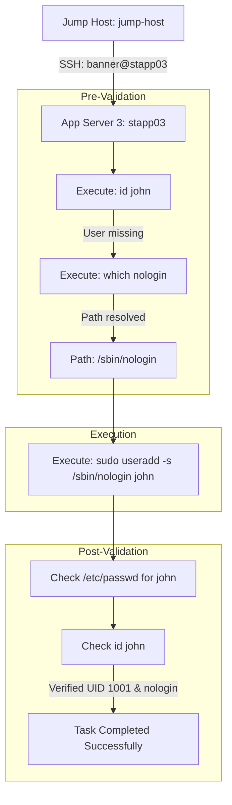

Here is the comprehensive Operational One-Time Solution (OTS), Runbook, and Architectural Flow Diagram for this task.

---

## 1. One-Time Solution (OTS)

To complete the requirement in a single execution command directly from the jump host, run:

```bash
sshpass -p 'BigGr33n' ssh -o StrictHostKeyChecking=no banner@stapp03 "echo BigGr33n | sudo -S useradd -s /sbin/nologin john && grep '^john:' /etc/passwd"

```

---

## 2. Standard Operating Procedure (Runbook)

### Target Information

* **Target Server:** Application Server 3 (`stapp03` / `10.244.234.212`)
* **Username:** `john`
* **Shell Type:** Non-interactive (`/sbin/nologin` or `/usr/sbin/nologin`)
* **Service Account:** `banner`

---

### Step-by-Step Runbook Execution

#### Step 1: Establish SSH Connection

Connect to App Server 3 from `jump-host`:

```bash
ssh banner@stapp03

```

*Provide password `BigGr33n` when prompted.*

#### Step 2: Pre-Execution Validation

Validate that the user does not already exist and locate the correct `nologin` binary path:

```bash
# Check existing user
id john

# Check valid non-interactive shell binary
which nologin

```

*Expected Output:* `id: 'john': no such user` and `/usr/sbin/nologin` (or `/sbin/nologin`).

#### Step 3: Execution - Create Non-Interactive User

Create the system account `john` with shell restricted to `/sbin/nologin`:

```bash
sudo useradd -s /sbin/nologin john

```

*Provide sudo password `BigGr33n` when prompted.*

#### Step 4: Post-Execution Verification

Confirm user creation, assigned shell, and default UID/GID assignments:

```bash
grep "^john:" /etc/passwd
id john

```

**Expected Output:**

```text
john:x:1001:1001::/home/john:/sbin/nologin
uid=1001(john) gid=1001(john) groups=1001(john)

```

---

## 3. Workflow Architecture Diagram

