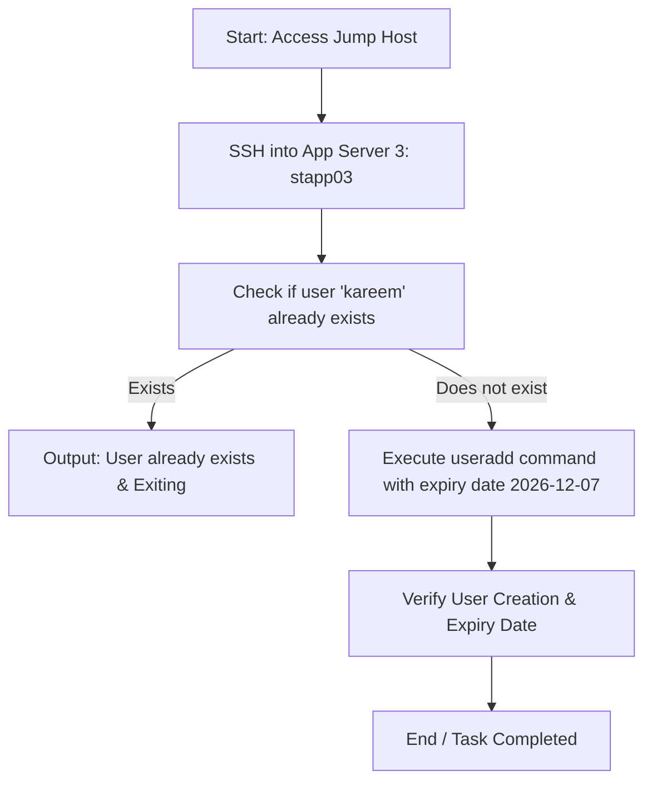

Here is the step-by-step runbook, executable setup script, and Mermaid workflow diagram to create the temporary user `kareem` on **App Server 3 (`stapp03`)**.

---

## 1. Process Workflow Diagram (Mermaid)



---

## 2. Step-by-Step Runbook

### Step 1: Connect to App Server 3 (`stapp03`)

From your terminal / jump host, SSH into Application Server 3 using the credentials from the infrastructure details:

* **Hostname:** `stapp03`
* **User:** `banner`
* **Password:** `BigGr33n`

```bash
ssh banner@stapp03

```

### Step 2: Switch to Root or Use Sudo

Switch to `root` or elevate privileges to run user management commands:

```bash
sudo su -
# Or supply 'banner' password (BigGr33n) when prompted for sudo

```

### Step 3: Run the Automation Script or Execution Commands

Execute the automated one-liner script below (or follow manual execution).

---

## 3. One-Time Execution Script (with Validations)

This shell script handles pre-checks, user creation with the required expiration date (`2026-12-07`), and post-verification automatically.

```bash
#!/bin/bash
set -e

USERNAME="kareem"
EXPIRY_DATE="2026-12-07"

echo "=== [1/3] Pre-Validation Check ==="
if id "$USERNAME" &>/dev/null; then
    echo "Validation Failed: User '$USERNAME' already exists on this server!"
    chage -l "$USERNAME" | grep "Account expires"
    exit 1
else
    echo "Validation Passed: User '$USERNAME' does not exist."
fi

echo "=== [2/3] Creating Temporary User ==="
useradd -e "$EXPIRY_DATE" "$USERNAME"
echo "User '$USERNAME' successfully created with expiration set to $EXPIRY_DATE."

echo "=== [3/3] Post-Validation Check ==="
echo "Verifying user creation in /etc/passwd:"
grep "^${USERNAME}:" /etc/passwd

echo "Verifying account expiration date using chage:"
EXPIRY_VERIFY=$(chage -l "$USERNAME" | grep "Account expires")
echo "$EXPIRY_VERIFY"

if echo "$EXPIRY_VERIFY" | grep -q "Dec 07, 2026"; then
    echo "SUCCESS: User '$USERNAME' verified with expiry date $EXPIRY_DATE."
else
    echo "WARNING: Check expiry verification output above."
fi

```

---

## 4. Manual Commands Quick-Reference

If you prefer executing commands individually step-by-step:

1. **Create the user with expiry date:**
```bash
sudo useradd -e 2026-12-07 kareem

```


2. **Verify user entry in `/etc/passwd`:**
```bash
id kareem

```


3. **Verify account expiration date:**
```bash
sudo chage -l kareem

```


*Expected Output line:* `Account expires : Dec 07, 2026`