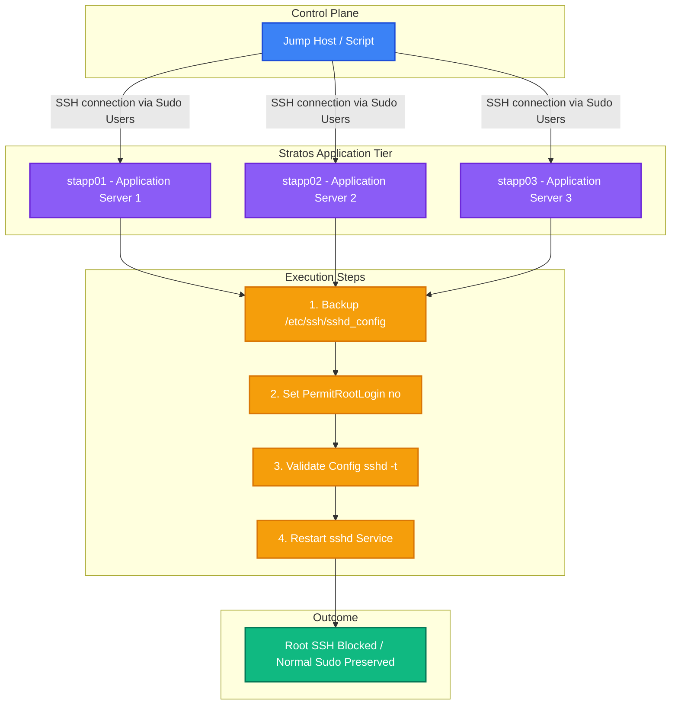

Here is the complete package to disable direct SSH root login across your Application Servers (`stapp01`, `stapp02`, and `stapp03`), including an automated **One-Time Bash Script**, a step-by-step **Runbook**, and a **Colored Mermaid Diagram**.

---

## 1. Automated One-Time Bash Script

Save this script as `disable_root_ssh.sh` on your Jump Host/control machine and execute it. It uses `sshpass` to connect using the application user credentials provided in your infrastructure details, uses `sudo` to set `PermitRootLogin no` in SSH config, and restarts the SSH service.

```bash
#!/bin/bash
# ==============================================================================
# Script Name: disable_root_ssh.sh
# Purpose: Disable direct SSH root login on Stratos DC App Servers
# ==============================================================================

# Ensure sshpass is installed
if ! command -v sshpass &> /dev/null; then
    echo "Installing sshpass..."
    sudo yum install -y sshpass || sudo apt-get install -y sshpass
fi

# Define App Servers Array Format: "HOSTNAME:USER:PASSWORD"
SERVERS=(
    "stapp01:tony:Ir0nM@n"
    "stapp02:steve:Am3ric@"
    "stapp03:banner:BigGr33n"
)

echo -e "\n=========================================="
echo "Starting SSH Root Login Disabling Process..."
echo -e "==========================================\n"

for SERVER_INFO in "${SERVERS[@]}"; do
    IFS=":" read -r HOST USER PASS <<< "$SERVER_INFO"
    
    echo "------------------------------------------"
    echo "Processing Server: $HOST as User: $USER"
    echo "------------------------------------------"
    
    # Execute SSH commands remotely:
    # 1. Backup /etc/ssh/sshd_config
    # 2. Update 'PermitRootLogin' setting to 'no'
    # 3. Test SSH daemon configuration syntax
    # 4. Restart sshd service
    sshpass -p "$PASS" ssh -o StrictHostKeyChecking=no "$USER@$HOST" "
        echo '$PASS' | sudo -S cp /etc/ssh/sshd_config /etc/ssh/sshd_config.bak_\$(date +%F_%T) && \
        echo '$PASS' | sudo -S sed -i 's/^#\?PermitRootLogin.*/PermitRootLogin no/' /etc/ssh/sshd_config && \
        echo '$PASS' | sudo -S sshd -t && \
        echo '$PASS' | sudo -S systemctl restart sshd
    "
    
    if [ $? -eq 0 ]; then
        echo -e "SUCCESS: Root SSH disabled and SSH service restarted on $HOST.\n"
    else
        echo -e "ERROR: Failed to update SSH configuration on $HOST.\n"
    fi
done

echo "=========================================="
echo "Task Completed across all App Servers!"
echo "=========================================="

```

---

## 2. Step-by-Step Operational Runbook

### **Runbook: Disable Root SSH Access on App Servers**

* **Objective:** Restrict direct root SSH access across all target application servers in compliance with security guidelines.
* **Target Hosts:**
* `stapp01` (User: `tony`, Pass: `Ir0nM@n`)
* `stapp02` (User: `steve`, Pass: `Am3ric@`)
* `stapp03` (User: `banner`, Pass: `BigGr33n`)


---

### **Execution Steps (Manual / Single Server Verification)**

1. **SSH into Target Host:**
```bash
ssh <username>@<app-server-hostname>

```


2. **Backup SSH Configuration File:**
```bash
sudo cp /etc/ssh/sshd_config /etc/ssh/sshd_config.bak

```


3. **Modify Configuration Setting:**
Edit `/etc/ssh/sshd_config` or run:
```bash
sudo sed -i 's/^#\?PermitRootLogin.*/PermitRootLogin no/' /etc/ssh/sshd_config

```


4. **Validate SSH Configuration:**
```bash
sudo sshd -t

```


5. **Restart SSH Service:**
```bash
sudo systemctl restart sshd

```


---

### **Verification Steps**

To confirm direct root login is disabled:

1. Attempt direct SSH login as root from your workstation/jump host:
```bash
ssh root@stapp01

```


2. **Expected Result:** `Permission denied (publickey,gssapi-keyex,gssapi-with-mic,password)`.
3. Confirm normal sudo login still works:
```bash
ssh tony@stapp01
sudo -i

```


---

### **Rollback Plan**

If legitimate access is inadvertently locked out:

1. Access the target host via regular user console or jump host.
2. Restore the backup configuration file:
```bash
sudo cp /etc/ssh/sshd_config.bak /etc/ssh/sshd_config
sudo systemctl restart sshd

```


---

## 3. Workflow Architecture Diagram

