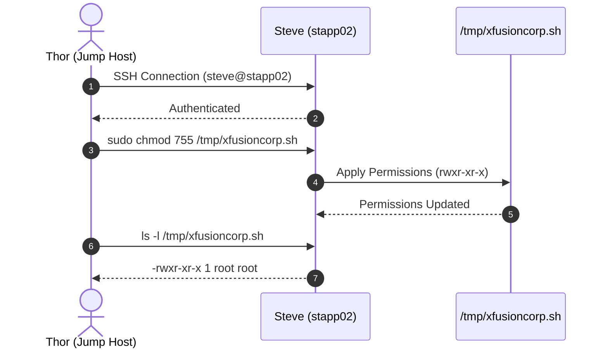
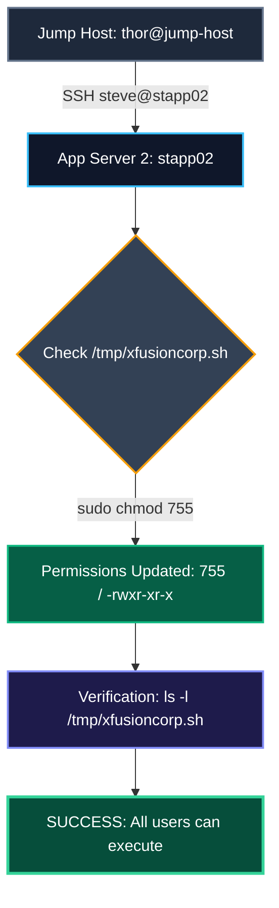

Awesome! Glad to hear that worked out.

Here is the **Operational Runbook (SOP)** along with a **Mermaid sequence diagram** to document the exact resolution for your team.

---

## 📘 Operational Runbook (SOP)

### **Task Overview**

* **Incident / Requirement:** Grant executable and read permissions to `/tmp/xfusioncorp.sh` on `App Server 2` for all users.
* **Target Host:** `stapp02` (App Server 2)
* **Target File:** `/tmp/xfusioncorp.sh`
* **Target Permissions:** `0755` (`-rwxr-xr-x`)

---

### **Execution Steps**

#### **1. SSH to Jump Host**

Log into the Stratos Datacenter Jump Host as `thor`.

#### **2. SSH to App Server 2**

Connect from the jump host to App Server 2:

```bash
ssh steve@stapp02

```

* **User:** `steve`
* **Password:** `Am3ric@`

#### **3. Apply Standard Permissions**

Ensure both **read (`r`)** and **execute (`x`)** permissions are applied for all users (`u+rwx, go+rx` or mode `755`):

```bash
sudo chmod 755 /tmp/xfusioncorp.sh

```

* **Sudo Password:** `Am3ric@`

#### **4. Verification**

Verify the file mode in the long directory listing:

```bash
ls -l /tmp/xfusioncorp.sh

```

* **Expected Output:** `-rwxr-xr-x 1 root root ... /tmp/xfusioncorp.sh`

*(Optional)* Perform a dry run execution to confirm standard execution permissions:

```bash
/tmp/xfusioncorp.sh

```

---

## 🧜‍♂️ Mermaid Flowchart & Sequence Diagram

Here are the diagrams rendered with custom color styling to visualize the execution flow.

### **1. Sequence Diagram**



---

### **2. Colored Workflow Diagram**

