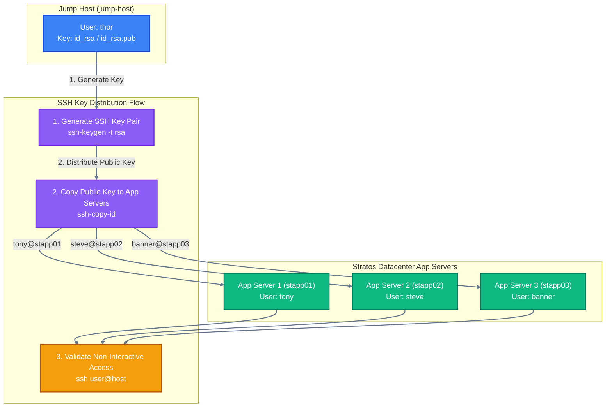

Here is the complete setup guide, including a automated shell script, standard operating procedure (Runbook), and a colorful Mermaid diagram detailing the architecture and authentication flow.

---

## 1. Automated One-Time Setup Script

Run this script on the **Jump Host** logged in as user `thor`. It generates SSH keys (if not already present), uses `sshpass` to copy the public key to each application server, and verifies password-less access.

```bash
#!/bin/bash
# ==============================================================================
# Script Name: setup_passwordless_ssh.sh
# Target: App Servers (stapp01, stapp02, stapp03)
# Description: Configures SSH Key-Based Authentication from thor@jump-host
# ==============================================================================

set -e

# Target Application Servers Credentials
# Format: "hostname:username:password"
SERVERS=(
    "stapp01:tony:Ir0nM@n"
    "stapp02:steve:Am3ric@"
    "stapp03:banner:BigGr33n"
)

SSH_DIR="$HOME/.ssh"
KEY_FILE="$SSH_DIR/id_rsa"

# Step 1: Ensure SSH key pair exists
if [ ! -f "$KEY_FILE" ]; then
    echo "[-] Generating SSH key pair for thor..."
    mkdir -p "$SSH_DIR"
    chmod 700 "$SSH_DIR"
    ssh-keygen -t rsa -b 4096 -f "$KEY_FILE" -N ""
else
    echo "[+] SSH key pair already exists at $KEY_FILE"
fi

# Step 2: Install sshpass if missing
if ! command -v sshpass &> /dev/null; then
    echo "[-] Installing sshpass..."
    sudo yum install -y sshpass || sudo apt-get install -y sshpass
fi

# Step 3: Copy SSH key to each application server and verify
echo -e "\n=========================================="
echo " Starting SSH Key Distribution & Verification"
echo "=========================================="

for ENTRY in "${SERVERS[@]}"; do
    IFS=":" read -r HOST USER PASS <<< "$ENTRY"

    echo -e "\n--> Processing $HOST ($USER)..."

    # Copy public key to remote host (bypassing strict host key checking)
    sshpass -p "$PASS" ssh-copy-id -o StrictHostKeyChecking=no "$USER@$HOST"

    # Step 4: Verification test
    if ssh -o BatchMode=yes -o ConnectTimeout=5 "$USER@$HOST" "echo '[+] Password-less SSH successful for $USER@$HOST'"; then
        echo "[SUCCESS] SSH connection verified for $HOST!"
    else
        echo "[ERROR] Failed password-less SSH test for $HOST!"
    fi
done

echo -e "\n=========================================="
echo " Setup Completed Successfully!"
echo "=========================================="

```

---

## 2. Standard Operating Procedure (Runbook)

### **Objective**

Configure password-less SSH authentication from user `thor` on `jump-host` to the sudo users of Application Server 1 (`stapp01`), Application Server 2 (`stapp02`), and Application Server 3 (`stapp03`).

### **Prerequisites & Server Inventory**

| Server | Hostname | User | Password |
| --- | --- | --- | --- |
| **Application Server 1** | `stapp01` | `tony` | `Ir0nM@n` |
| **Application Server 2** | `stapp02` | `steve` | `Am3ric@` |
| **Application Server 3** | `stapp03` | `banner` | `BigGr33n` |

---

### **Execution Steps (Manual)**

#### **Step 1: SSH into Jump Host**

Log into the Jump Host as `thor` (Password: `mjolnir123`).

```bash
ssh thor@jump-host

```

#### **Step 2: Generate SSH Keys on Jump Host**

Generate an RSA key pair if one does not already exist:

```bash
ssh-keygen -t rsa -b 4096 -N "" -f ~/.ssh/id_rsa

```

#### **Step 3: Copy Key to App Servers**

Run `ssh-copy-id` for each host, entering their respective passwords when prompted:

```bash
# App Server 1
ssh-copy-id -o StrictHostKeyChecking=no tony@stapp01

# App Server 2
ssh-copy-id -o StrictHostKeyChecking=no steve@stapp02

# App Server 3
ssh-copy-id -o StrictHostKeyChecking=no banner@stapp03

```

#### **Step 4: Verification**

Test password-less SSH access for all target hosts. You should be able to log in without entering a password:

```bash
ssh tony@stapp01 hostname
ssh steve@stapp02 hostname
ssh banner@stapp03 hostname

```

---

## 3. Colorful Architecture & Flow Diagram

