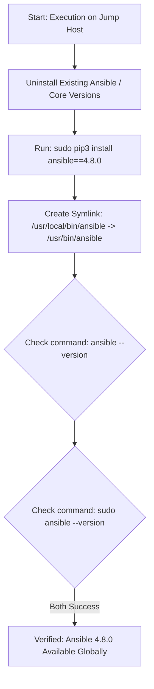

The output reveals two key issues:

1. **User vs. Global Install:** Ansible was installed without `sudo` under user scope (or pip installed binaries to `/usr/local/bin`, but `/usr/local/bin` isn't in `sudo`'s default `secure_path`).
2. **Wrong Version:** `ansible [core 2.11.12]` corresponds to Ansible package version **5.x**, not **4.8.0** (which uses `ansible-core 2.11.x`, but specifically Ansible version 4.8.0 needs to be targeted via `pip3 install ansible==4.8.0`). Additionally, `sudo` cannot find the executable because `/usr/local/bin` is missing from `sudo`'s `secure_path` or because of environment restrictions.

Here is the updated script, runbook, and flow diagram to fix the version and ensure **global availability** (including under `sudo` and for all system users).

---

## 1. Updated One-Time Bash Script

Save as `install_ansible.sh` and run it:

```bash
#!/usr/bin/env bash
set -euo pipefail

echo "=================================================="
echo " Installing Ansible 4.8.0 Globally "
echo "=================================================="

# 1. Uninstall any existing version to clear conflicts
echo "[1/4] Cleaning up existing Ansible installations..."
pip3 uninstall -y ansible ansible-core || true
sudo pip3 uninstall -y ansible ansible-core || true

# 2. Install exact version 4.8.0 globally using sudo pip3
echo "[2/4] Installing Ansible version 4.8.0 globally..."
sudo pip3 install --no-cache-dir "ansible==4.8.0"

# 3. Ensure /usr/local/bin is in global PATH and symlinked to /usr/bin if needed
echo "[3/4] Ensuring binary is accessible globally and via sudo..."
if [ ! -f /usr/bin/ansible ]; then
    sudo ln -s /usr/local/bin/ansible /usr/bin/ansible
    sudo ln -s /usr/local/bin/ansible-playbook /usr/bin/ansible-playbook
fi

# 4. Verify installation for current user and sudo
echo "[4/4] Verifying installations..."
echo "--- Current User Check ---"
ansible --version

echo "--- Sudo User Check ---"
sudo ansible --version

echo "=================================================="
echo " Ansible 4.8.0 successfully configured! "
echo "=================================================="

```

---

## 2. Updated Step-by-Step Runbook

### Prerequisites & Credentials

* **Host**: `jump-host`
* **User**: `thor`
* **Password**: `mjolnir123`

---

### Execution Steps

#### Step 1: Make Script Executable and Run

Create or update `install_ansible.sh`, grant execute permissions, and run it:

```bash
chmod +x install_ansible.sh
./install_ansible.sh

```

#### Step 2: Symlink Fix Explanation

When running `pip3 install` as root/sudo, packages often install to `/usr/local/bin`. On RHEL/CentOS systems:

* `/etc/sudoers` enforces a strict `secure_path` that often **excludes** `/usr/local/bin`.
* Symlinking `/usr/local/bin/ansible` to `/usr/bin/ansible` guarantees that every user (including `root` via `sudo`) can execute Ansible commands without editing system sudoers configuration.

#### Step 3: Verification

Run the following checks to ensure the requirements are fully satisfied:

1. **Verify Ansible version is 4.8.0:**
```bash
pip3 list | grep ansible

```


*(Expected output should show `ansible 4.8.0`)*
2. **Verify non-root user execution:**
```bash
ansible --version

```


3. **Verify root/sudo user execution:**
```bash
sudo ansible --version

```


---

## 3. Deployment Process Diagram

