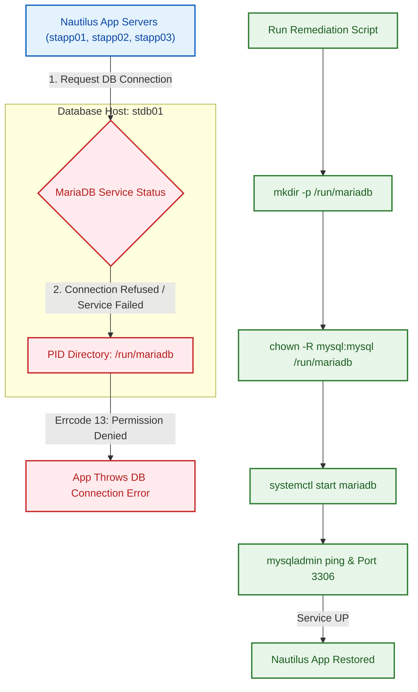

Here is the complete, error-free incident resolution package including the validated Mermaid diagram, One-Time Script (OTS), and Production Runbook for the MariaDB service outage on **`stdb01`**.

---

## 1. Visual Architecture & Remediation Flowchart



---

## 2. One-Time Script (OTS)

Save this script as `fix_mariadb_stdb01.sh` on **`stdb01`** and execute it with `sudo`.

```bash
#!/usr/bin/env bash
# ==============================================================================
# Script Name : fix_mariadb_stdb01.sh
# Target Host : stdb01 (Database Server)
# Purpose     : Fix PID directory permissions and restore MariaDB service
# Environment : Stratos DC (Production)
# ==============================================================================

set -euo pipefail

GREEN='\033[0;32m'
RED='\033[0;31m'
YELLOW='\033[1;33m'
NC='\033[0m'

echo -e "${YELLOW}[1/4] Ensuring PID directory /run/mariadb exists...${NC}"
mkdir -p /run/mariadb

echo -e "${YELLOW}[2/4] Setting permissions for mysql user...${NC}"
chown -R mysql:mysql /run/mariadb /var/lib/mysql /var/log/mariadb
chmod 755 /run/mariadb

echo -e "${YELLOW}[3/4] Starting and enabling MariaDB service...${NC}"
systemctl daemon-reload
systemctl start mariadb
systemctl enable mariadb

echo -e "${YELLOW}[4/4] Verifying MariaDB service status...${NC}"
sleep 2

if systemctl is-active --quiet mariadb; then
    echo -e "${GREEN}✓ MariaDB service is active and running!${NC}"
else
    echo -e "${RED}✗ Service failed to start. Journal logs:${NC}"
    journalctl -u mariadb -n 20 --no-pager
    exit 1
fi

# Ping check
if mysqladmin -u root ping &>/dev/null; then
    echo -e "${GREEN}✓ MariaDB socket response check passed (mysqld is alive).${NC}"
else
    echo -e "${RED}✗ MariaDB ping failed.${NC}"
    exit 1
fi

echo -e "${GREEN}=== Remediation Completed Successfully on stdb01 ===${NC}"

```

### Script Execution Steps:

```bash
chmod +x fix_mariadb_stdb01.sh
sudo ./fix_mariadb_stdb01.sh

```

---

## 3. Production Incident Runbook

> **Incident ID:** INC-STRATOS-001
> **Severity:** CRITICAL (P1)
> **Target System:** Database Server (`stdb01` | IP: Dynamic | User: `peter`)
> **Impacted Systems:** Application Servers (`stapp01`, `stapp02`, `stapp03`)
> **Root Cause:** MariaDB startup failure due to `Errcode 13: Permission denied` when creating `/run/mariadb/mariadb.pid`.

---

### Phase 1: Incident Identification & Initial Diagnosis

1. Connect to the database host:
```bash
ssh peter@stdb01

```


2. Check if MariaDB process or port 3306 is listening:
```bash
sudo ss -tulpn | grep 3306

```


3. Test local MySQL socket ping:
```bash
sudo mysqladmin -u root ping

```


4. Check startup error logs:
```bash
sudo tail -n 30 /var/log/mariadb/mariadb.log

```


*Expected Error Signature:*
`[ERROR] mariadbd: Can't create/write to file '/run/mariadb/mariadb.pid' (Errcode: 13 "Permission denied")`

---

### Phase 2: Manual Remediation Protocol

If executing manually without the OTS script:

1. **Fix directory ownership and permissions for the PID folder:**
```bash
sudo mkdir -p /run/mariadb
sudo chown -R mysql:mysql /run/mariadb
sudo chmod 755 /run/mariadb

```


2. **Ensure data and log directory ownership:**
```bash
sudo chown -R mysql:mysql /var/lib/mysql /var/log/mariadb

```


3. **Start and enable the MariaDB service:**
```bash
sudo systemctl daemon-reload
sudo systemctl start mariadb
sudo systemctl enable mariadb

```


---

### Phase 3: Post-Remediation Health Checks

1. Confirm service status:
```bash
sudo systemctl status mariadb --no-pager

```


2. Verify port binding on 3306:
```bash
sudo ss -tulpn | grep 3306

```


3. Confirm MySQL engine ping:
```bash
sudo mysqladmin -u root ping

```


*Output must return:* `mysqld is alive`

---

### Phase 4: Long-term Prevention (Persistence across reboots)

Because `/run` is typically a volatile `tmpfs` directory that resets on reboot, enforce directory creation via systemd tmpfiles:

```bash
echo "d /run/mariadb 0755 mysql mysql -" | sudo tee /etc/tmpfiles.d/mariadb.conf

```