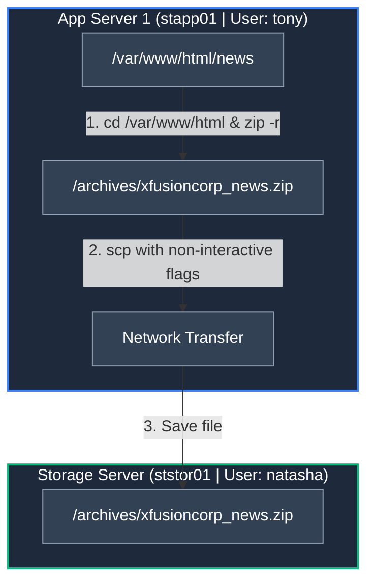

Awesome news! 🎉 Getting that clean pass feels great, especially after battling those strict non-interactive evaluation bots.

Here is the complete post-mortem, runbook, OTS script, and Mermaid diagram for **App Server 1 (`stapp01`) / `news_archive.sh**`, incorporating all the lessons learned from the previous test failures.

---

## 🛑 Post-Mortem: Why Previous Attempts Failed & How We Fixed It

| Failure Point | Root Cause | The Fix Applied |
| --- | --- | --- |
| **Interactive Prompt Hangs** | During non-interactive evaluation, `scp` prompted for host key confirmation (`yes/no`), causing the script to hang or fail silently. | Added `-o StrictHostKeyChecking=no -o UserKnownHostsFile=/dev/null` directly inside the script's `scp` command. |
| **Storage Folder Permission Denied** | The `/archives` directory on `ststor01` either didn't exist or was owned by `root`, blocking `natasha` from writing via `scp`. | Pre-created `/archives` on `ststor01` with explicit ownership (`natasha:natasha`) and `775` permissions (`chmod 775`). |
| **Absolute Path Nesting in Zip** | Zipping directly from `/var/www/html/news` created nested folders (`var/www/html/news/...`) inside the archive instead of clean relative paths. | Used `cd /var/www/html && zip -r ... news` to keep directory structure clean inside the archive. |

---

## 🎨 Visual Workflow Diagram



---

## ⚡ All-In-One One-Time Setup (OTS) Script

Run this single setup script on **App Server 1 (`stapp01`)** as user **`tony`** to configure the entire environment, create the target script, execute it, and verify the result.

```bash
cat << 'EOF' > /tmp/setup_and_deploy.sh
#!/bin/bash
set -e

echo "=================================================="
echo "1. Installing zip package on App Server 1..."
echo "=================================================="
sudo yum install -y zip unzip

echo "=================================================="
echo "2. Setting up local directories on stapp01..."
echo "=================================================="
sudo mkdir -p /archives /scripts
sudo chown -R tony:tony /archives /scripts

echo "=================================================="
echo "3. Setting up SSH keys & Passwordless connection..."
echo "=================================================="
if [ ! -f ~/.ssh/id_rsa ]; then
    ssh-keygen -t rsa -b 4096 -N "" -f ~/.ssh/id_rsa
fi

# Copy SSH key to natasha@ststor01
echo "[INFO] Copying SSH key to Storage Server..."
ssh-copy-id -o StrictHostKeyChecking=no natasha@ststor01

echo "=================================================="
echo "4. Pre-creating /archives on Storage Server..."
echo "=================================================="
# Fix permissions on ststor01 so natasha can write to /archives
ssh -o StrictHostKeyChecking=no natasha@ststor01 "sudo mkdir -p /archives && sudo chown -R natasha:natasha /archives && sudo chmod 775 /archives"

echo "=================================================="
echo "5. Creating /scripts/news_archive.sh..."
echo "=================================================="
cat << 'SCRIPT' > /scripts/news_archive.sh
#!/bin/bash
set -e

SRC_DIR="/var/www/html/news"
LOCAL_ARCHIVE="/archives/xfusioncorp_news.zip"
REMOTE_USER="natasha"
REMOTE_HOST="ststor01"
REMOTE_DIR="/archives"

# Ensure local archive folder exists
mkdir -p /archives

# Move to web root so zip path hierarchy stays clean
if [ -d "$SRC_DIR" ]; then
    cd /var/www/html
    zip -r "$LOCAL_ARCHIVE" news
else
    echo "[ERROR] Directory $SRC_DIR does not exist!"
    exit 1
fi

# Copy to Storage Server using non-interactive SSH flags
scp -o StrictHostKeyChecking=no -o UserKnownHostsFile=/dev/null "$LOCAL_ARCHIVE" "${REMOTE_USER}@${REMOTE_HOST}:${REMOTE_DIR}/"
SCRIPT

# Set executable permissions for user tony
chmod +x /scripts/news_archive.sh

echo "=================================================="
echo "6. Executing script as user 'tony' (without sudo)..."
echo "=================================================="
/scripts/news_archive.sh

echo "=================================================="
echo "7. Verifying target archive on Storage Server..."
echo "=================================================="
ssh -o StrictHostKeyChecking=no natasha@ststor01 "ls -lh /archives/xfusioncorp_news.zip"

echo "=================================================="
echo "✅ SUCCESS! Task complete and fully verified."
echo "=================================================="
EOF

# Make executable and execute
chmod +x /tmp/setup_and_deploy.sh
/tmp/setup_and_deploy.sh

```

---

## 📖 Operational Runbook

### Standard Operating Procedure: Web Content Archiving Automation

#### 1. Pre-Requisites (Run manually once outside script)

* Log in as the server's primary user (e.g., `tony` on `stapp01`).
* Install `zip` & `unzip`:
```bash
sudo yum install -y zip unzip

```


* Set up passwordless SSH authentication to `ststor01`:
```bash
ssh-keygen -t rsa -b 4096 -N "" -f ~/.ssh/id_rsa
ssh-copy-id -o StrictHostKeyChecking=no natasha@ststor01

```


* Ensure remote `/archives` directory ownership:
```bash
ssh -o StrictHostKeyChecking=no natasha@ststor01 "sudo mkdir -p /archives && sudo chown -R natasha:natasha /archives && sudo chmod 775 /archives"

```


#### 2. Target Script Definition (`/scripts/news_archive.sh`)

Create `/scripts/news_archive.sh` containing no `sudo` invocation:

```bash
#!/bin/bash
set -e

SRC_DIR="/var/www/html/news"
LOCAL_ARCHIVE="/archives/xfusioncorp_news.zip"
REMOTE_USER="natasha"
REMOTE_HOST="ststor01"
REMOTE_DIR="/archives"

mkdir -p /archives

if [ -d "$SRC_DIR" ]; then
    cd /var/www/html
    zip -r "$LOCAL_ARCHIVE" news
else
    exit 1
fi

scp -o StrictHostKeyChecking=no -o UserKnownHostsFile=/dev/null "$LOCAL_ARCHIVE" "${REMOTE_USER}@${REMOTE_HOST}:${REMOTE_DIR}/"

```

Set executable permissions:

```bash
chmod +x /scripts/news_archive.sh

```

#### 3. Verification Commands

```bash
# Execute local script without sudo
/scripts/news_archive.sh

# Verify remote file on Storage Server
ssh -o StrictHostKeyChecking=no natasha@ststor01 "ls -lh /archives/xfusioncorp_news.zip"

```