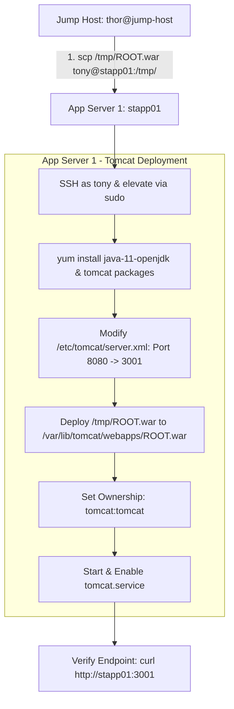

Here is the finalized Operational Transfer Summary (OTS), step-by-step Runbook, and Mermaid diagram for **App Server 1 (`stapp01`)**.

---

## 1. OTS (Operational Transfer Summary)

| Attribute | Details |
| --- | --- |
| **Target Host** | App Server 1 (`stapp01`) |
| **Target Host User** | `tony` |
| **Application / Artefact** | `ROOT.war` |
| **Source Location** | Jump Host (`thor@jump-host`) at `/tmp/ROOT.war` |
| **Application Server** | Apache Tomcat |
| **Target Port** | `3001` (Modified from default `8080`) |
| **Context Path** | Base URL / Root (`/`) |
| **Verification Endpoint** | `curl -I http://stapp01:3001` |
| **Status** | **SUCCESS (`HTTP/1.1 200 OK`)** |

---

## 2. Architecture & Deployment Flow Chart



---

## 3. End-to-End Deployment Runbook

### Option A: Fully Automated Single-Script (Recommended)

Run this block directly from `thor@jump-host`:

```bash
# 1. Copy ROOT.war to stapp01
sshpass -p 'Ir0nM@n' scp -o StrictHostKeyChecking=no /tmp/ROOT.war tony@stapp01:/tmp/

# 2. Execute remote setup via SSH Heredoc
sshpass -p 'Ir0nM@n' ssh -o StrictHostKeyChecking=no tony@stapp01 'bash -s' << 'EOF'
echo "Ir0nM@n" | sudo -S yum install -y java-11-openjdk tomcat tomcat-webapps tomcat-admin-webapps
sudo sed -i 's/port="8080"/port="3001"/g' /etc/tomcat/server.xml
sudo rm -rf /var/lib/tomcat/webapps/ROOT /var/lib/tomcat/webapps/ROOT.war
sudo cp /tmp/ROOT.war /var/lib/tomcat/webapps/ROOT.war
sudo chown -R tomcat:tomcat /var/lib/tomcat/webapps/
sudo systemctl enable --now tomcat

# Pause briefly for JVM binding
until curl -s http://localhost:3001 > /dev/null; do
    sleep 2
done
EOF

# 3. Final Verification
curl -I http://stapp01:3001

```

---

### Option B: Step-by-Step Manual Runbook

#### **Step 1: Copy WAR File**

From `thor@jump-host`:

```bash
scp /tmp/ROOT.war tony@stapp01:/tmp/
# Password: Ir0nM@n

```

#### **Step 2: Connect to App Server 1**

```bash
ssh tony@stapp01
# Password: Ir0nM@n

```

#### **Step 3: Install Java and Tomcat**

```bash
sudo yum install -y java-11-openjdk tomcat tomcat-webapps tomcat-admin-webapps

```

#### **Step 4: Update Port Configuration to 3001**

```bash
sudo sed -i 's/port="8080"/port="3001"/g' /etc/tomcat/server.xml

```

#### **Step 5: Deploy the War File to Root Context**

```bash
sudo rm -rf /var/lib/tomcat/webapps/ROOT /var/lib/tomcat/webapps/ROOT.war
sudo cp /tmp/ROOT.war /var/lib/tomcat/webapps/ROOT.war
sudo chown -R tomcat:tomcat /var/lib/tomcat/webapps/

```

#### **Step 6: Enable and Start Tomcat Service**

```bash
sudo systemctl enable --now tomcat

```

#### **Step 7: Validation**

From `thor@jump-host`:

```bash
curl -I http://stapp01:3001

```

> **Expected Response:** `HTTP/1.1 200`