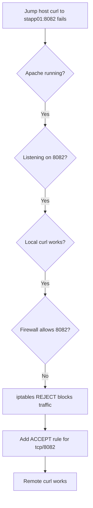

Yes — the issue was **not Apache itself**. Apache was already running and listening on port 8082; the real blocker was the **iptables firewall**, which was rejecting inbound traffic except SSH, so the jump host could not reach the app server. [ppl-ai-file-upload.s3.amazonaws](https://ppl-ai-file-upload.s3.amazonaws.com/web/direct-files/attachments/images/88511178/35ac5298-ad5d-451c-bd1f-fa9bd815f185/image.jpg)

## Issue highlight
- Apache service was healthy: `httpd` was `active (running)` and bound to `*:8082`. [ppl-ai-file-upload.s3.amazonaws](https://ppl-ai-file-upload.s3.amazonaws.com/web/direct-files/attachments/images/88511178/35ac5298-ad5d-451c-bd1f-fa9bd815f185/image.jpg)
- Local access worked from the server itself. [ppl-ai-file-upload.s3.amazonaws](https://ppl-ai-file-upload.s3.amazonaws.com/web/direct-files/attachments/images/88511178/35ac5298-ad5d-451c-bd1f-fa9bd815f185/image.jpg)
- Remote access from the jump host failed with `No route to host`. [ppl-ai-file-upload.s3.amazonaws](https://ppl-ai-file-upload.s3.amazonaws.com/web/direct-files/attachments/images/88511178/35ac5298-ad5d-451c-bd1f-fa9bd815f185/image.jpg)
- `iptables -L` showed a final `REJECT` rule, and no allow rule for 8082. [ppl-ai-file-upload.s3.amazonaws](https://ppl-ai-file-upload.s3.amazonaws.com/web/direct-files/attachments/images/88511178/35ac5298-ad5d-451c-bd1f-fa9bd815f185/image.jpg)
- Adding `ACCEPT tcp dpt:8082` fixed the problem. [ppl-ai-file-upload.s3.amazonaws](https://ppl-ai-file-upload.s3.amazonaws.com/web/direct-files/attachments/images/88511178/35ac5298-ad5d-451c-bd1f-fa9bd815f185/image.jpg)

## Related or not?
It was **related to host firewall policy**, not to Apache configuration, SELinux, or hostname resolution. Apache was configured correctly; the network path was blocked by packet filtering on `stapp01`. [ppl-ai-file-upload.s3.amazonaws](https://ppl-ai-file-upload.s3.amazonaws.com/web/direct-files/attachments/images/88511178/35ac5298-ad5d-451c-bd1f-fa9bd815f185/image.jpg)

## Runbook
1. Check Apache status:
   ```bash
   sudo systemctl status httpd
   ```
2. Check listening port:
   ```bash
   sudo ss -tulnp | grep 8082
   ```
3. Test local access:
   ```bash
   curl http://localhost:8082
   ```
4. Check firewall rules:
   ```bash
   sudo iptables -L -n --line-numbers
   ```
5. Add allow rule for the Apache port:
   ```bash
   sudo iptables -I INPUT 4 -p tcp --dport 8082 -j ACCEPT
   ```
6. Retest from the jump host:
   ```bash
   curl http://stapp01:8082
   ```

## Mermaid


If you want, I can turn this into a **clean incident report** or a **short SOP document**.