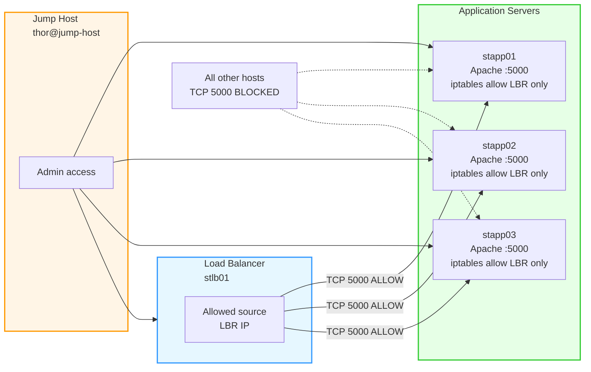

Here is the **complete OTS, Runbook, and Mermaid** for **all three app servers** and the LBR, for port **5000**.

## OTS
- Log in to the **jump host**.
- Identify the **LBR IP** from `stlb01`.
- On each app server (`stapp01`, `stapp02`, `stapp03`), install `iptables` and `iptables-services`.
- Allow TCP `5000` **only** from the LBR IP.
- Reject TCP `5000` from everyone else.
- Save the rules so they persist after reboot.
- Verify connectivity from LBR and confirm blocking from non-LBR hosts.

## Pre-requisites
- SSH access to:
  - `jump-host`
  - `stlb01`
  - `stapp01`
  - `stapp02`
  - `stapp03`
- Sudo/root access on the app servers.
- Apache running on port `5000` on all app servers.
- Known LBR IP.
- Maintenance window, if needed.

## Runbook

### 1) Log in to the jump host
```bash
ssh thor@jump-host
```

### 2) Log in to the load balancer and get its IP
```bash
ssh loki@stlb01
hostname -I
```
Note the IP shown. Use it as `<LBR_IP>` in the next steps.

### 3) Log in to each app server
```bash
ssh tony@stapp01
ssh steve@stapp02
ssh banner@stapp03
```

### 4) Install iptables and persistence package on each app server
Run on each app server:
```bash
sudo yum install -y iptables iptables-services
```

### 5) Add firewall rules on each app server
Replace `<LBR_IP>` with the IP of `stlb01`:

```bash
sudo iptables -I INPUT 1 -p tcp -s <LBR_IP> --dport 5000 -j ACCEPT
sudo iptables -A INPUT -p tcp --dport 5000 -j REJECT
```

### 6) Save the rules permanently
Run on each app server:
```bash
sudo iptables-save | sudo tee /etc/sysconfig/iptables > /dev/null
```

### 7) Enable and restart iptables
```bash
sudo systemctl enable iptables
sudo systemctl restart iptables
```

### 8) Verify the rules
```bash
sudo iptables -L INPUT -n --line-numbers
```
You should see:
- ACCEPT for `5000` from `<LBR_IP>`
- REJECT for `5000` from all other sources

### 9) Test from the load balancer
From `stlb01`:
```bash
curl http://stapp01:5000
curl http://stapp02:5000
curl http://stapp03:5000
```

### 10) Confirm persistence after reboot
Reboot one app server:
```bash
sudo reboot
```
After it comes back:
```bash
sudo iptables -L INPUT -n --line-numbers
```

## Post-requisites
- Port `5000` is accessible only from `stlb01`.
- All other sources are blocked.
- Rules survive reboot.
- Same configuration exists on all three app servers.

## Mermaid diagram


If you want, I can also make this into a **short exam-style answer** or a **single ready-to-run command block**.


#!/bin/bash

LBR_IP="10.244.195.214"   # replace with the actual LBR IP you found
PORT=5000

sudo yum install -y iptables iptables-services

sudo iptables -C INPUT -p tcp -s "$LBR_IP" --dport "$PORT" -j ACCEPT 2>/dev/null || \
sudo iptables -I INPUT 1 -p tcp -s "$LBR_IP" --dport "$PORT" -j ACCEPT

sudo iptables -C INPUT -p tcp --dport "$PORT" -j REJECT 2>/dev/null || \
sudo iptables -A INPUT -p tcp --dport "$PORT" -j REJECT

sudo iptables-save | sudo tee /etc/sysconfig/iptables > /dev/null
sudo systemctl enable iptables
sudo systemctl restart iptables

sudo iptables -L INPUT -n --line-numbers