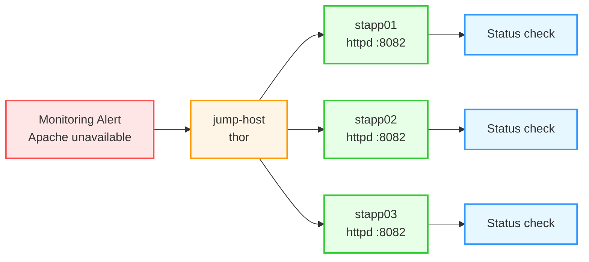

Here’s the **complete OTS, runbook, pre-requisites, post-checks, and Mermaid diagram** for the Apache issue on port **8082**.

## OTS
- Identify the faulty app host from `stapp01`, `stapp02`, and `stapp03`.
- Check Apache service status on all app servers.
- Confirm Apache is configured to listen on **port 8082**.
- Fix the misconfigured host if needed.
- Ensure Apache is **running** and **enabled on boot** on all app servers.
- Verify the service and port after the fix.

## Pre-requisites
- SSH access to:
  - `jump-host` as `thor`
  - `stapp01` as `tony`
  - `stapp02` as `steve`
  - `stapp03` as `banner`
- sudo access on the app servers.
- Apache package installed on all app servers.
- No application code deployment is required.
- Monitoring alert or issue report indicating Apache unavailability.

## Runbook

### 1) Log in to the jump host
```bash
ssh thor@jump-host
```

### 2) Check Apache status on all app servers
Run these from the jump host:
```bash
ssh tony@stapp01 "sudo systemctl status httpd"
ssh steve@stapp02 "sudo systemctl status httpd"
ssh banner@stapp03 "sudo systemctl status httpd"
```

### 3) Check whether Apache is listening on port 8082
```bash
ssh tony@stapp01 "sudo ss -lntp | grep 8082"
ssh steve@stapp02 "sudo ss -lntp | grep 8082"
ssh banner@stapp03 "sudo ss -lntp | grep 8082"
```

### 4) Fix the faulty host
If Apache is not active or not listening on `8082`, connect to that host and fix the configuration.

On the faulty host:
```bash
sudo vi /etc/httpd/conf/httpd.conf
```

Ensure this line exists:
```apache
Listen 8082
```

Then start and enable Apache:
```bash
sudo systemctl start httpd
sudo systemctl enable httpd
```

If Apache fails to start, review the error:
```bash
sudo journalctl -xeu httpd.service
```

### 5) Verify Apache is running
```bash
sudo systemctl status httpd
sudo ss -lntp | grep 8082
```

### 6) Repeat verification on all app servers
```bash
ssh tony@stapp01 "sudo systemctl is-active httpd && sudo ss -lntp | grep 8082"
ssh steve@stapp02 "sudo systemctl is-active httpd && sudo ss -lntp | grep 8082"
ssh banner@stapp03 "sudo systemctl is-active httpd && sudo ss -lntp | grep 8082"
```

## Post-checks
- Apache is active on `stapp01`, `stapp02`, and `stapp03`.
- Apache is listening on port `8082` on all app servers.
- The faulty host is fixed and enabled on boot.
- No page content deployment is needed.

## Mermaid diagram


If you want, I can also give you the **final exam-style short answer** for this task.