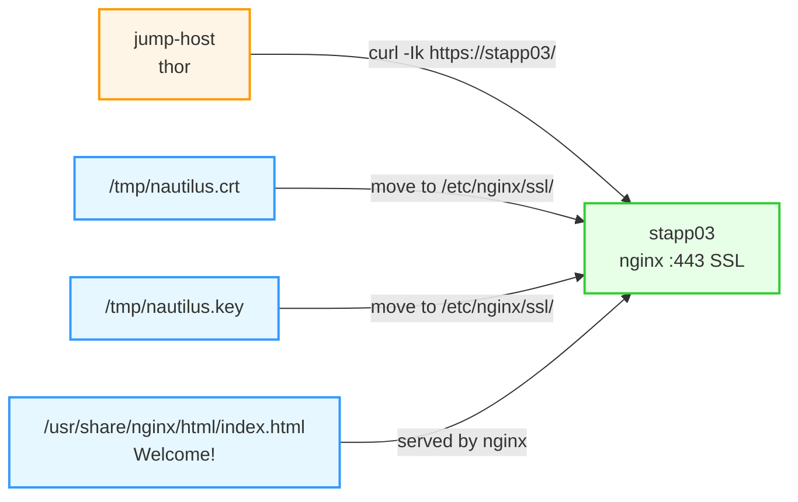

Below is the complete **OTS, runbook, pre-requisites, post-checks, and Mermaid diagram** for preparing **App Server 3** with **nginx + SSL + index.html**.

## OTS
- Install `nginx` on **App Server 3**.
- Move the provided SSL certificate and key from `/tmp/nautilus.crt` and `/tmp/nautilus.key` to a proper Nginx SSL directory.
- Configure Nginx to use those SSL files.
- Create `index.html` with the text `Welcome!` under the Nginx document root.
- Verify HTTPS access from the jump host using the app server hostname.

## Pre-requisites
- SSH access to:
  - `jump-host` as `thor`
  - `stapp03` as `banner`
- sudo access on `stapp03`.
- Certificate and key exist on `stapp03`:
  - `/tmp/nautilus.crt`
  - `/tmp/nautilus.key`
- Hostname `stapp03` resolves from the jump host.
- No other service should occupy port `443` on `stapp03`.

## Runbook

### 1) Log in to the jump host
```bash
ssh thor@jump-host
```

### 2) Log in to App Server 3
```bash
ssh banner@stapp03
```

### 3) Install Nginx
On `stapp03`:
```bash
sudo yum install -y nginx
```

### 4) Create SSL directory and move certificate files
```bash
sudo mkdir -p /etc/nginx/ssl
sudo mv /tmp/nautilus.crt /etc/nginx/ssl/
sudo mv /tmp/nautilus.key /etc/nginx/ssl/
sudo chmod 600 /etc/nginx/ssl/nautilus.key
sudo chmod 644 /etc/nginx/ssl/nautilus.crt
```

### 5) Configure Nginx for SSL
Create the Nginx server block:
```bash
sudo tee /etc/nginx/conf.d/nautilus.conf > /dev/null <<'EOF'
server {
    listen 443 ssl;
    server_name stapp03;

    ssl_certificate     /etc/nginx/ssl/nautilus.crt;
    ssl_certificate_key /etc/nginx/ssl/nautilus.key;

    location / {
        root /usr/share/nginx/html;
        index index.html;
    }
}
EOF
```

### 6) Create the required index.html
```bash
echo "Welcome!" | sudo tee /usr/share/nginx/html/index.html > /dev/null
```

### 7) Validate Nginx configuration
```bash
sudo nginx -t
```

### 8) Start and enable Nginx
```bash
sudo systemctl enable nginx
sudo systemctl restart nginx
```

### 9) Verify locally on App Server 3
```bash
curl -Ik https://localhost/
```

### 10) Final testing from jump host
From `jump-host`:
```bash
curl -Ik https://stapp03/
```

## Post-checks
- `nginx` is installed and active on `stapp03`.
- SSL certificate and key are moved to `/etc/nginx/ssl/`.
- Nginx serves HTTPS on port `443`.
- `index.html` contains `Welcome!`.
- `curl -Ik https://stapp03/` works from the jump host.

## Mermaid diagram


If you want, I can also provide a **single copy-paste script** for the full setup.