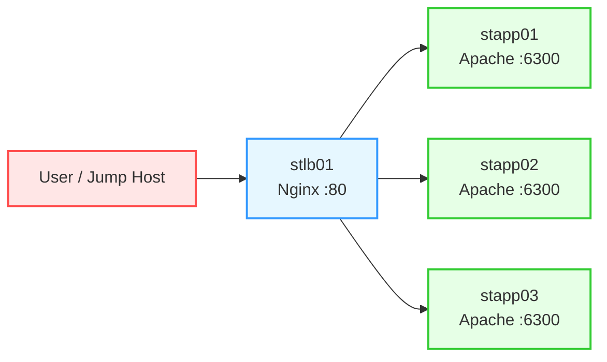

Here’s the complete package for the task: **OTS, runbook, Mermaid, pre-checks, and post-checks**.

## OTS
- Install `nginx` on `stlb01` if it is not already installed.
- Configure Nginx load balancing in the `http` context using all app servers.
- Update only `/etc/nginx/nginx.conf`.
- Do not change the Apache port on the app servers.
- Ensure Apache is running on `stapp01`, `stapp02`, and `stapp03`.
- Verify access with `curl http://stlb01:80`.

## Pre-checks
- Confirm SSH access to `jump-host`, `stlb01`, `stapp01`, `stapp02`, and `stapp03`.
- Confirm `httpd` is active on all app servers.
- Confirm the app servers are listening on the expected port, which in your environment is `6300`.
- Confirm `stlb01` can resolve and reach the app servers by hostname.
- Confirm you have sudo access on `stlb01`.

## Runbook

### 1) Check Apache on app servers
Run from `jump-host`:
```bash
ssh -t tony@stapp01 "sudo systemctl status httpd && sudo ss -lntp | grep :6300 && curl http://localhost:6300"
ssh -t steve@stapp02 "sudo systemctl status httpd && sudo ss -lntp | grep :6300 && curl http://localhost:6300"
ssh -t banner@stapp03 "sudo systemctl status httpd && sudo ss -lntp | grep :6300 && curl http://localhost:6300"
```

### 2) Log in to the load balancer
```bash
ssh loki@stlb01
```

### 3) Install Nginx
```bash
sudo yum install -y nginx
```

### 4) Back up the config
```bash
sudo cp /etc/nginx/nginx.conf /etc/nginx/nginx.conf.bak.$(date +%F-%H%M%S)
```

### 5) Edit `/etc/nginx/nginx.conf`
Use this content:

```nginx
user nginx;
worker_processes auto;
error_log /var/log/nginx/error.log;
pid /run/nginx.pid;

events {
    worker_connections 1024;
}

http {
    upstream backend {
        server stapp01:6300;
        server stapp02:6300;
        server stapp03:6300;
    }

    server {
        listen 80;
        location / {
            proxy_pass http://backend;
            proxy_set_header Host $host;
            proxy_set_header X-Real-IP $remote_addr;
            proxy_set_header X-Forwarded-For $proxy_add_x_forwarded_for;
            proxy_set_header X-Forwarded-Proto $scheme;
        }
    }
}
```

### 6) Validate and restart Nginx
```bash
sudo nginx -t
sudo systemctl enable nginx
sudo systemctl restart nginx
```

### 7) Test the site
From `jump-host`:
```bash
curl http://stlb01:80
```

## Post-checks
- `nginx` is installed and running on `stlb01`.
- `/etc/nginx/nginx.conf` has the upstream block with all three app servers on port `6300`.
- Apache remains unchanged on the app servers.
- `httpd` is active on all app servers.
- `curl http://stlb01:80` returns the application page.

## Mermaid


If you want, I can also turn this into a **single clean script for `stlb01`**.