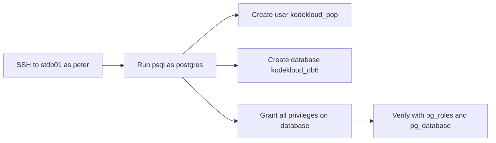

Here’s the complete package for the PostgreSQL task: **OTS script, runbook, Mermaid, pre-checks, and post-checks**.

## OTS script
Run this on `stdb01` as `peter`:

```bash
#!/bin/bash
set -e

sudo -u postgres psql -c "CREATE USER kodekloud_pop WITH PASSWORD 'TmPcZjtRQx';"
sudo -u postgres psql -c "CREATE DATABASE kodekloud_db6;"
sudo -u postgres psql -c "GRANT ALL PRIVILEGES ON DATABASE kodekloud_db6 TO kodekloud_pop;"
```

## Runbook
1. SSH to the database server:
```bash
ssh peter@stdb01
```
2. Run the script above.
3. Verify the user exists:
```bash
sudo -u postgres psql -tAc "SELECT 1 FROM pg_roles WHERE rolname='kodekloud_pop';"
```
4. Verify the database exists:
```bash
sudo -u postgres psql -tAc "SELECT 1 FROM pg_database WHERE datname='kodekloud_db6';"
```
5. Verify privileges:
```bash
sudo -u postgres psql -c "\l+ kodekloud_db6"
```

## Pre-checks
- Confirm PostgreSQL is already installed on `stdb01`.
- Confirm SSH access to `stdb01` as `peter`.
- Confirm `sudo` access from `peter` to run `psql` as the `postgres` OS user.
- Confirm you do **not** need to restart PostgreSQL.

## Post-checks
- User `kodekloud_pop` exists.
- Database `kodekloud_db6` exists.
- Full privileges on `kodekloud_db6` are granted to `kodekloud_pop`.
- No PostgreSQL service restart was performed.

## Mermaid


If you want, I can also provide an **idempotent version** of the OTS script that won’t fail if run twice.