Here’s the complete package for the Apache static websites task: **OTS, runbook, pre-checks, post-checks, and a colorful Mermaid diagram**.

## OTS
- Install `httpd` on `app server 1`.
- Configure Apache to listen on port `6400`.
- Place the `news` website at `/news/` and the `games` website at `/games/`.
- Ensure both sites are accessible with:
  - `curl http://localhost:6400/news/`
  - `curl http://localhost:6400/games/`

## Pre-checks
- Confirm you have access to `jump_host` as `thor`.
- Confirm `app server 1` is reachable as `tony`.
- Confirm the backups exist on `jump_host`:
  - `/home/thor/news`
  - `/home/thor/games`
- Confirm sudo privileges are available on `app server 1`.
- Confirm port `6400` is free on `app server 1`.

## Runbook

### 1) Install Apache on app server 1
```bash
sudo yum install -y httpd
```

### 2) Change Apache port to 6400
Edit `/etc/httpd/conf/httpd.conf` and change:
```apache
Listen 80
```
to:
```apache
Listen 6400
```

Or use:
```bash
sudo sed -i 's/^Listen 80$/Listen 6400/' /etc/httpd/conf/httpd.conf
```

### 3) Copy website backups from jump_host to app server 1
From `jump_host`:
```bash
scp -r /home/thor/news /home/thor/games tony@stapp01:/tmp/
```

### 4) Place the content under Apache document root
On `stapp01`:
```bash
sudo cp -r /tmp/news /var/www/html/news
sudo cp -r /tmp/games /var/www/html/games
sudo chown -R apache:apache /var/www/html/news /var/www/html/games
sudo chmod -R 755 /var/www/html/news /var/www/html/games
```

### 5) Configure Apache aliases
Create `/etc/httpd/conf.d/news.conf`:
```apache
Alias /news /var/www/html/news
<Directory "/var/www/html/news">
    Require all granted
    AllowOverride All
    Options Indexes FollowSymLinks
</Directory>
```

Create `/etc/httpd/conf.d/games.conf`:
```apache
Alias /games /var/www/html/games
<Directory "/var/www/html/games">
    Require all granted
    AllowOverride All
    Options Indexes FollowSymLinks
</Directory>
```

### 6) Start and enable Apache
```bash
sudo systemctl enable httpd
sudo systemctl restart httpd
```

### 7) Test the websites
```bash
curl http://localhost:6400/news/
curl http://localhost:6400/games/
```

## Post-checks
- `httpd` is installed and running on `app server 1`.
- Apache is listening on port `6400`.
- `news` is available at `http://localhost:6400/news/`.
- `games` is available at `http://localhost:6400/games/`.
- Both `curl` commands return the expected content.

## Mermaid

```mermaid
flowchart LR
    A[Jump Host: /home/thor/news<br/>/home/thor/games]:::source --> B[scp to stapp01:/tmp]:::transfer
    B --> C[stapp01: Install httpd]:::server
    C --> D[Set Listen 6400]:::config
    D --> E[Copy content to /var/www/html]:::content
    E --> F[Create /news and /games aliases]:::alias
    F --> G[Enable and restart httpd]:::run
    G --> H[Test curl on port 6400]:::test
    H --> I["Success: news and games live"]:::done

    classDef source fill:#ffe6e6,stroke:#e74c3c,stroke-width:2px,color:#000;
    classDef transfer fill:#e6f7ff,stroke:#3498db,stroke-width:2px,color:#000;
    classDef server fill:#e8f8e8,stroke:#27ae60,stroke-width:2px,color:#000;
    classDef config fill:#fce4ec,stroke:#d81b60,stroke-width:2px,color:#000;
    classDef content fill:#fff3cd,stroke:#f1c40f,stroke-width:2px,color:#000;
    classDef alias fill:#ede7f6,stroke:#8e44ad,stroke-width:2px,color:#000;
    classDef run fill:#e0f7fa,stroke:#00acc1,stroke-width:2px,color:#000;
    classDef test fill:#f3e5f5,stroke:#9b59b6,stroke-width:2px,color:#000;
    classDef done fill:#d5f5e3,stroke:#2ecc71,stroke-width:2px,color:#000;
```


If you want, I can also give you a **single clean `ots.sh` file** for this task.

Here is the **single clean `ots.sh`** for the Apache static websites task. It assumes you will run it on **app server 1** after the website backups have been copied to `/tmp/news` and `/tmp/games`.

```bash
#!/bin/bash
set -e

sudo yum install -y httpd

sudo sed -i 's/^Listen 80$/Listen 6400/' /etc/httpd/conf/httpd.conf

sudo cp -r /tmp/news /var/www/html/news
sudo cp -r /tmp/games /var/www/html/games

sudo chown -R apache:apache /var/www/html/news /var/www/html/games
sudo chmod -R 755 /var/www/html/news /var/www/html/games

sudo tee /etc/httpd/conf.d/news.conf > /dev/null <<'EOF'
Alias /news /var/www/html/news
<Directory "/var/www/html/news">
    Require all granted
    AllowOverride All
    Options Indexes FollowSymLinks
</Directory>
EOF

sudo tee /etc/httpd/conf.d/games.conf > /dev/null <<'EOF'
Alias /games /var/www/html/games
<Directory "/var/www/html/games">
    Require all granted
    AllowOverride All
    Options Indexes FollowSymLinks
</Directory>
EOF

sudo systemctl enable httpd
sudo systemctl restart httpd

curl http://localhost:6400/news/
curl http://localhost:6400/games/
```

## Important
Before running this script, copy the backups from **jump_host** to `stapp01`:

```bash
scp -r /home/thor/news /home/thor/games tony@stapp01:/tmp/
```

If you want, I can also provide a **version that includes the scp copy step in the runbook**.