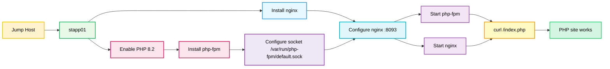

Below is the **complete package** for your PHP + Nginx task: **OTS, runbook, prerequisites, post-checks, and a colorful Mermaid diagram**. The key is that `php-fpm` must listen on the same unix socket that Nginx uses, and the socket permissions must allow Nginx to access it. [github](https://github.com/karadHub/100-Days-Of-DevOps/blob/main/Day%2020/Configure%20Nginx%20+%20PHP-FPM%20Using%20Unix%20Sock.md)

## OTS
Run on **app server 1**.

```bash
#!/bin/bash
set -e

sudo yum install -y nginx
sudo yum module reset php -y
sudo yum module enable php:8.2 -y
sudo yum install -y php php-fpm php-common

sudo mkdir -p /var/run/php-fpm

sudo cp /etc/php-fpm.d/www.conf /etc/php-fpm.d/www.conf.bak.$(date +%F-%H%M%S)
sudo sed -i 's#^listen = .*#listen = /var/run/php-fpm/default.sock#' /etc/php-fpm.d/www.conf
sudo sed -i 's#^;listen.owner = nobody#listen.owner = nginx#' /etc/php-fpm.d/www.conf
sudo sed -i 's#^;listen.group = nobody#listen.group = nginx#' /etc/php-fpm.d/www.conf
sudo sed -i 's#^listen.mode = 0660#listen.mode = 0660#' /etc/php-fpm.d/www.conf

sudo cp /etc/nginx/nginx.conf /etc/nginx/nginx.conf.bak.$(date +%F-%H%M%S)
sudo tee /etc/nginx/nginx.conf > /dev/null <<'EOF'
# For more information on configuration, see:
#   * Official English Documentation: [http://nginx.org/en/docs/](http://nginx.org/en/docs/)
#   * Official Russian Documentation: [http://nginx.org/ru/docs/](http://nginx.org/ru/docs/)

user nginx;
worker_processes auto;
error_log /var/log/nginx/error.log;
pid /run/nginx.pid;

# Load dynamic modules. See /usr/share/doc/nginx/README.dynamic.
include /usr/share/nginx/modules/*.conf;

events {
    worker_connections 1024;
}

http {
    log_format  main  '$remote_addr - $remote_user [$time_local] "$request" '
                      '$status $body_bytes_sent "$http_referer" '
                      '"$http_user_agent" "$http_x_forwarded_for"';

    access_log  /var/log/nginx/access.log  main;

    sendfile            on;
    tcp_nopush          on;
    tcp_nodelay         on;
    keepalive_timeout   65;
    types_hash_max_size 4096;

    include             /etc/nginx/mime.types;
    default_type        application/octet-stream;

    # Load modular configuration files from the /etc/nginx/conf.d directory.
    # See [http://nginx.org/en/docs/ngx_core_module.html#include](http://nginx.org/en/docs/ngx_core_module.html#include)
    # for more information.
    include /etc/nginx/conf.d/*.conf;

    server {
        listen 8093;
        server_name stapp01;
        root /var/www/html;
        index index.php index.html index.htm;

        location / {
            try_files $uri $uri/ =404;
        }

        location ~ \.php$ {
            include fastcgi_params;
            fastcgi_index index.php;
            fastcgi_pass unix:/var/run/php-fpm/default.sock;
            fastcgi_param SCRIPT_FILENAME $document_root$fastcgi_script_name;
        }
    }
}
EOF

sudo systemctl enable php-fpm
sudo systemctl restart php-fpm
sudo systemctl enable nginx
sudo systemctl restart nginx

curl http://stapp01:8093/index.php
```

## Pre-requisites
- `stapp01` is reachable from the jump host.
- You have `sudo` access on `stapp01`.
- `/var/www/html/index.php` and `/var/www/html/info.php` already exist and must not be modified.
- Port `8093` is free on `stapp01`.
- The server has access to the CentOS Stream 9 PHP 8.2 module stream. [digitalocean](https://www.digitalocean.com/community/tutorials/php-fpm-nginx)
- Nginx and PHP-FPM packages are available from the configured repositories.

## Runbook
1. SSH into `stapp01`.
2. Run the OTS script above.
3. Verify PHP-FPM socket creation:
```bash
ls -l /var/run/php-fpm/default.sock
```
4. Verify services:
```bash
sudo systemctl status php-fpm
sudo systemctl status nginx
```
5. Verify Nginx is listening on port `8093`:
```bash
sudo ss -lntp | grep 8093
```
6. Test from jump host:
```bash
curl http://stapp01:8093/index.php
curl http://stapp01:8093/info.php
```

## Post-checks
- `php-fpm` is active and running.
- Nginx is active and running.
- `/var/run/php-fpm/default.sock` exists.
- Nginx config uses `fastcgi_pass unix:/var/run/php-fpm/default.sock;`.
- `curl http://stapp01:8093/index.php` returns the PHP page.
- `index.php` and `info.php` remain unchanged.

## Mermaid


If you want, I can also give you a **short troubleshooting section** for the most common socket/permission errors.