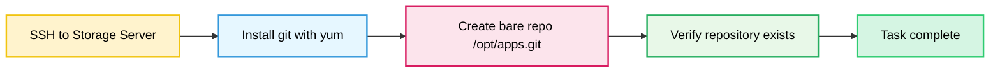

Below is the complete package for the Git repository task: **todo, pre-checks, post-checks, OTS, runbook, and Mermaid**.

## Todo
- Install `git` on the Storage server using `yum`.
- Create a bare repository at exactly `/opt/apps.git`.

## Pre-checks
- Confirm you can SSH into the Storage server.
- Confirm you have `sudo` access on the Storage server.
- Confirm `/opt` is writable by root.
- Confirm no existing repository already exists at `/opt/apps.git` unless overwriting is intended.

## OTS
Run this on the **Storage server**:

```bash
#!/bin/bash
set -e

sudo yum install -y git
sudo git init --bare /opt/apps.git
```

## Runbook
1. SSH into the Storage server.
2. Run the OTS script above.
3. Verify Git is installed:
```bash
git --version
```
4. Verify the bare repository exists:
```bash
sudo ls -ld /opt/apps.git
sudo git -C /opt/apps.git status
```

## Post-checks
- `git` is installed on the Storage server.
- `/opt/apps.git` exists.
- The repository is bare.
- No files were added to the repository working tree, since this is a bare repo.

## Mermaid


If you want, I can also provide a **single `ots.sh` file** version.