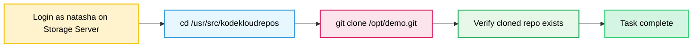

Below is the complete package for the Git clone task: **OTS, runbook, and Mermaid**.

## OTS
Run this on the **Storage Server** as **natasha**.

```bash
#!/bin/bash
set -e

cd /usr/src/kodekloudrepos
git clone /opt/demo.git
```

## Runbook
1. SSH into the Storage Server as `natasha`.
2. Verify the target directory exists:
```bash
ls -ld /usr/src/kodekloudrepos
```
3. Change into the target directory:
```bash
cd /usr/src/kodekloudrepos
```
4. Clone the repository:
```bash
git clone /opt/demo.git
```
5. Verify the clone:
```bash
ls -l /usr/src/kodekloudrepos
```

## Mermaid


If you want, I can also add **pre-checks and post-checks** in the same format.