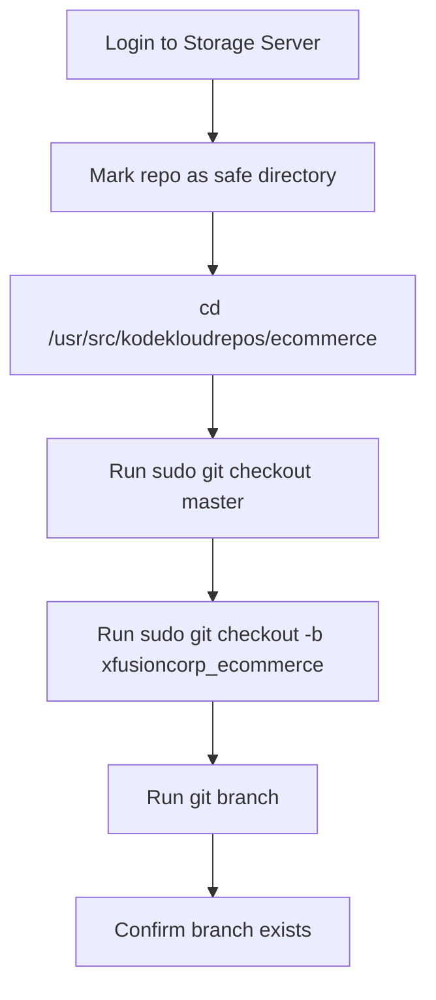

Here’s a clean version of the **OTS, runbook, and mermaid** for the full task.

## OTS
```bash
git config --global --add safe.directory /usr/src/kodekloudrepos/ecommerce
cd /usr/src/kodekloudrepos/ecommerce
sudo git checkout master
sudo git checkout -b xfusioncorp_ecommerce
git branch
```

## Runbook
1. Connect to the Storage server as `natasha`.
2. Add the repository as a safe directory so Git trusts it.
3. Go to the ecommerce repository directory.
4. Use elevated permissions because the repo is owned by `root`.
5. Checkout `master`.
6. Create the new branch `xfusioncorp_ecommerce` from `master`.
7. Verify the branch was created successfully with `git branch`.

## Mermaid


## Note
The repository is owned by `root:root`, so `natasha` needs `sudo` to create the branch successfully.