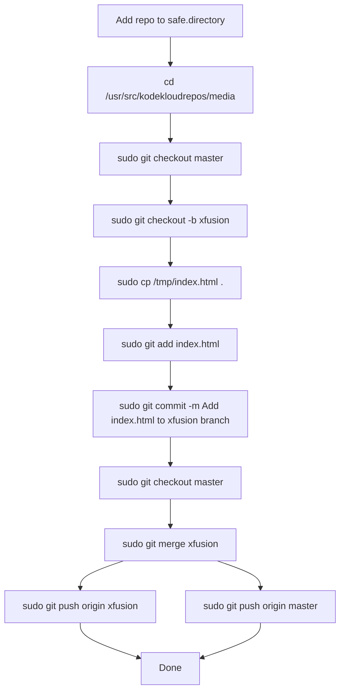

You’re hitting **two separate problems**:

1. Git blocks the repo because of **dubious ownership**.
2. `natasha` does not have **write permission** in `/usr/src/kodekloudrepos/media`, so `cp` and Git commit/push operations fail.

## Corrected OTS
```bash
git config --global --add safe.directory /usr/src/kodekloudrepos/media
cd /usr/src/kodekloudrepos/media
sudo git checkout master
sudo git checkout -b xfusion
sudo cp /tmp/index.html .
sudo git add index.html
sudo git commit -m "Add index.html to xfusion branch"
sudo git checkout master
sudo git merge xfusion
sudo git push origin xfusion
sudo git push origin master
```

## Runbook
1. Mark `/usr/src/kodekloudrepos/media` as a safe Git directory.
2. Go to the repo path.
3. Use `sudo` because the repo is not writable by `natasha`.
4. Create branch `xfusion` from `master`.
5. Copy `/tmp/index.html` into the repo.
6. Add and commit the file on `xfusion`.
7. Merge `xfusion` back into `master`.
8. Push both branches to `origin`.

## Mermaid


If you want, I can also give you the **minimal final command set** only, without explanation.