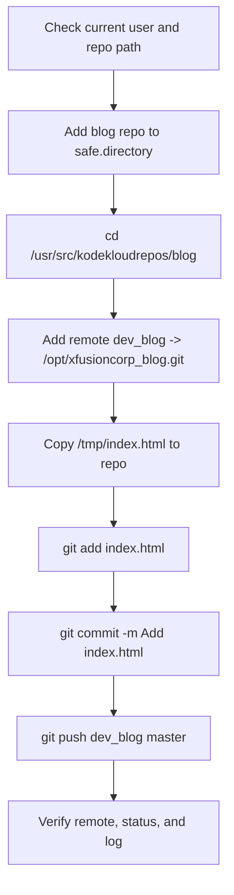

Absolutely — here is the **full documentation package** for this requirement, based on the earlier cases too.

## OTS
```bash
git config --global --add safe.directory /usr/src/kodekloudrepos/blog
cd /usr/src/kodekloudrepos/blog
sudo git remote add dev_blog /opt/xfusioncorp_blog.git
sudo cp /tmp/index.html .
sudo git add index.html
sudo git commit -m "Add index.html"
sudo git push dev_blog master
```

## Runbook
1. Add `/usr/src/kodekloudrepos/blog` to Git’s safe directory list for the current user.
2. Change into the cloned `blog` repository.
3. Use `sudo` for repository write actions because the repo is root-owned and the normal user cannot modify `.git/config`, `.git/index`, or the working tree.
4. Add the new remote named `dev_blog` and point it to `/opt/xfusioncorp_blog.git`.
5. Copy `/tmp/index.html` into the repository root.
6. Stage and commit the file on the `master` branch.
7. Push `master` to the `dev_blog` remote.

## Pre-checks
```bash
whoami
pwd
ls -ld /usr/src/kodekloudrepos/blog
ls -ld /usr/src/kodekloudrepos/blog/.git
git remote -v
git branch --show-current
```

## Post-checks
```bash
git remote -v
git status
git log --oneline --decorate -1
git branch
```

Optional validation for the remote branch:
```bash
git ls-remote dev_blog master
```

## Mermaid


## Note
The important lesson from the earlier errors is that **`safe.directory` only fixes Git trust**, while **`sudo` or writable permissions are still needed** if the repo is owned by `root` or another user. [git-scm](https://git-scm.com/docs/git-config)

If you want, I can also format this as a **lab-ready answer** with only the exact commands and no explanation.