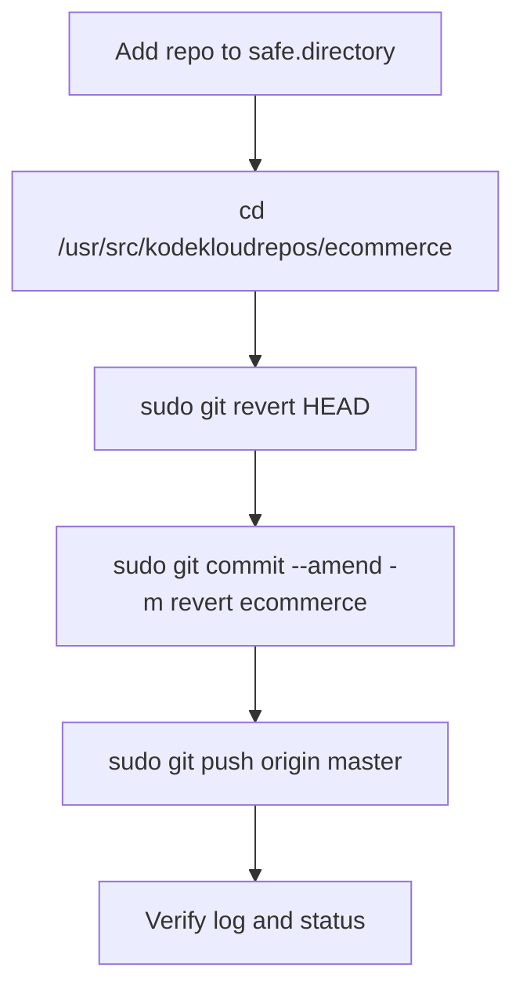

You’re right — for this repo task, the **sudo approach belongs in the solution** because we already saw the repo is root-owned and Git will fail on `.git/index.lock` and config writes without elevated permissions. `safe.directory` only handles Git’s trust check; it does not fix write access. [support.atlassian](https://support.atlassian.com/bitbucket-cloud/kb/git-command-returns-fatal-error-detected-dubious-ownership/)

## Correct OTS
```bash
git config --global --add safe.directory /usr/src/kodekloudrepos/ecommerce
cd /usr/src/kodekloudrepos/ecommerce
sudo git revert HEAD
sudo git commit --amend -m "revert ecommerce"
sudo git push origin master
```

## Why sudo is needed here
- `git revert HEAD` creates a new commit and writes to `.git`, so it needs write access.
- If the repo is root-owned, non-root Git commands can fail with `Permission denied` or `index.lock` errors.
- `sudo` is the right fix when ownership is not meant to be changed. [github](https://github.com/orgs/community/discussions/48355)

## Runbook
1. Mark the repo as safe for the current user.
2. Go to `/usr/src/kodekloudrepos/ecommerce`.
3. Revert the latest commit using `sudo`.
4. Amend the revert commit message to exactly `revert ecommerce`.
5. Push the updated `master` branch to `origin`.

## Pre-checks
```bash
whoami
cd /usr/src/kodekloudrepos/ecommerce
ls -ld .git
git log --oneline -3
git branch --show-current
```

## Post-checks
```bash
git log --oneline -3
git show --stat HEAD
git status
```

## Mermaid


If you want, I can also provide a **lab-style short answer** with only the exact commands.